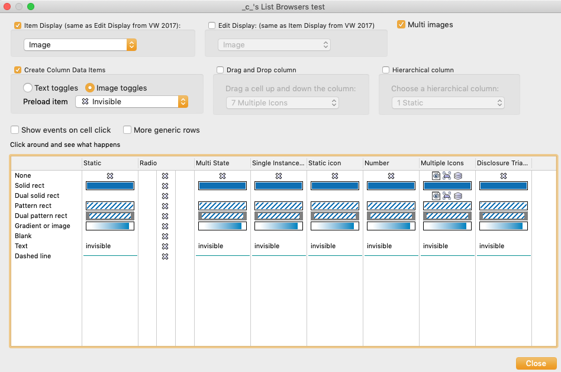

# Dialog with List Browser

A resizable dialog with a list browser, pull down menus, an enhanced pulldown menu, radio and check boxes. This is the basic example for the article [List Browsers](VS-List Browsers part 1.md).

With this dialog you can experiment with the different results in List Browsers, according to their four basic features: Column Data Items, Control Type, Display Type, Column Owner.  
By --\_c\_ (Orso B. Schmid)

The compiler mode is enabled automatically by this script in the snippet `SetPref(407, TRUE)`. Remember to turn it off!

## Description

In the Dialog with List Browser we create a List Browser with:

- one column for each of the seven Control Types
- one row for each of the nine cell Owners
- each column is connected with a list with three Column Data Items containing both Images and Strings.

Then there is:

- one pull-down menu for Item Display (same as Edit Display from VW 2017)
- one pull-down menu for Edit Display (same as Item Display from VW 2017)
- radio boxes for loading different Data Items: string or image

Change the values in the pop-up menus, click around the List Browsers to see what happens. Experiment with the other available options.

> **NOTE:** "Pattern" and "Dual pattern" don't work before VW 2010.

## Image



## Code

```pascal
// filepath: d:\Engineering\developer-scripting\Common\Tasks\Dialogs\Dialog with List Browser.md
{
2009-2021 (_c_) CAD-BIM-Manager.com
test dialog for List Browsers

This dialog is meant for you to experiment with the different List Browser setting.
Just click around and see what happens.


2009		created
2018.01.01	rewritten for compatibility with VW 2017
2021.01.01	expanded to VW 2021
2021.01.07	added full option for Hierarchical Display as Class list
}

PROCEDURE LB_Test;

CONST
	
	{ Display Type flags }
	{kLBdisplTypeText	= 0;}
	{ this is the the value on GET, but is not usable to SET }
	
	kLBdispImageOnly	= 1;
	kLBdispTextOnly		= 2;
	kLBdispImageAndText	= 3;
	
	{ Control Type flags and column indexes! }
	{ the names of these Controls are loaded as title for each col
	see array gControlTypeStr }
	kLB_JustStr 		= 0; { Control Type }
	kLBctrNone			= 1; { Static }
	kLBctrRadio			= 2;
	kLBctrMultiState	= 3;
	kLBctrSingleInstance = 4;
	kLBctrNoClick		= 5; { Static icon }
	kLBctrNumber		= 6;
	kLBctrMultipleImages = 7; { Use with kListBrowserDisplayImageOnly }
	kLBctrDiscTriangl 	= 8; { introduced by VW 17 (2012) VW 18 (2013) }
	
	{ Column Owner flags, applied to cells, not to columns, despite the name  }
	{ the names of these Owners are loaded as Cell 1 of each row
	see array gColOwnerStr }
	kLBNotOwnerDrawn	= 0; { none }
	kLBSolidRect		= 1;
	kLBDualSolidRect	= 2;
	kLBPatRect			= 3;
	kLBDualPatRect		= 4;
	kLBGradientOrImage	= 5; { works for tiles too }
	kLBBlankOwnerDrawn	= 6;
	kLBTxtOwnerDrawn	= 7; { text }
	kLBDashedLine		= 8;
	kLBTile				= 9;
		
	{ list browser events }
	kLBrowColDataSel 	= -2;	{ user changed column data items, this occurs also without click! }
	kLBDataChangeAllClick	= -3; {}
	kLBrowSel			= -4;	{ user clicked on row }
	kLBDoubleClick		= -5;
	kLBDeleteKeyPressed	= -6;
	kLBUpKeyPressed		= -7;
	kLBDownKeyPressed	= -8; { user scrolled a row using arrow keys: no rows and cols are set by GetLBEventInfo! }
	kLBAlphaNumericKeyPressed	= -9; { user typed a key and the LB scrolls down: no rows/cols are set by GetLBEventInfo! }
	kLBSortOccurred				= -10;
	kLBSelectionMultChangeClick = -11;
	kLBEnterKeyPressed			= -12;
	kLBDataChangeRecursiveClick	= -13;
	kLBDoubleAllClick			= -14;
	kLBDoubleRecursiveClick		= -15;
	kLBItemEditCompletionData   = -19;
	
	
	{ dialog constants for resizement }
	kAl_Rig		= 1; { Right }
	kAl_Bot		= 2; { Bottom }
	kAl_Lef		= 3; { Left }
	kAl_resiz	= 0; { Resize }
	kAl_shift	= 1; { Move }
	
	cChGr_ItemDisplay = 8;
		cPull_ItemDisplay = 9;
	cChGr_EditDisplay = 10;
		cPull_EditDisplay = 11;
		
	cCh_MultiImages = 12;
	
	cChGr_ColDataItem = 20;
		cRa_txtToggles = 21;
		cRa_imgToggles = 22;
		cSt_PreloadImg = 23;
		cPull_PreloadImg = 24;
	
	cSt_OwnerType	= 30;
	cSt_ControlType = 31;
	
	cChGr_DragDrop = 32;
		cSt_DragDrop = 33;
		cPull_DragDrop = 34;
	
	cChGr_Hierarchical = 40;
		cSt_Hierarchical = 41;
		cPull_Hierarchical = 42;
	
	cLB	= 50; { list browser }
	
	cGr_Bot = 60;
		cCh_MoreRows = 71;
		cCh_ShowEvents = 72;
		cSt_Message = 73;

VAR
	gD 	: LONGINT;
	gImgCnt, gPreloadImg : INTEGER;
	gVectorFill, gLineType : LONGINT;
	gIsMac : BOOLEAN;
	
	gDisplayTypeStr : ARRAY[1..4] OF STRING;
	gControlTypeStr : ARRAY[1..8] OF STRING;
	gColOwnerStr : ARRAY[1..9] OF STRING;
	
	n, temp_i		: INTEGER;
	temp_L		: LONGINT;
	temp_r		: REAL;
	temp_s		: STRING;
	temp_b		: BOOLEAN;
	temp_h		: HANDLE;


{ ************************************************ }
{ gets a choice index }
FUNCTION D_PullIntChoice(dlog, pullID: LONGINT): INTEGER;
	VAR
		outSelectedChoiceText : STRING;
		
	BEGIN
		GetSelectedChoiceInfo(dlog, pullID, 0, D_PullIntChoice, outSelectedChoiceText); { from VW15 }
	END;
	

{ ************************************************* }
{ gets choice from radio, checkbox items }
FUNCTION R_GetBooleanItem(dlog, radioOrCheckID: LONGINT): BOOLEAN;
	BEGIN
		GetBooleanItem(dlog, radioOrCheckID, R_GetBooleanItem); { from VW15 }
	END;
	

{ ************************************************* }
{ returns count of choices in a pulldown menu }
FUNCTION R_GetChoiceCount(d, pullID: LONGINT): INTEGER;
	BEGIN
		GetChoiceCount(d, pullID, R_GetChoiceCount); { from VW15 }
	END; 


{ ************************************************ }
FUNCTION DialogLayout: INTEGER;
	CONST
		cLBWidth	= 130;	{ width in characters }
		cLBHeight	= 20;	
		cWidth		= 25;
	VAR 
		dlog, i : INTEGER;
	
	BEGIN
		dlog := CreateResizableLayout('_c_''s List Browsers test', FALSE, 'Close', '', TRUE, TRUE);
		
		CreateCheckBoxGroupBox(dlog, cChGr_ItemDisplay, 'Item Display (same as Edit Display from VW 2017): ', TRUE);
			CreatePullDownMenu(dlog, cPull_ItemDisplay, cWidth);
			SetFirstGroupItem(dlog, cChGr_ItemDisplay, cPull_ItemDisplay);
		
		CreateCheckBoxGroupBox(dlog, cChGr_EditDisplay, 'Edit Display: (same as Item Display from VW 2017)', TRUE);
			CreatePullDownMenu(dlog, cPull_EditDisplay, cWidth);
			SetFirstGroupItem(dlog, cChGr_EditDisplay, cPull_EditDisplay);
			
		CreateCheckBox(dlog, cCh_MultiImages, 'Multi images');
		
		CreateCheckBoxGroupBox(dlog, cChGr_ColDataItem, 'Create Column Data Items', TRUE);
			CreateRadioButton(dlog, cRa_txtToggles, 'Text toggles');
			CreateRadioButton(dlog, cRa_imgToggles, 'Image toggles');
		
			CreateStaticText(dlog, cSt_PreloadImg, 'Preload item ', -1);
			CreateEnhancedPullDownMenu(dlog, cPull_PreloadImg, cWidth, TRUE);
			
			SetFirstGroupItem(dlog, cChGr_ColDataItem, cRa_txtToggles);
				SetRightItem(dlog, cRa_txtToggles, cRa_imgToggles, 0, 0);
				SetBelowItem(dlog, cRa_txtToggles, cSt_PreloadImg, 0, 0);
				SetRightItem(dlog, cSt_PreloadImg, cPull_PreloadImg, 0, 0);
		
		CreateCheckBoxGroupBox(dlog, cChGr_DragDrop, 'Drag and Drop column', TRUE);
			CreateStaticText(dlog, cSt_DragDrop, 'Drag a cell up and down the column:', -1);
			CreatePullDownMenu(dlog, cPull_DragDrop, cWidth);
		
			SetFirstGroupItem(dlog, cChGr_DragDrop, cSt_DragDrop);
				SetBelowItem(dlog, cSt_DragDrop, cPull_DragDrop, 0, 0);
		
		CreateCheckBoxGroupBox(dlog, cChGr_Hierarchical, 'Hierarchical column', TRUE);
			CreateStaticText(dlog, cSt_Hierarchical, 'Choose a hierarchical column:', -1);
			CreatePullDownMenu(dlog, cPull_Hierarchical, cWidth);
		
			SetFirstGroupItem(dlog, cChGr_Hierarchical, cSt_Hierarchical);
				SetBelowItem(dlog, cSt_Hierarchical, cPull_Hierarchical, 0, 0);
		
		CreateStaticText(dlog, cSt_OwnerType, 'Column Owner', cWidth);
		CreateStaticText(dlog, cSt_ControlType, 'Control Types', cWidth);
		
		CreateGroupBox(dlog, cGr_Bot, '', FALSE);
			CreateCheckBox(dlog, cCh_ShowEvents, 'Show events on cell click');
			CreateStyledStatic(dlog, cSt_Message, '<message bar>', cLBWidth, 3); { 3 = reduced }
			SetStaticTextColor(dlog, cSt_Message, 255, 0, 0); { SetStaticTextColor is broken on VW 2020-1 }
		
			{ I am not using here a CreateRadioButtonGroupBox because it crashes }
			CreateCheckBox(dlog, cCh_MoreRows, 'More generic rows');
			
			SetFirstGroupItem(dlog, cGr_Bot, cCh_ShowEvents);
				SetRightItem(dlog, cCh_ShowEvents, cCh_MoreRows, 0, 0);
				SetBelowItem(dlog, cCh_ShowEvents, cSt_Message, 0, 0);
		
		CreateLB(dlog, cLB, cLBWidth, cLBHeight); 
		
 		SetFirstLayoutItem(dlog, cChGr_ItemDisplay);
 			SetRightItem(dlog, cChGr_ItemDisplay, cChGr_EditDisplay, 0, 0);
 			SetRightItem(dlog, cChGr_EditDisplay, cCh_MultiImages, 0, 0);
 			
 			SetBelowItem(dlog, cChGr_ItemDisplay, cChGr_ColDataItem, 0, 0);
 			SetRightItem(dlog, cChGr_ColDataItem, cChGr_DragDrop, 0, 0);
 			SetRightItem(dlog, cChGr_DragDrop, cChGr_Hierarchical, 0, 0);
 			
 			SetBelowItem(dlog, cChGr_ColDataItem, cGr_Bot, 0, 0);
 			SetBelowItem(dlog, cGr_Bot, cLB, 0, 0);
			
		SetEdgeBinding(dlog, cLB, TRUE, TRUE, TRUE, TRUE);
		SetEdgeBinding(dlog, cGr_Bot, TRUE, TRUE, TRUE, FALSE);
		
		{ return the dialog ID }
		DialogLayout := dlog;
	END; { DialogLayout }


{ ************************************************ }	
PROCEDURE DialogDriver(VAR item: LONGINT; data: LONGINT);
	VAR
		event, eventRow, eventCol : INTEGER;
		recursive : BOOLEAN;
		
		i, temp_i : INTEGER;
		temp_s : STRING;
		temp_L : LONGINT;
	

	{ ************************************************ }
	{ 
	++++ ONLY FOR EXPERIMENTS +++++

	loads cells with resource thumbnails and names.
	The routine below doesn't check for valid resource types.
	This will work with all resources creating a thumbnail in the Resource Browser.
	This can run you out of memory on heavy resource thumbnails like textures.

	Use the typical GetType constants for setting the resource type to be loaded, for example:

	16: sym definition
	66: hatch definition
	97: texture definiton EXTREMELLY heavy, any user click causes the watch-cursor
	119: image fill definition
	120: gradient fill definition
	127: wall style


	Thus you can see how bad thumbnails aside of gradients display
	Try it on a document with some symbols

	the list browser has two columns, 
	col 0 has control Static, item display text: we load the symbol name
	col 1 Static, item display image: we load here the sym thumbnail
	}

	PROCEDURE LB_LoadIndexedResources(dlog, LB: INTEGER; resourceType: INTEGER);
		VAR
			resList, cnt : LONGINT;
			resName : STRING;
			row, col : INTEGER;
			temp_b : BOOLEAN;
		
		{ ************************************************ }
		{ reads obj type descriptions from the VW resources }
		{ these do not need to be laoden, like IP Resources and }
		{ they are localized: from VW LocalD.qtr, string 4501 }
		{ the extended descriptions are in VW LocalD.qtr, string 4504 }
		{ the subtypes are in VW LocalD.qtr, string 4505 }
		FUNCTION H_GetTypeName(aType: INTEGER): STRING;
			VAR
				typeStr, extendedExplan : STRING;
			BEGIN
				H_GetTypeName := '<unknown>';
				aType := aType + 1;
			
				GetResourceString(typeStr, 4501, aType);
				IF typeStr <> '()' THEN BEGIN
					GetResourceString(extendedExplan, 4504, aType);
					H_GetTypeName := Concat(typeStr, ' ', extendedExplan);
				END;
			END; { H_GetTypeName }
		
		BEGIN
			IF DeleteAllLBItems(dlog, LB) THEN BEGIN
				EnableLBUpdates(dlog, LB, FALSE);
			
				resList := BuildResourceList(resourceType, 0, '', cnt); 
				{ if you did some resource renaming during dialog execution this can mess up the list, 
				in this case you better redo the list.
				You don't need to redo it if your resList is not modified during dialog execution }
			
				IF cnt > 0 THEN BEGIN
					row := -1;
					col := 0;
				
					WHILE (row+1) < cnt DO BEGIN
						resName := GetNameFromResourceList(resList, row+2); { this is a 1-based list }
					
						{ resource name at column 0 }
						row := InsertLBItem(dlog, LB, GetNumLBItems(dlog, LB), resName);
						temp_b := SetLBColumnOwnerDrawnType(dlog, LB, row, col, kLBTxtOwnerDrawn); { text owner }
						
						{ resource icon at column 1 }
						IF SetLBColumnOwnerDrawnType(dlog, LB, row, col +1, kLBGradientOrImage) THEN { vectorfll owner }
							temp_b := SetLBItemGradientOrImageRefNumber(dlog, LB, row, col+1, Name2Index(resName));
					END;
				
				END ELSE
					AlrtDialog(Concat('Resource list for object type "' , H_GetTypeName(resourceType), '" is either empty or not parsable') );
			
				EnableLBUpdates(dlog, LB, TRUE);
				temp_b := RefreshLB(dlog, LB);
			END;
		END; { LB_LoadIndexedResources }
	

	{ **************************** }
	{ create a class list cLB }
	PROCEDURE LB_CreateClassListLB(editDisplay, itemDisplay : INTEGER);
		VAR
			row, col, i, clNum : INTEGER;
			temp_b : BOOLEAN;
		
		BEGIN
			{ set up columns }
			
			col := InsertLBColumn(gD, cLB, 0, 'Class Name', 200);
			temp_b := SetLBControlType(gD, cLB, col, kLBctrNone);
			temp_b := SetLBItemDisplayType(gD, cLB, col, kLBdispImageAndText);
				
			{ set up rows }
		
			FOR i := 1 TO ClassNum DO BEGIN
				row := InsertLBItem(gD, cLB, GetNumLBItems(gD, cLB), ClassList(i));
				temp_b := SetLBColumnOwnerDrawnType(gD, cLB, row, col, kLBctrDiscTriangl);
			END;
			
			{ disable fields that aren't used while in LB_CreateClassListLB }
			EnableItem(gD, cChGr_DragDrop, FALSE);
			EnableItem(gD, cChGr_ColDataItem, FALSE);
			EnableItem(gD, cChGr_ItemDisplay, FALSE);
			EnableItem(gD, cChGr_EditDisplay, FALSE);
			SelectChoice(gD, cPull_Hierarchical, 1, TRUE); { preselects 1st choice = 1st col }
		END; { LB_CreateClassListLB }
	
	
	{ **************************** }
	{ create one column for each Control Type }
	PROCEDURE LB_CreateColumns;
		VAR
			controlType, col, w: INTEGER;
			gTitles: ARRAY[1..20] OF STRING;
			temp_b : BOOLEAN;
		
		BEGIN
			{ the first column (index 0) is the Column Owner, which applies to each row }
			col := InsertLBColumn(gD, cLB, GetNumLBColumns(gD, cLB), '', 120);
		
			{ Mac and PC have different field widths }
			w := 78;
			IF gIsMac THEN
				w := 95;
			
			{ add one column for each Control type }
			FOR controlType := 1 TO 8 DO BEGIN
				col := InsertLBColumn(gD, cLB, GetNumLBColumns(gD, cLB), gControlTypeStr[controlType], w);
				temp_b := SetLBControlType(gD, cLB, col, controlType);
			END;
			
			temp_b := EnableLBClickAllDataChange(gD, cLB, TRUE);
			temp_b := SetLBColumnWidth(gD, cLB, 0, 0, 120); { first col is wider }
		
			EnableLBRadioColumnLines(gD, cLB, kLBctrRadio, TRUE);
			{ this will only be effective on Control Type radio }
			{ it also needs Column Data Items to be set up for the column }
		
			EnableLBColumnLines(gD, cLB, TRUE);
		END; { LB_CreateColumns }


	{ **************************** }
	{ creates a list of column data items for the specified column index "col" }
	PROCEDURE LB_CreateColDataItems(col: INTEGER);
		VAR
			dataItemCnt : INTEGER;
		 
		BEGIN
			dataItemCnt := -1;
		
			{ text toggles }
			IF R_GetBooleanItem(gD, cRa_txtToggles) THEN BEGIN
				dataItemCnt := InsertLBColumnDataItem(gD, cLB, col, 'Orso', -1, -1, 0);
				dataItemCnt := InsertLBColumnDataItem(gD, cLB, col, 'Atta', -1, -1, 0);
				dataItemCnt := InsertLBColumnDataItem(gD, cLB, col, 'Ax', -1, -1, 0);
				{ dataItemCnt increments all the times starting 0 }
			END
		
			{ image toggles }
			ELSE BEGIN
				{ this will build your Column Data Items list or the Radio columns }
				dataItemCnt := InsertLBColumnDataItem(gD, cLB, col, 'visible', gImgCnt-3, -1, 0);
				dataItemCnt := InsertLBColumnDataItem(gD, cLB, col, 'invisible', gImgCnt-2, -1, 0);
				dataItemCnt := InsertLBColumnDataItem(gD, cLB, col, 'grayed', gImgCnt-1, -1, 0);
			END;
		END; { LB_CreateColDataItems }


	{ **************************** }
	{ setup cLB columns }
	PROCEDURE LB_LoadColumns(editDisplay, itemDisplay : INTEGER);
		VAR
			col: INTEGER;
			temp_b : BOOLEAN;
		
		BEGIN
			{ setup the columns }
			{ we leave the first column out (index 0), since we have labels there }
			FOR col := 1 TO GetNumLBColumns(gD, cLB) -1 DO BEGIN
			
				{ reset: apparently Item and Edit display are now (VW 2017 or perhaps before) interchangeable, 
				the last used is valid for both }
				IF editDisplay > -1 THEN
					temp_b := SetLBEditDisplayType(gD, cLB, col, editDisplay); 
				IF itemDisplay > -1 THEN
					temp_b := SetLBItemDisplayType(gD, cLB, col, itemDisplay);
			
				{ create a list of column data items for each column }
				{ here for each column we make the same list }
				IF R_GetBooleanItem(gD, cChGr_ColDataItem) THEN
					LB_CreateColDataItems(col);
				
				temp_b := SetLBColumnHeaderToolTip(gD, cLB, col, Concat(
					'Item Display choice: ', itemDisplay, 
					'; Edit Display choice: ', editDisplay
					), '');

			END;
		
			{ add hints to the first col, that we left outside the loop }
			temp_b := SetLBColumnHeaderToolTip(gD, cLB, 0, Concat(
				'Item Display choice: ', GetLBItemDisplayType(gD, cLB, 0), 
				'; Edit Display choice: ', GetLBEditDisplayType(gD, cLB, 0)
				), '');
			
			IF EnableLBDragAndDrop(gD, cLB, R_GetBooleanItem(gD, cChGr_DragDrop)) THEN
				temp_b := SetLBDragDropColumn(gD, cLB, D_PullIntChoice(gD, cPull_DragDrop));
				{ +1 because the pull index is 0-based }
		END; { LB_LoadColumns }


	{ ************************************************ }
	{ load rows in a cLB, remember to empty it first! }
	PROCEDURE LB_LoadRows;
		VAR
			colOwner, col, row, n : INTEGER;
			temp_b : BOOLEAN;
		
		BEGIN
				
			{ insert a row for each Column Owner (cell property) }
			{ solid rect, dual solid rect, pattern rect.. }
			FOR colOwner := 1 TO 9 DO BEGIN
				{ add a row at the end }
				{ set the Column Owner name on the first cell of the 1st column (0) }
				row := InsertLBItem(gD, cLB, GetNumLBItems(gD, cLB), gColOwnerStr[colOwner]); { Labels }
				temp_b := SetLBColumnOwnerDrawnType(gD, cLB, row, 0, kLBNotOwnerDrawn);
			
				{ setup cell infos in each column of the row }
				{ we leave the first cell out, where we have labels }
				FOR col := 1 TO GetNumLBColumns(gD, cLB)-1 DO BEGIN
				
					temp_b := SetLBColumnOwnerDrawnType(gD, cLB, row, col, colOwner-1); { col owner 1-9 }
					
					{ insert a string and loads the imagine set in gPreloadImg, which is user's choice }
					IF SetLBItemInfo(gD, cLB, row, col, Concat(row, '-', col), gPreloadImg) THEN BEGIN
						
						{ I set each cell to use the ColumnDataItem, if any available. 
						This overrides any value previously defined in SetLBItemInfo }
						IF R_GetBooleanItem(gD, cChGr_ColDataItem) & (GetNumLBColumnDataItems(gD, cLB, col) > 0) THEN
							temp_b := SetLBItemUsingColumnDataItem(gD, cLB, row, col, gPreloadImg);
					
						IF R_GetBooleanItem(gD, cCh_MultiImages) & (col = kLBctrMultipleImages) THEN
							temp_b := SetLBImageIndexes(gD, cLB, row, col, 
								'Vectorworks/Standard Images/ViewBarSavedViews.png', 
								'Vectorworks/Standard Images/Viewports.png', 
								'Vectorworks/Standard Images/Layers.png'
							);
					
						{ we have one row for each Column Owner }
						CASE row OF
						kLBSolidRect, kLBDualSolidRect, kLBPatRect, kLBDualPatRect:
							BEGIN
								temp_b := SetLBItemFillForeColor(gD, cLB, row, col, 0, 109, 181); { enough for Solid Rect }
								temp_b := SetLBItemFillBackColor(gD, cLB, row, col, 255, 255, 255); { needed for dual solid and pattern }
								
								temp_b := SetLBItemPenForeColor(gD, cLB, row, col, 255, 255, 255); { white }
								temp_b := SetLBItemPenBackColor(gD, cLB, row, col, 0, 0, 0); { black }
								
								temp_b := SetLBItemPatternIndex(gD, cLB, row, col, 25); { pattern index }
							END;
						
						kLBGradientOrImage:
							temp_b := SetLBItemGradientOrImageRefNumber(gD, cLB, row, col, gVectorFill); { gradient index }
					
						kLBDashedLine:
							BEGIN
								temp_b := SetLBItemLineType(gD, cLB, row, col, gLineType, 15);
								temp_b := SetLBItemPenForeColor(gD, cLB, row, col, 0, 125, 125);
								temp_b := SetLBItemPenBackColor(gD, cLB, row, col, 255, 192, 0); { Orange }
							END;
						END; { CASE }
						
					END;
				END; { FOR col }
				
			END; { FOR colOwner }
			
		
			{ add extra cells with defaults: control none, display text }
			IF R_GetBooleanItem(gD, cCh_MoreRows) THEN
				FOR n:=0 TO 40 DO BEGIN
			
					row := InsertLBItem(gD, cLB, GetNumLBItems(gD, cLB), Concat(row+1, '-0'));
					FOR col:=1 TO GetNumLBColumns(gD, cLB)-1 DO BEGIN
						IF SetLBItemInfo(gD, cLB, row, col, Concat(row, '-', col), gPreloadImg) THEN BEGIN
					
							{ do experiments here }
						END;
					
						{ do experiments here }
					END;
				END;
		END; { LB_LoadRows }


	{ ************************************************ }
	{ destroy LBs }
	PROCEDURE LB_Destroy;
		VAR
			temp_b : BOOLEAN;
			
		BEGIN
			temp_b := DeleteAllLBItems(gD, cLB);
		
			WHILE GetNumLBColumns(gD, cLB) > 0 DO BEGIN
				RemoveAllLBColumnDataItems(gD, cLB, 0); { remove all data items }
				temp_b := DeleteLBColumn(gD, cLB, 0);
			END;
		END; { LB_Destroy }


	{ ************************************************ }
	{ destroy LBs and rebuild them anew }
	PROCEDURE LB_Reset;
		VAR
			event, eventRow, eventCol, itemIndex,
			editDisplay, itemDisplay : INTEGER;
			isHierarchical : BOOLEAN;
			
		BEGIN
			{ pause updating while we reset the cLB }
			EnableLBUpdates(gD, cLB, FALSE);
		
			{ preload first image }
			gPreloadImg := D_PullIntChoice(gD, cPull_PreloadImg);
			
			editDisplay := -1;
			IF R_GetBooleanItem(gD, cChGr_EditDisplay) THEN
				editDisplay := D_PullIntChoice(gD, cPull_EditDisplay);
				
			itemDisplay := -1;
			IF R_GetBooleanItem(gD, cChGr_ItemDisplay) THEN
				itemDisplay := D_PullIntChoice(gD, cPull_ItemDisplay);
				
			LB_Destroy; { destroy all LBs data }
			
			(*
			{ try this instead of LB_LoadColumns + LB_LoadRows }
			LB_CreateClassListLB(editDisplay, itemDisplay); { destroy all LBs data }
			*)
						
			{ get users choices for Display and Edit Types }
			{ increased because pull is 0-based }
			LB_CreateColumns;
			LB_LoadColumns(editDisplay, itemDisplay);
		
			{ reload all rows with data }
			LB_LoadRows; { rebuild the rows }
			
			{ perhaps you want to try this instead of LB_LoadRows }
			{LB_LoadIndexedResources(gD, cLB, 66);} { here loading hatches, change it as you please }
			
			isHierarchical := R_GetBooleanItem(gD, cChGr_Hierarchical);	
			IF isHierarchical THEN
				SetLBHierDispColumn(gD, cLB, D_PullIntChoice(gD, cPull_Hierarchical) +1);
				
			EnableLBHierDisplay(gD, cLB, isHierarchical); 
			{ Note: EnableLBHierDisplay must be after loading rows or it won't work }
			
			EnableLBSorting(gD, cLB, NOT isHierarchical);
			{ Warning: SetLBHierDispColumn collides with sorting }
			
			EnableLBUpdates(gD, cLB, TRUE);
			temp_b := RefreshLB(gD, cLB);
		END; { LB_Reset }
		
	
	{ DialogDriver }
	BEGIN
		CASE item OF
			SetupDialogC: 
				BEGIN
					{ these arrays don't actually need to be globals or to be here, 
					they are here only for clarity }
					
					{ Control Type, used for COLUMNS in LB_CreateColumns }
					
					{ used as title for each column }
					gControlTypeStr[1] := 'Static';
					gControlTypeStr[2] := 'Radio';
					gControlTypeStr[3] := 'Multi State';
					gControlTypeStr[4] := 'Single Instance Icon';
					gControlTypeStr[5] := 'Static icon';
					gControlTypeStr[6] := 'Number';
					gControlTypeStr[7] := 'Multiple Icons';
					gControlTypeStr[8] := 'Disclosure Triangle'; { for hierarchical display, introduced by VW 17 (2012) VW 18 (2013) }
	
					{ Column Owner Type, used for CELLS in LB_LoadRows }
					
					{ LABELS FOR ROWS }
					{ A COLUMN OWNER operates on CELLS }
					{ used on the first cell of each row }
					gColOwnerStr[1] := 'None';
					gColOwnerStr[2] := 'Solid rect ';
					gColOwnerStr[3] := 'Dual solid rect ';
					gColOwnerStr[4] := 'Pattern rect';
					gColOwnerStr[5] := 'Dual pattern rect';
					gColOwnerStr[6] := 'Gradient or image';
					gColOwnerStr[7] := 'Blank';
					gColOwnerStr[8] := 'Text';
					gColOwnerStr[9] := 'Dashed line';
	
					{ Display Type, used as modifier for cells }
					
					gDisplayTypeStr[1] := 'Image';
					gDisplayTypeStr[2] := 'Text only';
					gDisplayTypeStr[3] := 'Image and Text';
					
					{ there is Item and Edit Display, 
					they used to be different, now (VW 2017+) they seem to be the same }
					AddChoice(gD, cPull_ItemDisplay, '<nothing set>', 0);
					AddChoice(gD, cPull_EditDisplay, '<nothing set>', 0);
				
					FOR i:= 1 TO 3 DO BEGIN
						AddChoice(gD, cPull_ItemDisplay, gDisplayTypeStr[i], R_GetChoiceCount(gD, cPull_ItemDisplay));
						AddChoice(gD, cPull_EditDisplay, gDisplayTypeStr[i], R_GetChoiceCount(gD, cPull_EditDisplay));
					END;
					
					SetBooleanItem(gD, cChGr_ItemDisplay, TRUE);
					SetBooleanItem(gD, cChGr_EditDisplay, FALSE);
					SelectChoice(gD, cPull_ItemDisplay, 1, TRUE); { preselects 'Image' }
					SelectChoice(gD, cPull_EditDisplay, 1, TRUE); 
					
					SetBooleanItem(gD, cChGr_ColDataItem, TRUE);
					SetBooleanItem(gD, cRa_txtToggles, FALSE);
					SetBooleanItem(gD, cRa_imgToggles, TRUE);
					SetBooleanItem(gD, cCh_MultiImages, TRUE);
					SetBooleanItem(gD, cCh_ShowEvents, FALSE);
					SetBooleanItem(gD, cChGr_DragDrop, FALSE);
					SetBooleanItem(gD, cChGr_Hierarchical, FALSE);
					
					{ disable column data item toggles if not chosen }
					
					{ add images to the Icons List, available to the whole List Browser }
					gImgCnt := -1; { init }
					gImgCnt := AddListBrowserImage(gD, cLB, 'Vectorworks/Standard Images/Visible.png'); { black open eye 16x14 px }
					gImgCnt := AddListBrowserImage(gD, cLB, 'Vectorworks/Standard Images/Invisible.png'); { cross 16x14 px }
					gImgCnt := AddListBrowserImage(gD, cLB, 'Vectorworks/Standard Images/Gray.png'); { gray open eye 16x14 px }
					gImgCnt := AddListBrowserImage(gD, cLB, 'Vectorworks/Standard Images/DontSave.png'); { forbidden sign }
					
					{ init image preloading pull }
					temp_i := InsertEnhanPullDownMenuItem(gD, cPull_PreloadImg, 'Visible', 'Vectorworks/Standard Images/Visible.png');
					temp_i := InsertEnhanPullDownMenuItem(gD, cPull_PreloadImg, 'Invisible', 'Vectorworks/Standard Images/Invisible.png');
					temp_i := InsertEnhanPullDownMenuItem(gD, cPull_PreloadImg, 'Gray', 'Vectorworks/Standard Images/Gray.png');
					temp_i := InsertEnhanPullDownMenuItem(gD, cPull_PreloadImg, 'Forbidden', 'Vectorworks/Standard Images/DontSave.png');
					temp_i := InsertEnhanPullDownMenuItem(gD, cPull_PreloadImg, '-1', 'Vectorworks/Standard Images/Blank.png'); { add "-1", empty image }
					
					
					{ the preselection of an image from the Column Data Items is useful as starting point }
					{ Note: 'Single Selection' will show only the first two images in the list of Column Data Items
					 if you preselect other images, you'll just be confused }
					gPreloadImg := 1;
					SelectChoice(gD, cPull_PreloadImg, gPreloadImg, TRUE);
					
					FOR i := 1 TO 8 DO BEGIN
						AddChoice(gD, cPull_DragDrop, Concat(i, ' ', gControlTypeStr[i]), R_GetChoiceCount(gD, cPull_DragDrop));
						AddChoice(gD, cPull_Hierarchical, Concat(i, ' ', gControlTypeStr[i]), R_GetChoiceCount(gD, cPull_Hierarchical));
					END;
					
					SelectChoice(gD, cPull_DragDrop, kLBctrNumber, TRUE); { preselects Control Type Number }
					SelectChoice(gD, cPull_Hierarchical, 0, TRUE); { preselects Control Type Static }
					SetItemText(gD, cSt_Message, 'Click around and see what happens');
				
					LB_Reset;
				END; { SetupDialogC }
				
			cLB : 
				BEGIN
					IF GetLBEventInfo(gD, cLB, event, eventRow, eventCol) THEN BEGIN
					
						CASE eventCol OF
						kLBctrSingleInstance :
							SetItemText(gD, cSt_Message, 'Single Instance can only toggle between the first two Column Data Items: Visible, Invisible. Preloading other items will only confuse you.');
						END;
						
						
						IF R_GetBooleanItem(gD, cChGr_Hierarchical) THEN BEGIN
							
							{ recursive click on disclosure if option key pressed
							recursive := NOT AUTOKEY(temp_L) AND OPTION; }
							{ this is very strange, I am aware... }
							recursive := FALSE;
							IF eventCol = D_PullIntChoice(gD, cPull_Hierarchical) THEN
								IF HierLBItemIsClosed(gD, cLB, eventRow) THEN BEGIN
									HierLBItemOpened(gD, cLB, eventRow, recursive, temp_i)
								END ELSE
									HierLBItemClosed(gD, cLB, eventRow, recursive);
						END;
						
						IF R_GetBooleanItem(gD, cCh_ShowEvents) THEN 
							AlrtDialog(Concat('event: ', event, Chr(13), 'last sel row: ', eventRow, Chr(13), 'last sel col: ', eventCol));
							
					END ELSE
						AlrtDialog('GetLBEventInfo returned FALSE! Tell me when.');
				END;
				
			cPull_PreloadImg,
			cChGr_ItemDisplay, cChGr_EditDisplay,
			cPull_ItemDisplay, cPull_EditDisplay :
				BEGIN
					IF 	(D_PullIntChoice(gD, cPull_ItemDisplay) = kLBdispTextOnly) OR 
						(D_PullIntChoice(gD, cPull_EditDisplay) = kLBdispTextOnly) THEN
						SetItemText(gD, cSt_Message, 'You cannot see preloaded images while Display Type is set to "Text Only"')
					ELSE 
						SetItemText(gD, cSt_Message, 'Item and Edit Display are the same from VW 2017');
					
					LB_Reset; { destroys the LB and rebuilds it }
				END;
			
			cChGr_DragDrop, cPull_DragDrop :
				BEGIN 
					IF D_PullIntChoice(gD, cPull_DragDrop) <> kLBctrNumber THEN 
						SetItemText(gD, cSt_Message, 'Only works with Control Type "Number". Select a cell in the "Number" column and drag it up and down.');
					LB_Reset; { destroys the LB and rebuilds it }
				END;
				
			cChGr_Hierarchical, cPull_Hierarchical:
				BEGIN 
					SetItemText(gD, cSt_Message, 'Only works with Display Type Image and Text.');
					LB_Reset; { destroys the LB and rebuilds it }
				END;
					
			cRa_txtToggles:
				BEGIN 
					SetItemText(gD, cSt_Message, 'Click on some cells to toggle this sequence independently from the images: Orso, Atta, Ax');
					LB_Reset; { destroys the LB and rebuilds it }
				END;
				
			cCh_ShowEvents:
				BEGIN 
					SetItemText(gD, cSt_Message, 'If on, clicking on a cell will raise an alert showing relevant List Browser events.');
					LB_Reset; { destroys the LB and rebuilds it }
				END;
				
			cCh_MoreRows:
				BEGIN 
					SetItemText(gD, cSt_Message, 'If on, creates more generic cells for you to experiment. You should add cell experiments in the subroutine LB_LoadRows');
					LB_Reset; { destroys the LB and rebuilds it }
				END;
			
			cCh_MultiImages, cChGr_ColDataItem, cRa_imgToggles :
				LB_Reset; { destroys the LB and rebuilds it }
				
				
			{ OK button }
			1: 	BEGIN
					{ do you want do something at dialog exit? put it here }
				END;
		END;
 	END; { DialogDriver }


{ ************************************************** }
{ ********************* MAIN *********************** }
BEGIN
	SetPref(407, TRUE); { compiler mode, remember to turn it off! }
	
	GetVersion(n, n, n, n); { last checked value is the platform }
	gIsMac := (n = 1);
	gD := DialogLayout;
	
	{ whatsoever gradient to demonstrate the owner "Gradient or image" }
	
	temp_s := 'LB gradient';
	temp_h := GetObject(temp_s);
	IF temp_h = NIL THEN BEGIN
		temp_h := CreateGradient(temp_s);
		SetGradientSpotColor(temp_h, 2, 0, 109, 181); { petrol blue }
	END;
	gVectorFill := Name2Index(temp_s);
	
	{ whatsoever line type to demonstrate the owner "Dashed Line" }
	
	temp_s := 'LB Line Style';
	temp_h := GetObject(temp_s);
	IF temp_h = NIL THEN
		SetDashStyleN(temp_s, TRUE, 1, 5", 2"); { this wants page inches }
	gLineType := Name2Index(temp_s);
	
	IF VerifyLayout(gD) THEN
		temp_L := RunLayoutDialog(gD, DialogDriver)
	ELSE
		AlrtDialog('You made a mess again.');
END;
RUN(LB_Test);

