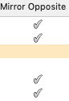
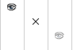

Some of you know me as Orso from the now defunct Vectorlab, I maintained it for many years. Here is the List Browsers article from the former Vectorlab site. For better understanding please use the comprehensive example at [Dialog with List Browser](Dialog%20with%20List%20Browser.md).

By --\_c\_ 01:31, 31 December 2020 (EST), 
previously Orso.B.Schmid, 2009-2018.


# List Browsers

List Browsers allow for great layout, advanced data management, but also amazing layout features within the single cells. It is not difficult to load them with some text data and make them display a whatever list. Still, the advanced settings of List Browsers are quite enigmatic. After years of trial and error, I attempt here to resume what I discovered. If you find an error, I'd be glad to be informed. I am a user and had no reference literature for this article which is based on pure experience; if you are a programmer you will probably find the terms employed not quite the right ones.

Since List Browsers are so complex, the best way to learn how to use them is to have some free code available for experiments. Free code for List Browsers can be counted on one hand and none of the snippets available tells you a single thing about Control Types, Edit Display Types, Item Display Types, Column Data Items and so on. 

Use the example [Dialog with List Browser](Dialog%20with%20List%20Browser.md) to experiment with the List Browser's options.

| [Part 1: Creation](List%20Browsers%20part%201.md) | [Part 2: Columns](List%20Browsers%20part%202.md) | [Part 3: Rows and Cells](List%20Browsers%20part%203.md) | [Part 4: Events](List%20Browsers%20part%204.md) |
|---|---|---|---|

## Introduction

The display of List Browsers is determined by the right combination of four settings: Control Type, Display Type, Cell's Column Owner, Column Data Items.

This is all rather difficult, especially because it is not documented. It resembles a 4D-puzzle.

| [Column Data Items](List%20Browsers%20part%202.md#column-data-items-list) |||
|---|---|---|
| Icons, Strings |  |  |
| [Column](List%20Browsers%20part%202.md#columns) || [Cell](List%20Browsers%20part%203.md#rows-and-cells) |
| [Control Type](List%20Browsers%20part%202.md#control-type) <br> display HOW | [Display Type](List%20Browsers%20part%202.md#display-type) <br> display WHICH DATA | [Column Owner Type](List%20Browsers%20part%203.md#column-owner-type) <br> display WHAT |
| - [Static](List%20Browsers%20part%202.md#static) <br> - [Radio](List%20Browsers%20part%202.md#radio) <br> - [Multi State](List%20Browsers%20part%202.md#multi-state) <br> - [Single Instance Icon](List%20Browsers%20part%202.md#single-instance-icon) <br> - [Static icon](List%20Browsers%20part%202.md#static-icon) <br> - [Number](List%20Browsers%20part%202.md#number) <br> - [Multiple Icons](List%20Browsers%20part%202.md#multiple-icons) |- Image <br> - Text only <br> - Image and Text | - [None](List%20Browsers%20part%203.md#none) <br> - [Solid rect](List%20Browsers%20part%203.md#solid-rect) <br> - [Dual solid rect](List%20Browsers%20part%203.md#dual-solid-rect) <br> - [Pattern rect](List%20Browsers%20part%203.md#pattern-and-dual-pattern) <br> - [Dual pattern rect](List%20Browsers%20part%203.md#pattern-and-dual-pattern) <br> - [Gradient or image](List%20Browsers%20part%203.md#gradients-and-images) <br> - [Blank](List%20Browsers%20part%203.md#blank) <br> - [Text](List%20Browsers%20part%203.md#text) <br> - [Dashed line](List%20Browsers%20part%203.md#dashed-line) |

| List Browser set up |
|---|
|
- [Create a List Browser](#create-a-list-browser) <br>
- [Create a List of Icons](#icon-list) (optional) <br>
- [Create columns](List%20Browsers%20part%202.md#columns) <br>
  - [Set Control Type](List%20Browsers%20part%202.md#control-type) (optional) <br>
  - [Set Display Type](List%20Browsers%20part%202.md#display-type) (optional) <br>
  - [Create a List of Column Data Items](List%20Browsers%20part%202.md#column-data-items-list) (optional) <br>
- [Insert rows](List%20Browsers%20part%203.md#rows-and-cells) <br>
&nbsp; For each row loop down all columns <br>
&nbsp; and set for each cell: <br>
  - [Column Owner Type](List%20Browsers%20part%203.md#column-owner-type) (optional) <br>
  - cell values: <br>
    - string and/or image, or <br>
    - item from a [List of Column Data Items](List%20Browsers%20part%202.md#column-data-items-list) (optional)


## Lists Validity Scope

List Browsers are more than tables of cells, they browse lists. You must imagine them like special containers with built-in lists of data which can be created and used on need. These lists have different validity scope.

- **List of icons:** available to the whole List Browser.
- **Column Data Items:** available to one column. Column Data Items will often use images from the List Browser's Image list, but they can also contain only strings.

## Create a List Browser

List Browsers are called in a Layout Creation routine with `CreateLB`.

```pascal
CreateLB(dialogID: LONGINT; listBrowserID: LONGINT; 
	widthInCharacters: INTEGER; heightInCharacters: INTEGER);
```

[CreateLB.md](../../../Function%20Reference/Functions/CreateLB.md) Creates an empty List Browser with no rows and no columns.

- **widthInCharacters, heightInCharacters:** is different between Mac and PC. Basically on Mac all dialog items with a scroll bar interpret the width excluding the bar. This will influence the width of dialog elements such as PullDown menus, List Browsers, Lists and such. These items won't align with Static Text, Edit fields and similar: the scroll bar will be outside alignment. You must correct the width programmatically.

### List Browsers in resizable dialogs

List Browsers are special dialog items with a built-in binding to their parent container. If a dialog is resizable, they resize width and height automatically, without any [SetEdgeBinding.md](../../../Function%20Reference/Functions/SetEdgeBinding.md). For this reason you'll prefer to leave List Browsers outside groups: they will fit beautifully to the dialog window without you to bother.

```pascal
dlog := CreateResizableLayout('List Browsers test', TRUE, 'Close', '', TRUE, FALSE);
{ ... }
CreateLB(dlog, lb, lbWidth, lbHeight);
```

## Load a List Browser

Your List Browser after creation is just an empty container without columns, rows or any data. Before loading the List Browser it is important to understand what needs to be loaded once and if there are things that needs to be loaded repeatedly, after destroying data. Aside of images, which must be really loaded only once, all other List Browser elements can be loaded, destroyed, created or modified according to your needs. The typical script will set up a List Browser once in [SetupDialogC.md](../../../Function%20Reference/Functions/SetupDialogC.md) and manipulate repeatedly only rows data. Usually you will:

- add [Icons](#icon-list) always only once
- add [Columns](List%20Browsers%20part%202.md#columns) most times once
- add [Column Data Items](List%20Browsers%20part%202.md#column-data-items-list) most times only once
- add/delete/modify [Rows and Cells](List%20Browsers%20part%203.md#rows-and-cells) repeatedly

Then you'll organize your loading code as follows:

- needs loading once --> has a place in the [SetupDialogC.md](../../../Function%20Reference/Functions/SetupDialogC.md) CASE item of your dialog driver routine
- needs loading repeatedly --> resides in a subroutine with wider validity scope (including [SetupDialogC.md](../../../Function%20Reference/Functions/SetupDialogC.md) for the first run).

### Items and Sub-items, index (0-based)

At start the main difficulty in understanding List Browsers is caused by the naming of the various routine parameters. Everyone will struggle initially with "itemIndex" and "subItemIndex", sometimes also called (more clearly) "columnIndex". The official documentation uses names not consequently. Just some examples:

- row index: itemIndex, nItemIndex
- column index: subItemIndex, nSubItemIndex, columnIndex

If you see both parameters for row and for column you know that you'll target a cell (intersection of row and column).

All indexes in List Browsers are 0-based:

- [Icons](#icon-list)
- [Column Data Items](List%20Browsers%20part%202.md#column-data-items-list)
- [Columns](List%20Browsers%20part%202.md#columns)
- [Rows and Cells](List%20Browsers%20part%203.md#rows-and-cells)

This implies that for setting the absence of an image -for example- you need to pass "-1". Take care to init your variables to -1. Mind the routine `AddListBrowserImage` which on Mac might return "0" also if it failed to insert an image.

Many mistakes in List Browsers are caused by unwanted 0-indexes in images or Column Data Items.

## Icon List

Very relevant for the layout of a List Browser is the list of icons (optional). Here you store small icons that will be available to the whole List Browser. The icons must be either loaded from external resource files or recycled from the built-in Vectorworks icons. They can be used directly from the singular cells and/or be used to build data in the List of Data Items of a column. An [Icon List](#icon-list) can be created using `AddListBrowserImage`. 

There is a single routine allowing to load icon resources without pre-loading them in the [Icon List](#icon-list) first: `SetLBImageIndexes`, which applies only to columns with control type Multiple Icons. 

To my knowledge, once loaded the original indexes of the icon-resources are lost: for example it's not possible to fetch the original resource index of icon "2" in the `Icon List` and substitute it with something else. This is only possible on Mac using columns of type Multiple Icons when they are loaded with `SetLBImageIndexes`, but I didn't try this with the new routine, only with its precursor: `AddLBImage` (obsolete).

It's also not possible to delete the image-list from the List Browser, once created. For this reason images must be loaded only once In [SetupDialogC.md](../../../Function%20Reference/Functions/SetupDialogC.md) and attention be paid that `AddListBrowserImage` doesn't land in any repetitive routine: this would add the same image over and over again, each time increasing the index count.

The sequence defined by adding images is not relevant if you need the icons for singular cells or for a List of Data Items, but becomes very important if your icons need to be displayed in Radio columns, since this control follows the insertion order of the [Icon List](#icon-list) precisely.

```pascal
AddListBrowserImage(dialogID: LONGINT; listBrowserID: LONGINT; imageSpecifier: DYNARRAY[] of CHAR): INTEGER;
```
[AddListBrowserImage.md](../../../Function%20Reference/Functions/AddListBrowserImage.md) Adds an image to the list of images that a list browser can use.

- **imageSpecifier:** the path to the image resource (since VW 2014), for example: 'Vectorworks/ResourceBrowser/WallStyle.png'.
  - I prefer to use icons from the application self, where there is a very large choice: loading resources from Vectorworks spares you the creation of your own resource file(s). The application ships with a huge number of icons and you always find something that fits your needs.

- **result (0-based):** the index of the newly inserted icon. This increases at each newly inserted icon. Once added, images cannot be deleted and stay with the List Browser until script ends. For this reason Images should be added to the List Browser only once. This is best done in the [SetupDialogC.md](../../../Function%20Reference/Functions/SetupDialogC.md) section of the dialog driver.
  - Since the index is 0-based you should remember later to use "-1" for telling cells not to use images. Whenever you see a routine allowing for an image index (for example [SetLBItemInfo.md](../../../Function%20Reference/Functions/SetLBItemInfo.md)) and you don't want an image to load, set the image index parameter to "-1". A typical mistake is to write "0", which will load the first image in the LB, if any loaded. If you didn't load images into your LB previously, you don't need to bother much.

### Use custom icons

- Create icons of size 16/16 px with a resolution of 72dpi.
- Save them as .png file
- Place them in the same folder where you have your plug-in .vsm file

See [Example: visibility toggle](#example-visibility-toggle) for a method to access them.

### Use icons from Vectorworks.app

You can use all images shipped in VectorworksXX.app. There are also images stored in the SDK libraries provided by the various plug-ins:
- on Mac
  - right-click on the application icon Vectorworks 20xx.app or any .vwlibrary file from the Plug-in Folder
  - select **Show Package Contents**
  - navigate to /Contents/Resources/xxx.vwr/Images
  - use the file path name without @2x and suffix
- on Win (to do)

### Example: selection toggle

The most frequent mistake in dealing with toggles, is to think that an icon list index is the same as a Column Data Item index. They are not the same list, so they might be the same only if the icon list is exactly identical with the Column Data Item list.

Example: 
- add 4 images to a list browser: pen, paint bucket, select and blank. The list sequence is 0, 1, 2, 3
- add 2 column data items to a column: select and blank. The index sequence is 0, 1, whereby img 0 and 1 correspond to 2 and 3 in the LB index.



```pascal
{ in the list browser setup, in SetupDialogC: }

{ add blank and selection images to a List Browser and index them: }
penLBindex := AddListBrowserImage(dlog, LB, 'Vectorworks/Attributes/Pen.png'); { sets icon index for pen, not in usage, only for extra index }
bucketLBindex := AddListBrowserImage(dlog, LB, 'Vectorworks/Attributes/PaintBucket.png'); { bucket, not in usage, only for extra index }
uncheckedLBindex := AddListBrowserImage(dlog, LB, 'Vectorworks/Standard Images/Blank.png'); { not selected, we use it later }
checkedLBindex := AddListBrowserImage(dlog, LB, 'Vectorworks/Standard Images/Checkmark.png'); { selected, we use it later }

{ during column creation : }
{ make a cell toggle status on click }
temp_b := SetLBControlType(dlog, LB, col, 3); { kLBctrMultiState }
temp_b := SetLBItemDisplayType(dlog, LB, col, 1); { kLBdispImageOnly }

{ upon click on a cell in this column, the value will toggle between "offIndex" and "onIndex" }
offIndex := InsertLBColumnDataItem(dlog, LB, col, '-', uncheckedLBindex, -1, 0);
onIndex := InsertLBColumnDataItem(dlog, LB, col, 'v', checkedLBindex, -1, 0);

{ variant: text-only toggle: }
{ temp_b := SetLBItemDisplayType(dlog, LB, col, 2); } { kLBdispTextOnly }
{ offIndex := InsertLBColumnDataItem(dlog, LB, col, '-', -1, -1, 0); }
{ onIndex := InsertLBColumnDataItem(dlog, LB, col, 'v', -1, -1, 0); }

{ ... }

{ while loading cell values: }
temp_b := SetLBItemUsingColumnDataItem(dlog, LB, row, col, onIndex); { set a cell to show as "selected"  }
temp_b := SetLBItemUsingColumnDataItem(dlog, LB, row, col, offIndex); { set a cell to show as "not selected"  }
```

### Example: visibility toggle

If you need to see the standard access to an image toggle, please first look at the example above. This example is a bit more complex than the previous and uses relative indexes. You prefer this approach to save on the amount of variables needed.

```pascal
{ add three images to a List Browser and index them: }
imgCnt := -1; { init }
imgVis := AddListBrowserImage(dlog, LB, 'Vectorworks/Standard Images/Visible');
imgInvis := AddListBrowserImage(dlog, LB, 'Vectorworks/Standard Images/Invisible');
imgGray := AddListBrowserImage(dlog, LB, 'Vectorworks/Standard Images/Gray');

{ Alternatively, store only the total count. Retrive them by offset to the count: }
imgCnt := -1; { init }
imgCnt := AddListBrowserImage(dlog, LB, 'Vectorworks/Standard Images/Visible');
imgCnt := AddListBrowserImage(dlog, LB, 'Vectorworks/Standard Images/Invisible');
imgCnt := AddListBrowserImage(dlog, LB, 'Vectorworks/Standard Images/Gray'); 

{ Or use your own icons : }
{ fetch the file path to the .vsm file }
IF (GetPluginInfo(pioName, pioRecordHandle)) & FindFileInPluginFolder(Concat(pioName, '.vsm'), pluginPath) THEN
	path2img := Concat(pluginPath, 'Imgs'); { path to a folder named 'Imgs' in your Plug-in folder }
	{ ... }

{ retrive your custom images during SetupDialogC }
imgCnt := -1; { init }
imgCnt := AddListBrowserImage(dlog, LB, Concat(path2img, '/Visible.png'));
imgCnt := AddListBrowserImage(dlog, LB, Concat(path2img, '/Invisible.png'));
imgCnt := AddListBrowserImage(dlog, LB, Concat(path2img, '/Gray.png')); 
```



Since we know that the list starts at zero and the counter always increases by 1, we store the final index in the variable "imgCnt". If something goes wrong, we have the needed "-1" value to declare the lack of images. To access them later we'll only need to subtract to this variable. You might prefer to access indexes in this fashion whenever your script uses only few images.


| [Part 1: Creation](List%20Browsers%20part%201.md) | [Part 2: Columns](List%20Browsers%20part%202.md) | [Part 3: Rows and Cells](List%20Browsers%20part%203.md) | [Part 4: Events](List%20Browsers%20part%204.md) |
|---|---|---|---|
