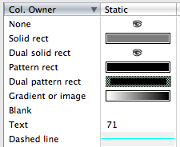

For better understanding please use the comprehensive example at [Dialog with List Browser](Dialog%20with%20List%20Browser.md).

By --\_c\_  03:08, 31 December 2020 (EST), previously Orso B. Schmid.

| [Part 1: Creation](./List%20Browsers%20part%201.md) | [Part 2: Columns](./List%20Browsers%20part%202.md) | [Part 3: Rows and Cells](./List%20Browsers%20part%204.md) | [Part 4: Events](./List%20Browsers%20part%204.md) |

# Columns

## Settings

After creating a list browser and, optionally, an [Icon List](./List%20Browsers%20part%201.md#icon-List), you can proceed adding columns to the List Browser. During column creation eventual modifiers can be added.

Please read [Working_with_VWListBrowserCtrl.md](https://github.com/Vectorworks/developer-sdk/blob/main/Info/Working%20with%20VWListBrowserCtrl.md) for more infos about controls and sorting.

| Column Settings | Modifiers | Column set up |
|---|---|---|
| - [Titles](#column-titles) <br> - [Column Lines](#column-lines) <br> - [Column Drag and Drop](#column-drag-and-drop) <br> - [Column Sorting](#column-sorting) <br> - [Hierarchical Display](#hierarchical-display) | - [Control Type](#control-type) <br> - [Display Type](#display-type) <br> - [Column Data Items List](#column-data-items-list) | Insert columns using **InsertLBColumn**. Set for each column: <br> - [Column Titles](#column-titles) <br> - if modifiers are needed, also set up: <br>   - [Control Type](#control-type) (optional) <br>   - [Display Type](#display-type) (optional) <br>   - [Column Data Items List](#column-data-items-list) (optional) <br> Outside any loop set for the whole List Browser: <br> - [Column Lines](#column-lines) (optional) <br> - [Column Drag and Drop](#column-drag-and-drop) (optional) <br> - [Column Sorting](#column-sorting) (optional) <br> - [Hierarchical Display](#hierarchical-display) (optional) |

## Create Columns

Most of the times you create columns only at dialog setup and in a loop. If you load the columns only once -because you won't delete columns later- this loop can be in [SetupDialogC](../../../VectorScript/pages/Creating%20a%20Custom%20Dialog%20Box.md). Nothing forbids you, though, to delete columns and redo them according to your script needs. In this case you'll have the column creation in a sub-routine callable on demand with a wider script scope (see usage of the subroutine `LB_CreateColumns` in the example [Dialog with List Browser](Dialog%20with%20List%20Browser.md);

```pascal
GetNumLBColumns( dialogID: LONGINT; listBrowserID: LONGINT): INTEGER;

InsertLBColumn( dialogID: LONGINT; listBrowserID: LONGINT; columnIndex: INTEGER; 
	headerString: STRING; width: INTEGER): INTEGER;
	
GetLBColumnWidth( dialogID: LONGINT; listBrowserID: LONGINT; columnIndex: INTEGER; 
	VAR width: INTEGER): BOOLEAN;
	
SetLBColumnWidth( dialogID: LONGINT; listBrowserID: LONGINT; 
	fromColumn: INTEGER; toColumn: INTEGER; width: INTEGER): BOOLEAN;
	
GetLBHeaderTextWidth(str: STRING; allowForSortIcon: BOOLEAN): INTEGER ;
```

- [`GetNumLBColumns`](../../../Function%20Reference/Functions/GetNumLBColumns.md) Count of columns present in a List Browser. You will use this call while adding or relating to columns. Remember to decrease the count of columns of -1, if you use it as column index reference, since -again- column indexes are 0-based.

- [`GetLBColumnWidth`](../../../Function%20Reference/Functions/GetLBColumnWidth.md), [`SetLBColumnWidth`](../../../Function%20Reference/Functions/SetLBColumnWidth.md) Manage col width.

- [`GetLBHeaderTextWidth`](../../../Function%20Reference/Functions/GetLBHeaderTextWidth.md) is pretty genial and returns the column width ''needed'' to fit the column title without resizing, not the active width.

- [`InsertLBColumn`](../../../Function%20Reference/Functions/InsertLBColumn.md)  Call InsertLBColumn for each column to be inserted, use the returned index for further column settings. Defaults upon creation are:
* **Control Type** [Static](#static) = 1
* **Display Type** [Text](#text) = 2 (Upon creation the Display type is "0", however the reason)

A column creates ready to display text which doesn't react on clicks. Any other display involves a resetting of [Control Type](#control-type) and [Display Type](#display-type).

|   |   |
|---|---|
| result (0-based) | index of the new column in the List Browser. |
| columnIndex | at which position in the List Browser the column should be inserted. |
| headerString | the column's title (string). The title aligns left by default. If a different alignment is needed it can be fixed later with [SetLBColumnHeaderJust](../../../Function%20Reference/Functions/SetLBColumnHeaderJust.md). |
| width | the width of the column. Can be modified anytime. Don't pass a zero width. |
| fromColumn, toColumn | the range of columns where the width should apply. Mind that the title leaves a large white space at the end. You should dimension columns rather large otherwise they won't display the whole title text. Use [GetLBHeaderTextWidth](../../../Function%20Reference/Functions/GetLBHeaderTextWidth.md) to dimension precisely the column width. |


```pascal
{ inserts columns with width 20 and loads as titles the alphabet from A to Z }
FOR i := 65 TO 90 DO
	col := InsertLBColumn(dialogID, listBrowserID, GetNumLBItems(dialogID, listBrowserID), Chr(i), 20); 
```


### Column Titles

Column titles cannot be changed after creation. The only solution is to destroy the column and recreate it. This can be done with [DeleteLBColumn](../../../Function%20Reference/Functions/DeleteLBColumn.md).

```pascal
SetLBColumnImage(dialogID, listBrowserID : LONGINT; 
	columnIndex, imageIndex : INTEGER) : BOOLEAN;
	
GetLBColumnHeaderJust( dialogID: LONGINT; listBrowserID: LONGINT; columnIndex: INTEGER; 
	VAR justification: INTEGER): BOOLEAN;
	
SetLBColumnHeaderJust( dialogID: LONGINT; listBrowserID: LONGINT; columnIndex: INTEGER; 
	justification: INTEGER): BOOLEAN;
	
GetLBColumnHeaderToolTip( dialogID: LONGINT; listBrowserID: LONGINT; columnIndex: INTEGER; 
	VAR toolTipPrimaryText: STRING; VAR toolTipSubText: STRING): BOOLEAN;

SetLBColumnHeaderToolTip( dialogID: LONGINT; listBrowserID: LONGINT; columnIndex: INTEGER; 
	toolTipPrimaryText: STRING; toolTipSubText: STRING): BOOLEAN;
	justification: INTEGER): BOOLEAN;
```

- [SetLBColumnImage](../../../Function%20Reference/Functions/SetLBColumnImage.md) Sets an image as column title.
- [GetLBColumnHeaderJust](../../../Function%20Reference/Functions/GetLBColumnHeaderJust.md), [SetLBColumnHeaderJust](../../../Function%20Reference/Functions/SetLBColumnHeaderJust.md) Modify the alignment of the column title.
- [GetLBColumnHeaderToolTip](../../../Function%20Reference/Functions/GetLBColumnHeaderToolTip.md), [SetLBColumnHeaderToolTip](../../../Function%20Reference/Functions/SetLBColumnHeaderToolTip.md) Gets/sets hovering tips for the column headers.

|   |   |
|---|---|
|__result__ | FALSE if the column index points to a column that doesn't exists. Note that the routine doesn't return false if the image index points to a missing icon.|
| __imageIndex__ | Use an icon as column title. This replaces the text, you cannot have both text and icon. The image must available in the List Browser's [Icon List](./List%20Browsers%20part%201.md#icon-List). |
| __Alignment Flags__ | *1 = Left <br> *2 = Center <br> *3 = Right |
|__ToolTip Flags__ | toolTipPrimaryText: text appearing on hovering over the column title. <br> toolTipSubText: text appearing pressing the cmd/alt (Mac/Win) key while hovering. |


### Column Lines

Column lines are the gray vertical lines drawn between each column. They are optional. Columns with control type [Radio](#radio) have an extra option for setting the sub-titles column lines.

```pascal
AreLBColumnLinesEnabled(dialogID: LONGINT; listBrowserID: LONGINT): BOOLEAN;

EnableLBColumnLines(dialogID: LONGINT; listBrowserID: LONGINT; 
	enableColumnLines: BOOLEAN);
	
AreLBRadioColumnLinesEnabled(dialogID: LONGINT; listBrowserID: LONGINT; columnIndex: INTEGER): BOOLEAN;

EnableLBRadioColumnLines(dialogID: LONGINT; listBrowserID: LONGINT; columnIndex: INTEGER; 
	enableRadioColumnLines: BOOLEAN);
```

- [AreLBColumnLinesEnabled](../../../Function%20Reference/Functions/AreLBColumnLinesEnabled.md), [EnableLBColumnLines](../../../Function%20Reference/Functions/EnableLBColumnLines.md) Checks/sets on/off status of column lines for a List Browser. Default: FALSE. Toggles the vertical column lines on/off. It affects a whole List Browser, so this call shall be kept outside repetitive routines. Usually it is called at the end of the List Browser setup routine. Don't confuse it with [EnableLBRadioColumnLines](../../../Function%20Reference/Functions/EnableLBRadioColumnLines.md).

- [AreLBRadioColumnLinesEnabled](../../../Function%20Reference/Functions/AreLBRadioColumnLinesEnabled.md) (only for control type [Radio](#radio)) Checks on/off status of the sub-column lines for a chosen radio column. Note that this applies to a column, not to the whole List Browser as AreLBColumnLinesEnabled.

- [EnableLBRadioColumnLines](../../../Function%20Reference/Functions/EnableLBRadioColumnLines.md) Default: FALSE. (only for control type [Radio](#radio)) Draws extra gray vertical lines for each sub-column in the chosen Radio column. For this to show you need:

* Column with control type [Radio](#radio)
* [Column Data Items List](#column-data-items-list)
This is applied on column index basis. Most of the times only a single Radio column is needed in a List Browser, so you'll choose to enable the radio vertical lines at the end of -and outside- the column creation loop (if any).


### Column Sorting

By default sorting is activated upon creating a List Browser, but it's possible to enable, disable and set sorting order (ascending or descending) during dialog execution.

```pascal
EnableLBSorting(dialogID: LONGINT; listBrowserID: LONGINT; enableSorting: BOOLEAN); 
IsLBSortingEnabled(dialogID: LONGINT; listBrowserID: LONGINT): BOOLEAN; 

GetLBSortColumn(dialogID: LONGINT; listBrowserID: LONGINT): INTEGER; 
SetLBSortColumn(dialogID: LONGINT; listBrowserID: LONGINT; columnIndex: INTEGER; isAscending: BOOLEAN); 

GetLBColumnSortState(dialogID: LONGINT; listBrowserID: LONGINT; columnIndex: INTEGER): INTEGER; 
EnableLBExternalSort(dialogID, listBrowserID: LONGINT; enable: BOOLEAN); { undocumented, new for VW 2021 }
```

Links to the present developer wiki: [EnableLBSorting](../../../Function%20Reference/Functions/EnableLBSorting.md), [EnableLBSorting](../../../Function%20Reference/Functions/EnableLBSorting.md), [EnableLBSorting](../../../Function%20Reference/Functions/EnableLBSorting.md), [EnableLBSorting](../../../Function%20Reference/Functions/EnableLBSorting.md), [EnableLBSorting](../../../Function%20Reference/Functions/EnableLBSorting.md), [EnableLBSorting](../../../Function%20Reference/Functions/EnableLBSorting.md) 

|   |   |
|---|---|
| Flags | -1 = not sorted by columnIndex <br> 0 = sorted by columnIndex |

A few observations:
* Sorting image cells is meaningless, you can disable it since it will only upset your user.
* Sorting numeric cells sort them alphabetically, see the cell ''Owner'' [Number](List%20Browsers%20part%202.md#number).
* Setting a sorting column by script unexpectedly (or not?) raises a List Browser event.
* [Hierarchical Display](#hierarchical-display) has a built-in Alpha sorting.
* Sorting must be thus disabled for [Hierarchical Display](#hierarchical-display) or you'll see a total mess.

```pascal
EnableLBSorting(dialogID: LONGINT; componentI LONGINT; 
	enableSorting: BOOLEAN);
```

[EnableLBSorting](../../../Function%20Reference/Functions/EnableLBSorting.md) Enables/disables sorting for a whole List Browser. Sorting is TRUE by default.

```pascal
GetLBColumnSortState( dialogID: LONGINT; componentID: LONGINT; 
	columnIndex:INTEGER):INTEGER;
```

[GetLBColumnSortState](../../../Function%20Reference/Functions/GetLBColumnSortState.md) Returns sorting state of a column.

```pascal
GetLBSortColumn( dialogID: LONGINT; componentID: LONGINT):INTEGER;
SetLBSortColumn( dialogID: LONGINT; componentID: LONGINT; columnIndex:INTEGER; 
	isAscending:BOOLEAN);
```

[GetLBSortColumn](../../../Function%20Reference/Functions/GetLBSortColumn.md), [SetLBSortColumn](../../../Function%20Reference/Functions/SetLBSortColumn.md) Returns or set the current sort column in a List Browser whose sorting is enabled.


### Column Drag and Drop

Drag and drop permits to the user to change order of the rows. This feature is disabled by default. Upon selecting a row and beginning a drag, the List Browser will wait for the user to drop it at some other position: it triggers user interaction.

```pascal
EnableLBDragAndDrop(dialogID: LONGINT; listBrowserID: LONGINT; enable: BOOLEAN): BOOLEAN; 
SetLBDragDropColumn(dialogID: LONGINT; listBrowserID: LONGINT; columnIndex: INTEGER): BOOLEAN; 
EnableLBDropOnIndices(dialogID, listBrowserID: LONGINT; iStartIndex, iEndIndex: INTEGER; bEnable: BOOLEAN): BOOLEAN; 
```

- [EnableLBDragAndDrop](../../../Function%20Reference/Functions/EnableLBDragAndDrop.md), [EnableLBDropOnIndices](../../../Function%20Reference/Functions/EnableLBDropOnIndices.md) The column involved in the drag and drop must have control type [Number](#number) set with [SetLBControlType](../../../Function%20Reference/Functions/SetLBControlType.md). Disabling a row index only prevents rows to be dropped on the item, not the row to be moved. The values don't have to be numbers, can be loaden with strings.

- [SetLBDragDropColumn](../../../Function%20Reference/Functions/SetLBDragDropColumn.md) By default all rows accept dropping. With this call is possible to disable, or re-enable, some rows from dropping. Notice that it targets rows, not columns.

|   |   |
|---|---|
| result | always TRUE, like ''SetLBDragDropColumn''. Simply pass the result to a temporary boolean variable that you can trash. |
| iStartIndex, iEndIndex | range of rows where dropping is disabled. |

```pascal
{ set up list browser }
temp_b := EnableLBDragAndDrop(dlog, lb, TRUE);
temp_b := SetLBDragDropColumn(dlog, lb, col);

{ set up column }
temp_b := SetLBControlType(dlog, lb, col, 6); { control type: number }
temp_b := EnableLBDropOnIndices(dlog, lb, 0, GetNumLBItems(dlog, lb), TRUE);

{ Supposing to have a LB with 2 rows, in order to avoid them to be moved before 1st item or after last item use this: }
temp_b := EnableLBDropOnIndices(dlog, lb, -1, 2, FALSE);
{ 
two rows
row index: 0 and 1
-1 is before row 0, 
2 is after row 1
}
```


### Hierarchical Display

Manages the display of rows containing strings with the character "-", such as the class list in the Organisation dialog. You decide which column is to be turned into hierarchical, all strings therein will indent after the character "-". 

There is a stand-alone example at [Example: hierarchical class list](#example-hierarchical-class-list)

```pascal
IsLBDisplayHier(dialogID: LONGINT; listBrowserID: LONGINT): BOOLEAN; 
SetLBHierDispColumn(dialogID: LONGINT; listBrowserID: LONGINT; columnID: INTEGER); 
EnableLBHierDisplay(dialogID, listBrowserID: LONGINT; enableHierDisplay: BOOLEAN); 

HierLBItemIsContain(dialogID: LONGINT; listBrowserID: LONGINT; rowIndex: INTEGER): BOOLEAN; 
HierLBItemOpened(dialogID: LONGINT; listBrowserID: LONGINT; rowIndex: INTEGER; recursive: BOOLEAN; VAR numbRedisplItems: INTEGER); 
HierLBItemClosed(dialogID: LONGINT; listBrowserID: LONGINT; rowIndex: INTEGER; recursive: BOOLEAN); 
HierLBItemIsClosed(dialogID: LONGINT; listBrowserID: LONGINT; rowIndex: INTEGER): BOOLEAN; 
ExpandAllLBItems(dialogID, listBrowserID: LONGINT); 
CollapseAllLBItems(dialogID: LONGINT; listBrowserID: LONGINT); 

GetLBItemOrigName(dialogID: LONGINT; listBrowserID: LONGINT; rowIndex: INTEGER): STRING; 
AddLBOriginalName(dialogID: LONGINT; listBrowserID: LONGINT; originalName: STRING); 
GetLBOrigNameClLevel(dialogID: LONGINT; listBrowserID: LONGINT; originalName: STRING; VAR level1Closed: BOOLEAN; VAR level2Closed: BOOLEAN; VAR level3Closed: BOOLEAN); 
SetLBOrigNameClLevel(dialogID: LONGINT; listBrowserID: LONGINT; originalName: STRING; level1Closed: BOOLEAN; level2Closed: BOOLEAN; level3Closed: BOOLEAN); 
```

- [`GetLBItemOrigName`](../../../Function%20Reference/Functions/GetLBItemOrigName.md) Returns the complete name including dividers, for example: "Class Name-Element" whereby the cell displays only the string "Element". All display alpha sorted. 

For this to work you need:
* **Control Type**: [Static](#static). Not **Disclosure Triangle**! The disclosure triangles seem to be built-in and appear all by themselves as soon as you toggle **EnableLBHierDisplay** on.
* **Display Type**  [Image and text](#image-and-text): shows disclosure triangles in both open or closed state together with the string.
* [EnableLBHierDisplay](../../../Function%20Reference/Functions/EnableLBHierDisplay.md): to be set ''after'' loading the rows, or the hierarchical display won't show at all.
* [EnableLBSorting](../../../Function%20Reference/Functions/EnableLBSorting.md) = FALSE: or the hierarchical display will mess up completely.


## Column Data Items List

If you're not a programmer -like me-, you'll struggle quite a bit to understand what Data Items are and above all what they do: they are items in a list of data. This list is available to the column where it's defined.

Whenever you start using List Browsers, soon or later you have the burning wish to coerce cells to a certain list of values. If you could, you'd just love to insert a pull-down menu in your cell, perhaps one with images in it, but this is not possible. You have ''Column Data Items List'' instead. These, once defined, are available column-wide. With ''Column Data Items List'' you can coerce all cells in a column to show only values present in a list. Each list element is a ''Column Data Item''.

 For example you could wish to pair the string "visible" with the black-eye icon, an item "invisible" with the cross icon and "grayed" with the grayed-eye icon. For each you need to create one Data Item using [InsertLBColumnDataItem](../../../Function%20Reference/Functions/InsertLBColumnDataItem.md) (and you already loaded the icons in the List Browser's [Icon List](./List%20Browsers%20part%201.md#icon-List) through [AddListBrowserImage](../../../Function%20Reference/Functions/AddListBrowserImage.md)).

Not all column's Control Types manage these lists, but for those who do, you will observe that cells using ''Column Data Items List'' will stop being free and only display a range of Data Items values. For example: "visible, invisible, grayed" and/or show the respective images on user's click.

The sequence in which you create the data items is relevant. ''Column Data Items List'' build an indexed list whose order is used by the columns where you apply them. The behavior of your cells depends on the column's [Control Type](#control-type). Moreover is influenced by the chosen column's [Display Type](#display-type). The only exception is the control [Radio](#radio), which uses the insertion order of the [Icon List](./List%20Browsers%20part%201.md#icon-List).

To fetch values from a cell using Column Data Items there is no dedicated call, you use **GetLBItemInfo** and parse string and/or image, but you must resolve the Data Item indexes. The needed approach is rather indirect. Please see [Cells with Column Data Items](./List%20Browsers%20part%203.md#cells-with-column-data-items).

__On-click behavior__: you can distinguish among column's controls which display their list of ''Column Data Items List'' on click and those who don't. All cells can be loaded with one ''Column Data Item'' using [SetLBItemUsingColumnDataItem](../../../Function%20Reference/Functions/SetLBItemUsingColumnDataItem.md), but only cells whose columns belong to [Multi State](#multi-state) and [Single Instance](List%20Browsers%20part%202.md#single-instance-icon) will toggle Data items on click (even if they weren't pre-loaded using [SetLBItemUsingColumnDataItem](../../../Function%20Reference/Functions/SetLBItemUsingColumnDataItem.md)). Radio columns do this too, but are a world on their own, please see [Radio](#radio).

''Column Data Items List'' are to be used only on columns with control type [Multi State](#multi-state), [Single Instance](List%20Browsers%20part%202.md#single-instance-icon) or [Radio](#radio). And -stating the obvious- you have no reason whatsoever to use these controls without ''Column Data Items List''. But in rare circumstances you might find comfortable to store hidden data in ''Column Data Items List'' just to be able to fetch it on need even from columns whose click-response is not available, like Static.

__Control [Multi State](#multi-state) or [Single Instance](List%20Browsers%20part%202.md#single-instance-icon)__: you should always pre-load cells using with this control type with [SetLBItemUsingColumnDataItem](../../../Function%20Reference/Functions/SetLBItemUsingColumnDataItem.md) in order to have proper start values. Don't use [SetLBItemInfo](../../../Function%20Reference/Functions/SetLBItemInfo.md). This is particularly important for cells whose column has control type Single Instance Icon. Under circumstances you'll like to pre-load an empty image.

__Control [Radio](#radio)__: it has the peculiar behavior to load all images starting with the first defined in the [Icon List](./List%20Browsers%20part%201.md#icon-List), unregarded the icon indexes passed in [InsertLBColumnDataItem](../../../Function%20Reference/Functions/InsertLBColumnDataItem.md). It can only display images ignoring text altogether.


| Control Type | Display Type | Response on click |
|--------------|--------------|-------------------|
| **[Static](#Static)** || <em>doesn't respond</em> |
| **[Radio](#Radio)** | - [Image](#image)<br>- [Text and Image](#text-and-image) | Shows multiple choices with icons, creates a sub-column for each call to [Manage the Data Items List](#Column-Data-Items-List) ([InsertLBColumnDataItem](../../../Function%20Reference/Functions/InsertLBColumnDataItem)), although it displays the [Icons](./List%20Browsers%20part%201.md#icon-List), in a sequence. Upon clicking on a sub-column, the image corresponding to the sub-column index (0-based) will show. Is unable to display text. |
| **[Multi State](#multi-state)** | - any | At each click displays the next Data Item by index in the list. |
| **[Single Instance Icon](List%20Browsers%20part%202.md#single-instance-icon)** | - any | Upon clicking in a cell display "item 1" of the *Data Item list*. Any previous selection will be set to "item 0" in the list. Thus you'll have one single instance of item 1 in a whole column. For this control you need only two Column Data Items List, the others don't display. |
| **[Static Icon](#static-icon)** || <em>doesn't respond</em> |
| **[Number](#Number)** || <em>doesn't respond</em> |
| **[Multiple Icons](#multiple-icons)** || <em>doesn't respond</em> |
| **[Disclosure Triangle](#Disclosure-Triangle)** || <em>doesn't respond</em> |

### Manage the Data Items List

Data Items are lists of elements (strings, images or both) available for a chosen column.

```pascal
InsertLBColumnDataItem(dialogID: LONGINT; listBrowserID: LONGINT; columnIndex: INTEGER; 
	itemString: STRING; imageOn: INTEGER; imageOff: INTEGER; itemData: LONGINT): INTEGER;

GetNumLBColumnDataItems( dialogID: LONGINT; listBrowserID: LONGINT; columnIndex: INTEGER): INTEGER; 
	
GetLBColumnDataItemInfo( dialogID: LONGINT; listBrowserID: LONGINT; columnIndex: INTEGER; 
	columnDataItemIndex: INTEGER; 
	VAR itemString: STRING; VAR imageOn: INTEGER; VAR imageOff: INTEGER; VAR itemData: LONGINT): BOOLEAN;
	
FindLBColumnDataItem( dialogID: LONGINT; listBrowserID: LONGINT; columnIndex: INTEGER; itemString: STRING; 
	VAR columnDataItemIndex: INTEGER): BOOLEAN;
	
RemoveLBColumnDataItem( dialogID: LONGINT; listBrowserID: LONGINT; columnIndex: INTEGER; 
	columnDataItemIndex: INTEGER): BOOLEAN;
	
RemoveAllLBColumnDataItems( dialogID: LONGINT; listBrowserID: LONGINT; columnIndex: INTEGER);
```

- [InsertLBColumnDataItem](../../../Function%20Reference/Functions/InsertLBColumnDataItem.md) Inserts one Data Item in the list for the chosen column. You will repeat the call for each Item to be inserted in your Column Data Items List.
- [GetLBColumnDataItemInfo](../../../Function%20Reference/Functions/GetLBColumnDataItemInfo.md), [FindLBColumnDataItem](../../../Function%20Reference/Functions/FindLBColumnDataItem.md), [RemoveLBColumnDataItem](../../../Function%20Reference/Functions/RemoveLBColumnDataItem.md), [RemoveAllLBColumnDataItems](../../../Function%20Reference/Functions/RemoveAllLBColumnDataItems.md)

|   |   |
|---|---|
| result (0-based) | index of the newly inserted Data Item. Most of the times is advisable to store only the start or end value of a Data Item List and use that adding or subtracting needed indexes. You might prefer this approach instead of storing singular Item indexes. |
| itemString | the string attached to this index of Column Data Item. MUST be defined otherwise the item doesn't insert in the List. <br> * [Multi State](#multi-state), [Single Instance Icon](List%20Browsers%20part%202.md#single-instance-icon): you can decide to create a Data Item containing only strings setting both "imageOn" and "imageOff" to "-1". <br> * [Radio](#radio): no string support, but the string must be nevertheless defined. |
| imageOn | is an icon index of the [Icon List](./List%20Browsers%20part%201.md#icon-List), the image to be triggered on user's click. Set to "-1" to make image undefined. <br> * [Multi State](#multi-state) : the icon shown when selecting a cell. At each further click, the next image in the list will be displayed. When the list has reached the end, the whole begins anew from the start. <br> * [Single Instance Icon](List%20Browsers%20part%202.md#single-instance-icon): on click shows image index 1. Any other selection shows image index 0. <br> * [Radio](#radio): see dedicated chapter. |
| imageOff | is an icon index of the [Icon List](./List%20Browsers%20part%201.md#icon-List), the image to be triggered on deselection. Set to "-1" to make the icon undefined. <br> * [Radio](#radio): set this in alternative to imageOn. You shouldn't have both "imageOn" and "imageOff" defined in a single call to InsertLBColumnDataItem. See [Radio](#radio). <br> * [Multi State](#multi-state) and [Single Instance Icon](List%20Browsers%20part%202.md#single-instance-icon): don't support "imageOff". |
| itemData | elsewhere called "User data". No idea how to use this. If you set something here it will block toggles, if the Longint passed exceeds the [Icon List](./List%20Browsers%20part%201.md#icon-List). See User Data. |
| Notes | If you don't want to load images pass "-1" to the parameters "imageOn" and "imageOff". Here is to be noted that: <br> * [Multi State](#multi-state) and [Single Instance Icon](List%20Browsers%20part%202.md#single-instance-icon) columns: ignore the "-1" and show the last valid image previously defined. If no images has been defined at all, the cells show nothing. <br> * [Radio](#radio) columns: show white space <br> * [Multi State](#multi-state) and [Single Instance Icon](List%20Browsers%20part%202.md#single-instance-icon) add the images according to the index passed in the parameter "imageOn". [Radio](#radio) columns add them according to the [Icon List](./List%20Browsers%20part%201.md#icon-List)'s index corresponding to the count of calls of the routine InsertLBColumnDataItem. This has been damn tough to find out. <br> (only [Radio](#radio)) If you load the parameter "imageOff" you should leave "imageOn" to "-1". Then it will display the image defined for off. If you define both, you'll have "imageOn" permanently visible both on selection and not. All other control types (supporting Column Data Items List) will only use imageOn. |

## Display Type

The **Display Type** determines which type of content a column should show: **Text only**, **Image**, or **Text and Image**. Image means here **Icon**. What you see at the end depends on the column's [Control Type](#control-type), if [Column Data Items List](#column-data-items-list) are setup or not, not last it depends on the [Cell Owner Type](List%20Browsers%20part%203.md#column-owner-type) of the singular cell. The Display Type choice applies to all cells in a column. Default upon column creation is ''Text only''.

__Note__: The documentation lists ''Item'' and ''Edit'' Display Type. They used to behave differently, but starting with VW 2017 Item and Edit Display seem to be the same, tested up to VW 2021.
: Control type Radio is indifferent to both Item and Edit Display: it can only display Images.
: in the documentation the Display Type **Text Only** is **0**, but this is only valid on **Get**. Upon **Set** the value to be used is **2**. 


| Display Type | Description |
|---|---|
| **1-Image** | shows only an image <br>  |
| **2-Text only** (Set), **0-Text only** (Get) | shows only text <br>  |
| **3-Image and Text** | shows both image and text <br>  |

| Control Types |
|---|
| Display Type setting needed | no setting needed |
| 1 Static <br> 6 Number <br> 3 Multi State <br> 4 Single Instance <br> 5 Static Icon <br> 7 Multiple Icons | 2 Radio |


```pascal
{ display type flags: }
kLBdisplTypeText	= 0; { valid for Get! }
kLBdispImageOnly	= 1;
kLBdispTextOnly		= 2; { valid for Set! }
kLBdispImageAndText	= 3;

{ same as Item Disply starting from VW 2017 }
GetLBEditDisplayType( dialogID: LONGINT; listBrowserID: LONGINT; columnIndex: INTEGER): INTEGER;
SetLBEditDisplayType( dialogID: LONGINT; listBrowserID: LONGINT; columnIndex: INTEGER; 
	displayType: INTEGER): BOOLEAN;

{ same as Edit Disply starting from VW 2017 }
GetLBItemDisplayType( dialogID: LONGINT; listBrowserID: LONGINT; columnIndex: INTEGER): INTEGER;
SetLBItemDisplayType( dialogID: LONGINT; listBrowserID: LONGINT; columnIndex: INTEGER; 
	displayType: INTEGER): BOOLEAN;
```

- [GetLBEditDisplayType](../../../Function%20Reference/Functions/GetLBEditDisplayType.md), [SetLBEditDisplayType](../../../Function%20Reference/Functions/SetLBEditDisplayType.md) Radio columns ignore them.


### Image ###

Display all cells in the chosen column as image. Ignored by [Radio](#radio)

 


### Text ###

Display all cells in the chosen column as text. Ignored by [Radio](#radio)

 


### Image and Text ###

Display all cells in the chosen column as text with an image on the left. Ignored by [Radio](#radio). Needed by [Disclosure Triangle](#disclosure-triangle).


## Control Type

The **Control Type** determines how a column will react to the user. Nevertheless, in order to achieve the desired effect, you must combine control types with the appropriate [Display Type](#display-type) (text only, icon only, text and icon). The Control Type and related Display Type choice depends on the kind of content that you mean to display in the column: picking from a List of Column Data Item or not. The default control type upon column creation is "1" = **Static**.

It's not always necessary to set a control type, only when the default value Static is not sufficient, that is, whenever you need special facilities for using a Column Data Items List. The control type can be changed any time after column insertion using **SetLBControlType**.


| Control Type | [Display Type](#display-type) | needs | is good for |
|---|---|---|---|
| 1- [Static](#static) | required | - | Text, simple icons, color cells, line style cells, thumbnail cells |
| 2- [Radio](#radio) | ignores it | [Column Data Items List](#column-data-items-list) |** Multiple options** with clickable icons. Can only do this.|
| 3- [Multi State](#multi-state) | required | [Column Data Items List](#column-data-items-list) | **Multiple toggles on click** of Column Data Items List, otherwise like Static|
| 4- [Single Instance Icon](List%20Browsers%20part%202.md#single-instance-icon) | required | [Column Data Items List](#column-data-items-list) with 2 items | **On-off toggle on click** of two Column Data Items, otherwise like Static|
| 5- [Static Icon](#static-icon) | required | - | **Icon from Column Data Items List**, otherwise like Static|
| 6- [Number](#number) | required | - | **Numbers**, otherwise like Static|
| 7- [Multiple Icons](#multiple-icons) | required | Icon Resources from external file | **Multiple icons** in one cell, without preloading in the [Icon List](./List%20Browsers%20part%201.md#icon-List), otherwise like Static (Mac only)|
| 8- [Disclosure Triangle](#disclosure-triangle) | [Image and Text](#image-and-text) | - | **Disclosure Triangle** to recreate Hierarchical Displays|


```pascal
{ control type flags }
kLBctrNone = 1; { Static }
kLBctrRadio = 2;
kLBctrMultiState = 3;
kLBctrSingleInstance = 4;
kLBctrNoClick = 5; { Static icon }
kLBctrNumber = 6;
kLBctrMultipleImages = 7; { Use with kLBdispImageOnly }
kLBctrDiscTriangl = 8; { introduced by VW 17, 2012, Use with kLBdispImageAndText }
	
temp_b := SetLBControlType(dlog, LB, colNr, controlType);
```

[SetLBControlType](../../../Function%20Reference/Functions/SetLBControlType.md) Sets the behaviour of all cells in a column.

|   |   |   |
|---|---|---|
| result | returns FALSE if <br> * no columns are present in the List Browser <br> * you try to set the control type on a column whose control is already set to the value "controlType" passed in the routine. For this reason is not advisable to code depending on the TRUE result of this routine. For example: set the Display Type if SetLBControlType returns TRUE. It will fail to change the display simply because the control was already set as you wish. Just assign the result of SetLBControlType to a temporary boolean variable which you'll trash. |
| controlType | expects one of following flags <br> * kLBctrNone = 1; { Static } <br> * kLBctrRadio = 2; <br> * kLBctrMultiState = 3; <br> * kLBctrSingleInstance = 4; <br> * kLBctrNoClick = 5; { Static icon } <br> * kLBctrNumber = 6; <br> * kLBctrMultipleImages = 7; { Use with kLBdispImageOnly } <br> * kLBctrDiscTriangl = 8; { introduced by VW 17, 2012, Use with kLBdispImageAndText } |
| Note | the three ''Control Types'' **Radio**, **Multi State**, **Single Instance Icon** only work properly if associated to a List of [Column Data Items List](#column-data-items-list). |

Inside the dialog event handling these types don't even return an active control without a list, not even the expected "-1". Experiment with the generic routine [GetActiveEditItem](../../../Function%20Reference/Functions/GetActiveEditItem.md) passing the dialog ID, try with and without Column Data Items List associated to the column. 


### Static



Static is the default control upon column creation. Sometimes also called ''None'' (not to be mistaken for the [Cell Owner None](List%20Browsers%20part%203.md#column-owner-type). It displays well anything excluding toggles (Column Data Items). In fact it can display them too, but only statically, no toggle on user's click, thus its name, I suppose. Using Data Items here make this control nearly identical to Static Icon.

This control is the good choice for **text**, simple **icons**, resource **thumbnails**, **colored cells**, **line styles**. Numbers should instead be created with a control type **Number**, since that offers a few more targeted facilities.

__For this to work you need__: nothing. But a few observations can be made as to the display:
* **Display Type** [Image](#image): shows an icon (if loaded in the [Icon List](./List%20Browsers%20part%201.md#icon-List)) or attribute cell
* **Display Type** [Text](#text): shows only text (really no good for attribute cells: infamous "AAAAA string" if you didn't set the cell's owner at the right place of your code)
* **Display Type** [Text and Image](#text-and-image): shows both icon and text (even worse for attribute cells)

Use it for columns whose cells have the following [Owner Types](List%20Browsers%20part%203.md#column-owner-type):
* **None** (default) --> load cells with [SetLBItemInfo](../../../Function%20Reference/Functions/SetLBItemInfo.md)
* **Text** --> load cells with [SetLBItemInfo](../../../Function%20Reference/Functions/SetLBItemInfo.md)
* **Solid Rect** and **Dual solid rect** --> load cells with the [Color routines](List%20Browsers%20part%203.md#color-cells)
* **Gradients and Images** --> load cells with [Indexed Resources Routines](List%20Browsers%20part%203.md#Indexed Resources)
* **Dashed line** --> load cells with [Color](List%20Browsers%20part%203.md#Color Cells) and [Line Styles routines](List%20Browsers%20part%203.md#line-styles)


### Radio


Used to display multiple choices as sub-columns of icons, triggered on click. Compared to the other controls, it's a radical modifier with following peculiarities:
* ignores any string (expected).
* ignores Display Types (expected).
* displays icons always according to the sequence defined in the [Icon List](./List%20Browsers%20part%201.md#icon-List), ignoring the indexes passed in the parameter "imageOn" in the Data Items List. For each sub-column to be created a call to [InsertLBColumnDataItem](../../../Function%20Reference/Functions/InsertLBColumnDataItem.md) must be performed. Each call matches the sub-column to the corresponding index from the [Icon List](./List%20Browsers%20part%201.md#icon-List). It means that you cannot "shuffle" the order set in the [Icon List](./List%20Browsers%20part%201.md#icon-List) and must plan the insertion order of the icons in the [Icon List](./List%20Browsers%20part%201.md#icon-List) carefully. This behavior is unique among Column Data Item aware control types.

__For this to work you need__: 
* [Icon List](./List%20Browsers%20part%201.md#icon-List) : at least two images in the list.
* [Column Data Items List](#column-data-items-list) : create two or more items.
* [Cell Owner](List%20Browsers%20part%202.md#owner): <anything>: is always ignored.
* Use [SetLBItemUsingColumnDataItem](../../../Function%20Reference/Functions/SetLBItemUsingColumnDataItem.md) for loading cell values, not [SetLBItemInfo](../../../Function%20Reference/Functions/SetLBItemInfo.md)
* Use [Column Lines](#column-lines) for setting up optional ''Radio Column Lines'' for the sub-columns


```pascal
InsertLBColumnDataItem( dialogID: LONGINT; listBrowserID: LONGINT; columnIndex: INTEGER; 
	itemString: STRING; imageOn: INTEGER; imageOff: INTEGER; itemData: LONGINT): INTEGER;
```
[InsertLBColumnDataItem](../../../Function%20Reference/Functions/InsertLBColumnDataItem.md) Inserts one sub-column in the Radio column. You will repeat the call for each Column Data Item to be inserted in your list. Each created sub-column corresponds to the same index of the [Icon List](./List%20Browsers%20part%201.md#icon-List).

For example: passing icon index "5" in the first call to **InsertLBColumnDataItem** won't load that icon in the first sub-column. The icon displayed on click will be index "0" (first item in the [Icon List](./List%20Browsers%20part%201.md#icon-List)).

|   |   |
|---|---|
| itemString | is ignored but must be defined, otherwise the sub-column doesn't generate. |
| imageOn | is an icon stored in the [Icon List](./List%20Browsers%20part%201.md#icon-List): the icon to be shown on column selection. The index passed to "imageOn" can be anything within the range "0 - countOfIcons" in the [Icon List](./List%20Browsers%20part%201.md#icon-List). Set to "-1" to make it undefined. |
| imageOff | is an icon stored in the [Icon List](./List%20Browsers%20part%201.md#icon-List): the icon to be shown upon de-selection. Set to "-1" to make the icon undefined. Use "imageOff" only as alternative to '"imageOn". You shouldn't have both "imageOn" and "imageOff" defined in a single call to InsertLBColumnDataItem otherwise "imageOn" displays permanently. Using "imageOff" instead of "imageOn" it will display "imageOff" on deselection. |


#### Example - cryptical subcolumns count ####


How many sub-columns does this generate? And what do they do?

```pascal
{ sub-col 0 } dataItemCnt := InsertLBColumnDataItem(dlog, LB, col, 'imageOn-0', gImg, -1, 0);
{ sub-col 1 } dataItemCnt := InsertLBColumnDataItem(dlog, LB, col, 'no images', -1, -1, 0); { string only }
{ sub-col 2 } dataItemCnt := InsertLBColumnDataItem(dlog, LB, col, '', gImg+2, -1, 0); { will be ignored: no string }
{ sub-col 3 } dataItemCnt := InsertLBColumnDataItem(dlog, LB, col, 'imageOn-1', gImg +1, -1, 0);
{ sub-col 4 } dataItemCnt := InsertLBColumnDataItem(dlog, LB, col, 'imageOff-1', -1, gImg+1, 0);
{ sub-col 5 } dataItemCnt := InsertLBColumnDataItem(dlog, LB, col, 'imageOn-0', gImg, -1, 0);
{ sub-col 6 } dataItemCnt := InsertLBColumnDataItem(dlog, LB, col, '', -1, -1, 0); { will be ignored: no string }
{ sub-col 7 } dataItemCnt := InsertLBColumnDataItem(dlog, LB, col, 'imageOff-2', -1, gImg+2, 0);
{ sub-col 8 } dataItemCnt := InsertLBColumnDataItem(dlog, LB, col, '', gImg+1, -1, 0); { will be ignored: no string }
{ sub-col 9 } dataItemCnt := InsertLBColumnDataItem(dlog, LB, col, 'no images', -1, -1, 0); { string only }
```

Passing the same imageOn over and over still make the Radio column display the full Icon List sequence:

```pascal
dataItemCnt := InsertLBColumnDataItem(dlog, LB, col, 'try0', 2, -1, 0);
dataItemCnt := InsertLBColumnDataItem(dlog, LB, col, 'try1', 2, -1, 0);
dataItemCnt := InsertLBColumnDataItem(dlog, LB, col, 'try2', 2, -1, 0);
dataItemCnt := InsertLBColumnDataItem(dlog, LB, col, 'try3', 2, -1, 0);
```


### Multi State


For **Multi State** you won't notice the difference until a [Column Data Items List](#column-data-items-list) is used, in absence of which it behaves like **Static**. If Column Data Items List are loaded in form of string or images (or both) the cell will loop down all items at each user's click. Multi State justifies the name "List Browser": it browses the list (... of Column Data Items List). You'll use it when you wish to restrict the available choices to a controlled range.

Proper Column Data Items List should be pre-loaded in each cell using [SetLBItemUsingColumnDataItem](../../../Function%20Reference/Functions/SetLBItemUsingColumnDataItem.md) in the row creation routine.

__For this to work you need__:
* [Column Data Items List](#column-data-items-list): must be set to two or more items. You can toggle strings and images. At each user's click the cell changes to the next item in the list.
* **Display Type** [Image](#image): toggles images starting from the index position currently valid in the cell
* **Display Type** [Text](#text): like above, but toggles text strings
* **Display Type** [Text and Image](#text-and-image): like above, but toggles both text and images
* [Cell Owner None](List%20Browsers%20part%203.md#column-owner-type) (default) is a good choice
* Use [SetLBItemUsingColumnDataItem](../../../Function%20Reference/Functions/SetLBItemUsingColumnDataItem.md) for loading cells, not [SetLBItemInfo](../../../Function%20Reference/Functions/SetLBItemInfo.md)


### Single Instance Icon


**Single Instance** is another [Column Data Items List](#column-data-items-list)' toggle. Also behaves as **Static** if no Data Items are used. Seems bizarre at first. You'll use it when you need a single instance of data to be present in a whole column, for example an icon marking the currently -only- active layer. Unregarded the definition, you can also use if for text strings. A NNA example of its usage can be seen in the Organization Dialog > Classes, when the option "Details" is on: is the selection icon on the left of the class names.

It has a built-in **Single line Selection** enabled: you can't select multiple rows when you click on a cell belonging to a Single Instance column. As soon as you click on a cell it will set the value to the next item defined in the Items list of the parent column. By clicking, the cell previously selected will be assigned the first Item.

__For this to work you need__:
* [Column Data Items List](#column-data-items-list): must be set to at least two items. You can toggle strings and images. Any Data Item after index "1" (the second in the list) will be ignored.
* **Display Type** [Image](#image): toggles images from index "0" to "1"
* **Display Type** [Text](#text): like above, but toggles text strings
* **Display Type** [Text and Image](#text-and-image): like above, but toggles both text and images
* [Cell Owner None](List%20Browsers%20part%203.md#column-owner-type) (default) is a good choice
* Use [SetLBItemUsingColumnDataItem](../../../Function%20Reference/Functions/SetLBItemUsingColumnDataItem.md) for loading cells, not [SetLBItemInfo](../../../Function%20Reference/Functions/SetLBItemInfo.md)

This will only work well if you really make sure to init the cells to proper values. The problem is when there wasn't a previous selection (just after launch for example) and the cells are set to a value whose appearance is not that of the Column Data Items List: all cells in the Single Instance column should be initialized to the 1st Column Data Item, but one, which will get the 2nd.

Since you know that all cells in the Single Instance column will (should) have the same value but one, you can search it securely using [FindLBColumnItem](../../../Function%20Reference/Functions/FindLBColumnItem.md).


### Static Icon


**Static Icon** is a [Column Data Items List](#column-data-items-list)' control. As usual behaving like **Static** if no **Data Items** are used. This control is sometimes called **No click**, which in this case is a good hint to the functionality that it triggers in its cells: it displays a single Data Item without allowing for any user interaction on click. As a whole it behaves absolutely the same as Static when passing to it a Data Item index (no click toggles).

The only difference that I could discover is that Static Icon cells send on click an event "-2" which I believe to be indicative of "Data-Items-awareness" while Static won't ever do it. The finesse of this control type is too much for me and I never used it. I'd love to know more about it.

__For this to work you need__:
* see [Static](#static)
* Use [SetLBItemUsingColumnDataItem](../../../Function%20Reference/Functions/SetLBItemUsingColumnDataItem.md) for loading cells, not [SetLBItemInfo](../../../Function%20Reference/Functions/SetLBItemInfo.md)


### Number


**Number** is a column control mainly dedicated to **Drag and Drop**. Otherwise it feels a little underdeveloped, above all because it won't sort cells numerically (or I didn't find out how). "400" will appear before "70", typical of alphabetical sorting.

It has a feature: it will strip out leading zeros from strings, if applicable. For example "0006" turns into "6" and will nevertheless sort as 0006. This opens the workaround to pad strings with a large amount of zeros at start and bring all numbers in a column to have the same characters' length. At this point you can sort also alphabetically and it will look like a numerical sorting.

And to my knowledge this is the only way of letting the columns sort "numerically". If anyone knows the straight way I beg to be informed.

Owner Number also doesn't automatically align left cell content. You must align the singular cells with SetLBItemTextJust. It doesn't do math: passing string "7-6" doesn't return "1", but this shouldn't be expected.

__For this to work you need__:
* [Cell Owner Text](List%20Browsers%20part%203.md#column-owner-type)
* **Display Type** [Text](#text)
* Use [SetLBItemInfo](../../../Function%20Reference/Functions/SetLBItemInfo.md) for loading cells

Anything else is just wilderness (... of pain). See the image on the right: only the "Owner Text" reliably displays a number. And this with Edit Display Image.


### Multiple Icons


**Multiple Icons** is sometimes also called **Multiple Images**. This control can display up to three images at the same time in a cell. The icon resources can be loaded directly from a resource file and don't need to be preloaded in the [Icon List](./List%20Browsers%20part%201.md#icon-List). It doesn't react on user's click and is not operational with **Column Data Items List** (whereby it sends an event "-2", which is indicative of some Data Items awareness, but I didn't succeed in discovering which). Is an image-based control type which expects Edit Display. 

A NNA example of Multiple Icons can be seen in the Organization dialog > Saved Views > Class Options, when the "Visibility" option is activated.
This control type behaves differently between Mac and PC:

Note: the info below must be checked for VW 2021:
:; PC: Doesn't display any image whatsoever. Whereby I am tempted here to file a VectorScript bug, since according to the SDK the corresponding callback routine **SetListBrowserMultImageIndexes** is implemented for both platforms. Which leaves the error to rely only on the control type Multiple Icons. And there are examples on the Organization dialog which work flawlessly on both platforms.
:; MAC: Allows to load directly three images from a resource file without adding them previously to the List of icons through **AddListBrowserImage**.

__For this to work you need__: ... a Mac, then
* [Cell Owner None](List%20Browsers%20part%203.md#column-owner-type)  (default) is a good choice
* Image Paths: the access is the same as for Add Images. All three images must be set, otherwise nothing display. You cannot pass -1 to any of the variables, but you can pass "0" which will make the image blank (since at index "0" of the built-in resources there is no image loaded).
* **Display Type** [Image](#image) shows only three images.
* [Display Type Image and text](#image-and-text): shows three images and the first Column Data Item defined if any, or the text set in the rows info. Mind, this is not a control that seems to be interesting with Column Data Items List.

Studying this routine a little, it is evident that it offers a fast and most flexible switch, since you don't have to bother with pre-loading the images. Too bad that it doesn't work on PC.


### Disclosure Triangle


This control shows cells with disclosure triangles. The icons don't need to be loaded into the List Browser before usage, they are built-in. You DON'T need to use this control for a hierarchical List Browser, the disclosure arrows will display also with a control type [Static](#static).

__For this to work you need__:
* [Display Type Image and text](#image-and-text): shows disclosure triangles in both open or closed state with the string.


## Examples


### Example: hierarchical class list

```pascal
{ _c_ 2021, basic list browser example for hierarchical display }
PROCEDURE Basic_Hierarchical_LB;
	CONST
		cLB = 10; { index const for a list browser item }
		
	VAR
		gD : LONGINT; { use dialog ID as global }
		
	
{ **************************** }
{ set up a list browser as Class List }
{ test on a document with lots of classes whose names are divided by '-' }
PROCEDURE LB_CreateClassListLB(dlog, lb : LONGINT; isHierarchical : BOOLEAN);
	VAR
		row, col, i : INTEGER;
		temp_b : BOOLEAN;
	
	BEGIN
		{ set up columns }
		col := InsertLBColumn(dlog, lb, 0, 'Class Name', 200);
		temp_b := SetLBControlType(dlog, lb, col, 1); { static }
		temp_b := SetLBItemDisplayType(dlog, lb, col, 3); { image and text }
			
		{ set up rows }
		
		{ pause updating while we reset the lb }
		EnableLBUpdates(dlog, lb, FALSE);
	
		FOR i := 1 TO ClassNum DO
			row := InsertLBItem(dlog, lb, GetNumLBItems(dlog, lb), ClassList(i));
		
		IF isHierarchical THEN
			SetLBHierDispColumn(dlog, lb, 0); { we have only 1 col }
			
		EnableLBHierDisplay(dlog, lb, isHierarchical); 
		{ Warning: EnableLBHierDisplay must be after loading the rows or it won't work }
		
		EnableLBSorting(dlog, lb, NOT isHierarchical);
		{ Warning: SetLBHierDispColumn is messed up by sorting and must be disabled }
		
		EnableLBUpdates(dlog, lb, TRUE);
		temp_b := RefreshLB(dlog, lb);
	END; { LB_CreateClassListLB }


{ ************************************************ }
PROCEDURE DialogLayout;
	BEGIN
		gD := CreateResizableLayout('_c_''s List Browsers test', FALSE, 'Close', '', TRUE, TRUE);
		
		CreateLB(gD, cLB, 130, 20); 
		{ ... }
		
 		SetFirstLayoutItem(gD, cLB);
		{ ... }
	END;


{ ************************************************ }	
PROCEDURE DialogDriver(VAR item: LONGINT; data: LONGINT);
	VAR
		event, eventRow, eventCol,
		temp_i : INTEGER;
		temp_L : LONGINT;
		recursive : BOOLEAN;

	{ DialogDriver }
	BEGIN
		CASE item OF
		SetupDialogC: 
			BEGIN
				{ ... }
				LB_CreateClassListLB(gD, cLB, TRUE);
			END;
			
		cLB : 
			BEGIN	
				IF GetLBEventInfo(gD, cLB, event, eventRow, eventCol) THEN BEGIN
					{ recursive click on disclosure if option key pressed }
					recursive := NOT AUTOKEY(temp_L) AND OPTION;
					{ this is very strange, I am aware... }
					{ vs.Autokey uses a Longing VAR (here temp_L). }
					{ This will be loaded during usage, but we don't make use of it. }
					{ We just need vs.Autokey for enabling vs.Option. This only works while called after vs.Autokey  }

					IF HierLBItemIsClosed(gD, cLB, eventRow) THEN 
						HierLBItemOpened(gD, cLB, eventRow, recursive, temp_i)
					ELSE
						HierLBItemClosed(gD, cLB, eventRow, recursive);
					{ now, upon clicking on the Alt (Win) / Option (Mac)  key, the disclosure will expand/collapse all there included items, recursing through them }
				END;
				
				{ ... }
			END;
		END; { CASE }
	END; { DialogDriver }

BEGIN
	DialogLayout; { sets global dialog var gD, this can also be made a function }
	IF VerifyLayout(gD) THEN
		temp_L := RunLayoutDialog(gD, DialogDriver);
END;
Run(Basic_Hierarchical_LB);
```


### Example: add column images


```pascal
	imgPen := AddListBrowserImage(dlog, LB, 'Vectorworks/Attributes/Pen'); { add icon of pen }
	imgBucket := AddListBrowserImage(dlog, LB, 'Vectorworks/Attributes/PaintBucket'); { add icon of bucket }
	
	col := InsertLBColumn(dlog, LB, GetNumLBColumns(dlog, LB), 'Fill', 40);
	temp_b := SetLBColumnImage(dlog, LB, col, iconBucket); { add icon of bucket }
	
	col := InsertLBColumn(dlog, LB, GetNumLBColumns(dlog, LB), 'Pen', 40);
	temp_b := SetLBColumnImage(dlog, LB, col, iconPen); { add icon of pen }
```


### Example: full column set-up

Create nine columns. Titles are stored in an array of string "gTitles" defined elsewhere. The default column width is "90".

```pascal
{ first column is of type 6 = Number }
col := InsertLBColumn(dlog, LB, GetNumLBColumns(dlog, LB), '#', 40);
temp_b := SetLBControlType(dlog, LB, col, 6);
{ display type: not defined, defaults is 2 = text, OK for number columns }
	
{ enable drag and drop, this will only work on a column of type Number }
IF EnableLBDragAndDrop(dlog, LB, TRUE) THEN BEGIN
	temp_b := SetLBDragDropColumn(dlog, LB, col); 
	temp_b := SetLBColumnHeaderJust(dlog, LB, col, 2); { justify title center }
END;


{ loop to add seven other columns }
FOR n:=1 TO 7 DO BEGIN
	col := InsertLBColumn(dlog, LB, GetNumLBColumns(dlog, LB), gTitles[n], 90);
	{ control type: not defined, defaults is 1 = Static, OK for me }
	{ display type: not defined, defaults is 2 = Text only, OK for me }
	
	temp_b := SetLBColumnHeaderToolTip(dlog, LB, col, gTitles[n], ''); { add title as column tip }
	
	{ ... }
END;


{ last column is of type 2 = Radio }
col := InsertLBColumn(dlog, LB, GetNumLBColumns(dlog, LB), 'Radio title', 100);
temp_b := SetLBControlType(dlog, LB, col, 2);
{ Display Type undefined, is irrelevant for Radio columns }

{ create a list of data items for this col, the icons are already in the LB Icon List }
dataItemCnt := InsertLBColumnDataItem(dlog, LB, col, 'visible', 0, -1, 0);
dataItemCnt := InsertLBColumnDataItem(dlog, LB, col, 'invisible', 0, -1, 0);
dataItemCnt := InsertLBColumnDataItem(dlog, LB, col, 'grayed', 0, -1, 0);

{ zero ImageON might be confusing, but is enough for Radio columns, 
they just need a call to InsertLBColumnDataItem and will create 
the icons in the order where you added them to the List Browser }

EnableLBRadioColumnLines(dlog, LB, col, TRUE);

EnableLBColumnLines(dlog, LB, TRUE); { enable gray lines between columns }
SetLBSortColumn(dlog, LB, 0, TRUE); 
{ sorting is on by default, no need to enable it, just enable the column 0 }
```


### Example: Data Item won't insert because of empty string

Here words don't help. If you wish to understand the deepness of Column Data Items List lists, you must go through some experiments. Get nuts with this:

```pascal
{ will be ignored since the string is missing }
dataItemCnt := InsertLBColumnDataItem(dlog, LB, col, '', imgIndex, -1, 0);
```


### Example: text only toggles

```pascal
{ text only toggles: use Item/Edit Display "Text only" }
dataItemCnt1 := InsertLBColumnDataItem(dlog, LB, col, 'Orso', -1, -1, 0);
dataItemCnt1 := InsertLBColumnDataItem(dlog, LB, col, 'Atta', -1, -1, 0);
dataItemCnt1 := InsertLBColumnDataItem(dlog, LB, col, 'Ax', -1, -1, 0);
```


### Example: text/image toggles

```pascal
{ text/image toggles: use Item/Edit Display "Image and text"}
{ gImgCnt is the count of images loaded in the [Icon List](./List%20Browsers%20part%201.md#icon-List) }
dataItemCnt3 := InsertLBColumnDataItem(dlog, LB, col, 'image 1', gImgCnt-2, -1, 0);
dataItemCnt3 := InsertLBColumnDataItem(dlog, LB, col, 'image 2', gImgCnt-1, -1, 0);
dataItemCnt3 := InsertLBColumnDataItem(dlog, LB, col, 'image 3', gImgCnt, -1, 0);
```


### Example: only string and one image at start: icon 2

```pascal
{ emtpy on "Radio", always image 2 on "Multi State" and "Single instance" }
dataItemCnt := InsertLBColumnDataItem(dlog, LB, col, 'string only', 2, -1, 0);
dataItemCnt := InsertLBColumnDataItem(dlog, LB, col, 'string only 2', -1, -1, 0); 
dataItemCnt := InsertLBColumnDataItem(dlog, LB, col, 'string only 3', -1, -1, 0);
```


### Example: targeted index sequence

```pascal
{ having 10 items defined in the [Icon List](./List%20Browsers%20part%201.md#icon-List) }
{ sequence 0, 1, 2, 3 on "Radio" }
{ sequence 8, 9, 6, 5 on "Multi State" }
{ sequence 8, 9 on "Single instance" }
dataItemCnt := InsertLBColumnDataItem(dlog, LB, col, 'image 8', 8, -1, 0);
dataItemCnt := InsertLBColumnDataItem(dlog, LB, col, 'image 9', 9, -1, 0);
dataItemCnt := InsertLBColumnDataItem(dlog, LB, col, 'image 6', 6, -1, 0);
dataItemCnt := InsertLBColumnDataItem(dlog, LB, col, 'image 5', 5, -1, 0);
```


### Example: use imageOff on Radio column

```pascal
{ having 10 items defined in the [Icon List](./List%20Browsers%20part%201.md#icon-List) }
{ sequence -, 1, 2, 3 on "Radio", with image 9 on sub-col 0 when NOT selected }
{ sequence 0, 0, 0, 0 on "Multi State" (facit: always image 0, perfectly senseless) }
{ sequence 0, 0 on "Single instance" }
dataItemCnt := InsertLBColumnDataItem(dlog, LB, col, 'image 9 on off', -1, 9, 0);
dataItemCnt := InsertLBColumnDataItem(dlog, LB, col, 'image 1', 0, -1, 0);
dataItemCnt := InsertLBColumnDataItem(dlog, LB, col, 'image 2', 0, -1, 0);
dataItemCnt := InsertLBColumnDataItem(dlog, LB, col, 'image 3', 0, -1, 0);
```


| [Part 1: Creation](./List%20Browsers%20part%201.md) | [Part 2: Columns](./List%20Browsers%20part%202.md) | [Part 3: Rows and Cells](./List%20Browsers%20part%204.md) | [Part 4: Events](./List%20Browsers%20part%204.md) |
