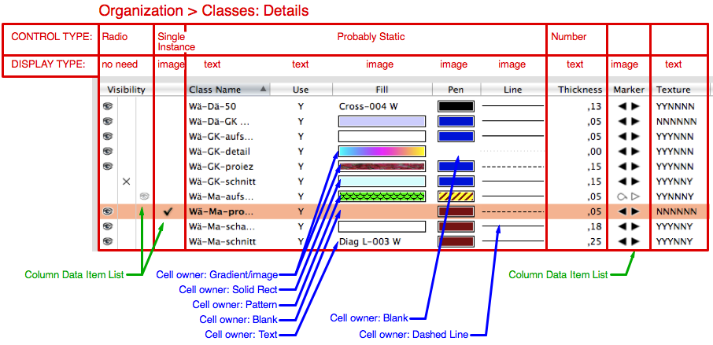
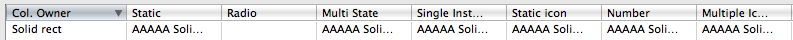
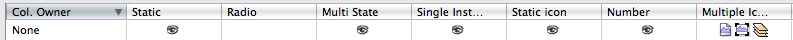
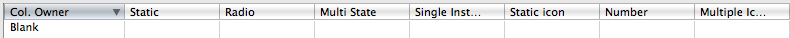
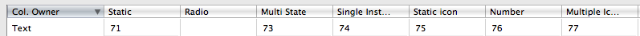
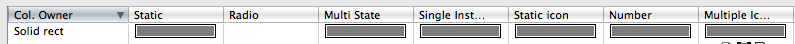
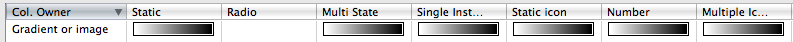
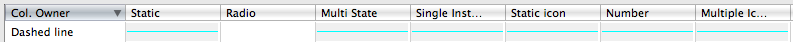
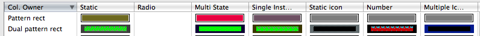

For better understanding please use the comprehensive example at [Dialog with List Browser](./Dialog%20with%20List%20Browser.md).

By --\_c\_  03:08, 31 December 2020 (EST) (previously Orso B. Schmid)

| [Part 1: Creation](./List%20Browsers%20part%201.md) | [Part 2: Columns](./List%20Browsers%20part%202.md) | [Part 3: Rows and Cells](./List%20Browsers%20part%203.md) | [Part 4: Events](./List%20Browsers%20part%204.md) |

# Rows and Cells

After setting up [Icon List](./List%20Browsers%20part%201.md#icon-List), your [Columns](./List%20Browsers%20part%202.md#Columns) together with their [List of Column Data Items](./List%20Browsers%20part%202.md#column-data-items-list), you can finally load rows of cells with content.

A row can be inserted using [InsertLBItem](../../../Function%20Reference/Functions/InsertLBItem.md), which also inserts a string value in the first cell of the first column. Again to be noticed that List Browsers default on creating text lists. Each column inserted with default control type [Static](./List%20Browsers%20part%202.md#static), left-aligned, and with [Display Type](./List%20Browsers%20part%202.md#display-type) *Text*. All is ready for a text list, your List Browser is set up and need only your string values.

If you have more than one column and/or need to set an icon in the first cell, there are further steps. This mainly depends on the column control type, if it uses a [List of Column Data Items](./List%20Browsers%20part%202.md#column-data-items-list) or not, or if you need to display special attributes like line styles, vector fills or color fills.

| Settings | Modifiers | Cells set up |
|---|---|---|
| * [Text attributes](#text-attributes) | * [Column Owner Type](#column-owner-type) | Insert rows using [InsertLBItem](#create-rows). Fill each cell in the row looping the available columns:<br/>* Column uses [Column Data Items](./List%20Browsers%20part%202.md#column-data-items-list):<br/>  * set up cells with [SetLBItemUsingColumnDataItem](../../../Function%20Reference/Functions/SetLBItemUsingColumnDataItem.md).<br/>* Column doesn't use 'Column Data Items':<br/>  * should show only generic text or/and icon:<br/>  * set up cells with [SetLBItemInfo](../../../Function%20Reference/Functions/SetLBItemInfo.md)<br/>* fix [Text attributes](#text-attributes) (optional)<br/>* otherwise, change cell [Owner](#column-owner-type):<br/>  * set up Colorfills: see [Color Cells](#color-cells) and [Solid Rect](#solid-rect)<br/>* set up Vectorfills: see [Gradients and Images](#gradients-and-images)<br/>* set up Pen Styles: see [Dashed line](#dashed-line) |

Below you can see a snapshot of NNA's Organization dialog for Class details with some comments of how it could be possible to reproduce it:



## Create rows

Rows are created with **InsertLBItem**: each cell of the row just after creation will have *Owner* [None](#none). *InsertLBItem* also loads the first cell of the first column with a string. Other cells must be loaded separately with the routines listed in [Load cells](#load--read-cells), according to their purpose. For specialized purposes like color fills or pen patterns, you need first to change cells' [Owner Type](#column-owner-type).

```pascal
InsertLBItem( dialogID: LONGINT; componentID: LONGINT; rowIndex: INTEGER; itemString: STRING): INTEGER;
```

[InsertLBItem](../../../Function%20Reference/Functions/InsertLBItem.md) Inserts a row in a List Browser and returns the index of the newly inserted row, which is to be used for further cell settings. The first cell in the first column gets the string stored in "itemString". Use one of the routines listed in [Load cells](#load--read-cells) to set up other cells in the row.

- **result**: the index of the newly inserted row, which is to be used for further cell settings.
- **itemString**: the string for the first cell in the first column.

```pascal
GetNumLBItems(dialogID: LONGINT; componentID: LONGINT): INTEGER;
```
[GetNumLBItems](../../../Function%20Reference/Functions/GetNumLBItems.md) Returns the count of rows in a list browser.

## Column Owner Type

The name "Column Owner" is misleading, since it's a cell property. The **Column Owner** determines what to display in a cell. It should be set only for cells where special attributes need to be displayed, otherwise the default value [None](#none) should be enough.

The cell's *Owner* can be set with [SetLBColumnOwnerDrawnType](../../../Function%20Reference/Functions/SetLBColumnOwnerDrawnType.md). It is important to change the *Owner* before loading the cells with values, otherwise cells will display unreliably. For example: cells set to display attributes such as color fills will show the plaguing string "AAAAA...." with any *Display* allowing *Text*. This doesn't happen if you set the cell's owner before the cell's value. See image below, showing cells whose *Owner* has been set after loading the cell values:



It's not difficult to choose the optimal cell Owner:

| all-rounder | text flattener | Image-based set |
|---|---|---|
| (default upon creation). Whenever a static image or text is sufficient. It displays what is set in the column's [Display Type](./List%20Browsers%20part%202.md#display-type): Text, or Image or both.<br/>* [None](#none) | Securely display text under imaged-based column controls, even if the [Display Type](./List%20Browsers%20part%202.md#display-type) is Image.<br/>* [Text](#text) | Specialized image-based cells which barely leave doubts as to their function. Must have a column [Display Type](./List%20Browsers%20part%202.md#display-type) Image.<br/>* [Blank](#blank)<br/>* [Solid Rect](#solid-rect) and [Dual solid rect](#dual-solid-rect)<br/>* [Patterns](#pattern-and-dual-pattern)<br/>* [Gradients and Images](#gradients-and-images)<br/>* [Dashed line](#dashed-line) |

Below you find a short introduction to each *Owner Type* with illustrations of the cell's display. Mind that for the sake of experimenting, the illustrations show the display of every *Owner* under each of the seven available column's [Control Types](./List%20Browsers%20part%202.md#control-type). This is not something that you'll ever do, nor should do: plan your column *Control Types* according to the needed cells.

**Notes:**
- [Gradients and Images](#gradients-and-images) can theoretically display any named resource that is accessible with *Index2Name*.
- [Radio](./List%20Browsers%20part%202.md#Radio) columns override any kind of cell Owner, so it's superfluous to set an *Owner* for cells belonging to these columns.
- Owners dedicated to attributes always need a column with [Display type Image](./List%20Browsers%20part%202.md#display-type).

```pascal
{ column owner, actually is a cell's property  }
kLBNotOwnerDrawn	= 0; { none }
kLBSolidRect		= 1;
kLBDualSolidRect	= 2;
kLBPatRect			= 3;
kLBDualPatRect		= 4;
kLBGradientOrImage	= 5; { works for tiles too }
kLBBlankOwnerDrawn	= 6;
kLBTxtOwnerDrawn	= 7; { text }
kLBDashedLine		= 8;
kLBTile				= 9;

SetLBColumnOwnerDrawnType( dialogID: LONGINT; componentID: LONGINT; rowIndex: INTEGER; colIndex: INTEGER; 
	ownerDrawnType: INTEGER): BOOLEAN;
	
GetLBColumnOwnerDrawnType( dialogID: LONGINT; componentID: LONGINT; rowIndex: INTEGER; colIndex: INTEGER; 
	VAR ownerDrawnType: INTEGER): BOOLEAN;
```

[SetLBColumnOwnerDrawnType](../../../Function%20Reference/Functions/SetLBColumnOwnerDrawnType.md) Sets the *Owner* for a cell. Only needed if the default value [None](#none) is not OK. The owner must be changed before loading cells with values.
[GetLBColumnOwnerDrawnType](../../../Function%20Reference/Functions/GetLBColumnOwnerDrawnType.md) It seems to be impossible to get the owner of a cell. The value returned is always "0". Must be a bug.

**ownerDrawnType**: declare the owner using one of the constants listed below. It is advisable to store them in an external px file to be loaded as include whenever a dialog involves List Browsers.

* kLBNotOwnerDrawn	= 0; { None }
* kLBSolidRect		= 1;
* kLBDualSolidRect	= 2;
* kLBPatRect	= 3;
* kLBDualPatRect	= 4;
* kLBGradientOrImage	= 5; { This you could call "Indexed Resources" }
* kLBBlankOwnerDrawn	= 6; { blank }
* kLBTxtOwnerDrawn	= 7; { text }
* kLBDashedLine	= 8;
- **result**: a boolean value, but I couldn't get this to return FALSE.

### None



**None** is a flexible generic cell's *Owner* optimal to display text, numbers and icons, without any specialization. Is the default owner upon creating a row of cells using **InsertLBItem**. This owner is always the right choice whenever you don't need to reproduce attributes cells like line styles, colors or thumbnails, or you plan to use a [Column Data Items](./List%20Browsers%20part%202.md#column-data-items-list) (since this consists in strings and icons).

__For this to work you need__:
  - [Control Type](./List%20Browsers%20part%202.md#control-type): *any*.
  - [Radio](./List%20Browsers%20part%202.md#Radio) overrides it.
  - [Display_Type](./List%20Browsers%20part%202.md#display-type): *anything*. Choose the *Display Type* appropriate to the parent column control.
  - [SetLBItemInfo](../../../Function%20Reference/Functions/SetLBItemInfo.md): for loading text and/or image
  - [SetLBItemUsingColumnDataItem](../../../Function%20Reference/Functions/SetLBItemUsingColumnDataItem.md): if the cell shall use *Column Data Items*.

### Blank



**Blank** is an image-only cell's *Owner*. At first it bewilders: it displays absolutely nothing. Blank won't ever load an image and is meaningless for [Display Type](./List%20Browsers%20part%202.md#display-type) *Text*. In the image above the *Display* is *Image*.
Due to the (declared) lack of display, you can use it to blank out image cells without upsetting image data. It positively shows an empty cell, if [Item](./List%20Browsers%20part%202.md#item-display) or [Display Type](./List%20Browsers%20part%202.md#display-type) is *Image*.
"Blank" doesn't affect images loaded from a [List of Column Data Items](./List%20Browsers%20part%202.md#column-data-items-list), though, all control types behave as expected also for *Blank* cells, whereby you won't bother to set such a cell owner and then use *Data Items*. But is possible.
Cells whose column have control type [Radio](./List%20Browsers%20part%202.md#Radio) are not affected in the least and don't blank.

__For this to work you need__:
  - [Control Type](./List%20Browsers%20part%202.md#control-type): *any*. [Radio](./List%20Browsers%20part%202.md#Radio) overrides it.
  - [Display Type](./List%20Browsers%20part%202.md#display-type): *Image*. Choose the *Display Type* appropriate to the parent column control.

### Text



**Text** owned cells can only display text, icons eventually loaded into the cell will be ignored. This can be used to coerce text. In the image above we loaded the cells with numbers.

There is a peculiarity. If a [Column Data Items](./List%20Browsers%20part%202.md#column-data-items-list) with both text and images is available to the cell's column, you can observe:
- [Display Type](./List%20Browsers%20part%202.md#display-type): *Image*. Cells show only text, as expected.
- [Display Type](./List%20Browsers%20part%202.md#display-type): *Text and Image*. Cells show both Image and Text. Image is here unexpected.
- Columns with control [Multiple Icons](./List%20Browsers%20part%202.md#multiple-icons) will suddenly display the images

This is kind of unexpected. You'd expect the image to drop here as well.

__For this to work you need__:
  - [Control Type](./List%20Browsers%20part%202.md#control-type): *any*. [Radio](./List%20Browsers%20part%202.md#Radio) overrides it.
  - [Display Type](./List%20Browsers%20part%202.md#display-type): *Image*. Choose the *Display Type* appropriate to the parent column control. <br>
    __Note__: If you set the *Item/Display Type* to *Image* you'll correct the unexpected behavior of the cells using [Column Data Items](./List%20Browsers%20part%202.md#column-data-items-list). If you don't have a list of Column Data Items set up, the Display is irrelevant. I know that it sounds mind-boggling to be able to to coerce a text display imposing a *Display Image*, but so is it.
  - [SetLBItemInfo](../../../Function%20Reference/Functions/SetLBItemInfo.md): for loading text, alternatively
  - [SetLBItemUsingColumnDataItem](../../../Function%20Reference/Functions/SetLBItemUsingColumnDataItem.md): if the cell shall use *Column Data Items*.

### Solid Rect



**Solid Rect** is an image-based Owner for drawing color-filled cells. It's well used together will the owner [Blank](#blank), when you need to show the absence of color (see the Organization dialog, Classes' details).

__For this to work you need__:
  - [Control Type](./List%20Browsers%20part%202.md#control-type): *any*. [Radio](./List%20Browsers%20part%202.md#Radio) overrides it.
  - [Display Type](./List%20Browsers%20part%202.md#display-type): *Image*. Choose the *Display Type* appropriate to the parent column control.
  - [SetLBItemFillForeColor](../../../Function%20Reference/Functions/SetLBItemFillForeColor.md): for loading the Solid Rect's color. Pass an r, g, b triplet in range 0-255.

### Dual Solid Rect

**Dual Solid Rect** seems to be an owner that cannot be displayed. I believe that it should show a cell similar to [Solid Rect](#solid-rect) but with a thick border. Setting a cell to this owner turns it into [None](#none) (I believe. But since [GetLBColumnOwnerDrawnType](../../../Function%20Reference/Functions/GetLBColumnOwnerDrawnType.md) is not operational, I can't be really sure). I don't recall ever seeing a NNA list browser cell displaying a *Dual Solid Rect*, or a [Dual Pattern](#pattern-and-dual-pattern), by the way.

### Gradients and Images



**Gradients and Images** could do more than displaying only Gradients, it can actually display any kind of resource whose name is parsable with *Index2Name*. Unfortunately there are screen issues (distortion of the resource thumbnails). The tiny thumbnails generated indeed make this owner only apt for displaying Gradients, I find it too little also for Image resources. In the Organization dialog hatches are notably set to display only the name (a radical [Text](#text) owner, I suppose), which is the better choice. Gradients cells display indeed well.

See [Example: rows](#example-rows) for an experimental example about this owner.

Be careful in loading symbols or textures. They can kill your dialog for excessive CPU usage and under circumstances run you out of memory.

__For this to work you need__:
  - [Control Type](./List%20Browsers%20part%202.md#control-type): *any*. [Radio](./List%20Browsers%20part%202.md#Radio) overrides it.
  - [Display Type](./List%20Browsers%20part%202.md#display-type): *Image*. Choose the *Display Type* appropriate to the parent column control.
  - [SetLBItemGradientOrImageRefNumber](../../../Function%20Reference/Functions/SetLBItemGradientOrImageRefNumber.md): for loading a resource index

### Dashed Line



**Dashed Line** cells can represent the attributes of a styled line (style and thickness) over a colored background. In the image above the background color has been given a light gray (darker on PC) for better understanding. Most of the times the background needs to be set to white.

__For this to work you need__:
  - [Control Type](./List%20Browsers%20part%202.md#control-type): *any*. [Radio](./List%20Browsers%20part%202.md#Radio) overrides it.
  - [Display Type](./List%20Browsers%20part%202.md#display-type): *Image*. Choose the *Display Type* appropriate to the parent column control.
  - [SetLBItemPenForeColor](../../../Function%20Reference/Functions/SetLBItemPenForeColor.md): for setting the line color. Pass an r, g, b triplet in range 0-255.
  - [SetLBItemPenBackColor](../../../Function%20Reference/Functions/SetLBItemPenBackColor.md): for setting the background of the line. Pass an r, g, b triplet in range 0-255. The background color fills the whole cell. White background: 255, 255, 255.
  - [SetLBItemDashStyle](../../../Function%20Reference/Functions/SetLBItemDashStyle.md): for loading the pen style

### Pattern and Dual Pattern



With VW 2010 the functions [GetLBItemPatternIndex](../../../Function%20Reference/Functions/GetLBItemPatternIndex.md) and [SetLBItemPatternIndex](../../../Function%20Reference/Functions/SetLBItemPatternIndex.md) have been introduced allowing to display also patterns. To my knowledge there is no way to control pattern cells in List Browsers before VW 2010. On Mac the cells display random color and pattern values (see image above), on PC they are at least stable in the display.
On PC there is sometimes a heavy CPU issue connected with setting all four [Color routines](#color-cells) in cells whose *Owner* is pattern: the CPU will run at maximum and never stop until document closed. Simply avoid unwanted *Pattern Owners* in your cell. Since Patterns are officially not supported, this cannot be considered a bug.

## Load / Read cells

After setting up the cell's [Owner Type](#column-owner-type) (optional, whenever *Owner* [None](#none) is not sufficient) you can load cells with values and read them accordingly.

### Cells without Column Data Items

If your cell is generic use [SetLBItemInfo](../../../Function%20Reference/Functions/SetLBItemInfo.md) to load it. This call is good for cells whose column has *Control type*:
- [Static](./List%20Browsers%20part%202.md#Static)
- [Number](./List%20Browsers%20part%202.md#Number)

```pascal
SetLBItemInfo( dialogID: LONGINT; componentID: LONGINT; rowIndex: INTEGER; colIndex: INTEGER; 
	itemString: STRING; imageIndex: INTEGER): BOOLEAN;
	
GetLBItemInfo(dialogID: LONGINT; componentID: LONGINT; rowIndex: INTEGER; colIndex: INTEGER; 
	VAR itemString: STRING; VAR imageIndex: INTEGER): BOOLEAN;
	
SetLBItemData(dialogID, componentID : LONGINT; rowIndex, nSubItemIndex : INTEGER; 
	nUserData : LONGINT);
```

[SetLBItemInfo](../../../Function%20Reference/Functions/SetLBItemInfo.md), [GetLBItemInfo](../../../Function%20Reference/Functions/GetLBItemInfo.md)  Gets/sets string and icon in a cell identified by row index "rowIndex" and column index "colIndex".
[SetLBItemData](../../../Function%20Reference/Functions/SetLBItemData.md) Not operational any longer since VW 2018, I used to hide here things that I wanted to store for a cell.

- **itemString**: the string value for a cell. Can be empty.
- **imageIndex**: the icon to be displayed in the cell. The icon index is related to the sequence generated while creating the List Browser's [Icon List](./List%20Browsers%20part%201.md#icon-list). If you need icons, the list must be created first. Pass "-1" if you don't need any icon.

```pascal
FindLBColumnItem( dialogID: LONGINT; componentID: LONGINT; columnIndex: INTEGER; 
	itemString: STRING; VAR rowIndex: INTEGER): BOOLEAN;
```
[FindLBColumnItem](../../../Function%20Reference/Functions/FindLBColumnItem.md) Searches a column for a certain string "itemString". Returns the found row index "rowIndex" or "-1".

### Cells with Column Data Items

After setting up the [List of Column Data Items](./List%20Browsers%20part%202.md#column-data-items-list) for a column, cells need to be initialized to a proper list value. This can be done with **SetLBItemUsingColumnDataItem**. This is the call to be used for cells whose columns have control type:
- [Multi State](./List%20Browsers%20part%202.md#multi-state)
- [Single Instance Icon](./List%20Browsers%20part%202.md#single-instance-icon)
- [Static Icon](./List%20Browsers%20part%202.md#static-icon)

```pascal
SetLBItemUsingColumnDataItem( dialogID: LONGINT; componentID: LONGINT; rowIndex: INTEGER; colIndex: INTEGER; 
	columnDataItemIndex: INTEGER): BOOLEAN;
	
GetLBItemInfo(dialogID: LONGINT; componentID: LONGINT; rowIndex: INTEGER; colIndex: INTEGER; 
	VAR itemString: STRING; VAR imageIndex: INTEGER): BOOLEAN;
```
[SetLBItemUsingColumnDataItem](../../../Function%20Reference/Functions/SetLBItemUsingColumnDataItem.md) Assigns a *Column Data Item* by index (0-based) to a cell, all data types (string, image) defined in the chosen "columnDataItemIndex" will apply. Choose the appropriate [Display Type](./List%20Browsers%20part%202.md#display-type) type (text, strings or both). You should use this call to initialize your cells whenever their column uses a List of Data Items. Avoid using *SetLBItemInfo*.
- **result**: false if no Column Data Items are available for the cell's column (because you didn't set them up with [InsertLBColumnDataItem](../../../Function%20Reference/Functions/InsertLBColumnDataItem.md)).

**Warning:** Mind that in order to read the assigned column data item of a cell, you still use [GetLBItemInfo](../../../Function%20Reference/Functions/GetLBItemInfo.md). And be careful, the values returned are those AFTER the click. Example: you have a column whose Column Data Items are "yes", "no". You have a cell where you see displayed "no". Upon click on that cell, the value cycles to the next Column Data Item: "yes". If you parsed the cell value using *GetLBItemInfo* you'd get "yes". It means that if you want to know what was before the click, you'll have to go 1 item backward in the column data item list. You use
- [FindLBColumnDataItem](../../../Function%20Reference/Functions/FindLBColumnDataItem.md) passing the string obtained with *GetLBItemInfo*, it returns the index of the Column Data Item
- [GetLBColumnDataItemInfo](../../../Function%20Reference/Functions/GetLBColumnDataItemInfo.md) passing the index of a Column Data Item
When the [Icon List](./List%20Browsers%20part%201.md#icon-list) for the list browser corresponds to the Column Data Item list you can use the index *img* from *GetLBItemInfo*, correcting the value by -1 to retrieve the val before click.

```pascal
{ if the image list <> Column Data Item list you must search for the string in the data items list }
IF GetLBItemInfo(d, lb, eventRow, eventCol, str, img) THEN
	IF FindLBColumnDataItem(d, lb, eventCol, str, temp_i) THEN
		{ temp_i is loaded with the index corresponding to the searched string: str }
		{ if the list of Column Data Items loaded the string str more than once, you'll get the first found };

{ if the image list = Column Data Item list you can use directly the img index from GetLBItemInfo }
IF GetLBItemInfo(d, lb, eventRow, eventCol, str, img) THEN
	IF GetLBColumnDataItemInfo(d, lb, eventCol, img -1, temp_s, imgOn, imgOff, itemData) THEN
		{ temp_s is loaded with the string corresponding to the searched index: img-1 };
```

### Multiple Icons cells

For cells whose columns have control type:
- [Multiple Icons](./List%20Browsers%20part%202.md#multiple-icons)

```pascal
GetLBMultImageIndexes( dialogID: LONGINT; componentID: LONGINT; rowIndex: INTEGER; colIndex: INTEGER; 
	VAR imageIndex0: INTEGER; VAR imageIndex1: INTEGER; VAR imageIndex2: INTEGER): BOOLEAN;
	
SetLBMultImageIndexes( dialogID: LONGINT; componentID: LONGINT; rowIndex: INTEGER; colIndex: INTEGER; 
	imageIndex0: INTEGER; imageIndex1: INTEGER; imageIndex2: INTEGER): BOOLEAN;
```
[GetLBMultImageIndexes](../../../Function%20Reference/Functions/GetLBMultImageIndexes.md), [SetLBMultImageIndexes](../../../Function%20Reference/Functions/SetLBMultImageIndexes.md) Gets/sets indexes of three icons from a resource file. This is only used by cells whose column Control is *Multiple Icons* and seems to work only on Mac. The indexes are constructed like in the [Icon_List](./List%20Browsers%20part%201.md#icon-list).

### Color Cells

Special image-based cells dedicated to represent solid fills. Sets colors for cells whose [Owner](#column-owner-type) is:
- [Solid Rect](#solid-rect)
- [Dashed Line](#dashed-line)
[Pattern](#pattern-and-dual-pattern) cells use them too, but you can't use them on VW before 2010.

```pascal
GetLBItemFillForeColor( dialogID: LONGINT; componentID: LONGINT; rowIndex: INTEGER; colIndex: INTEGER; 
	VAR redIndex: INTEGER; VAR greenIndex: INTEGER; VAR blueIndex: INTEGER): BOOLEAN;
SetLBItemFillForeColor( dialogID: LONGINT; componentID: LONGINT; rowIndex: INTEGER; colIndex: INTEGER; 
	redIndex: INTEGER; greenIndex: INTEGER; blueIndex: INTEGER): BOOLEAN;
GetLBItemFillBackColor( dialogID: LONGINT; componentID: LONGINT; rowIndex: INTEGER; colIndex: INTEGER; 
	VAR redIndex: INTEGER; VAR greenIndex: INTEGER; VAR blueIndex: INTEGER): BOOLEAN;
SetLBItemFillBackColor( dialogID: LONGINT; componentID: LONGINT; rowIndex: INTEGER; colIndex: INTEGER; 
	redIndex: INTEGER; greenIndex: INTEGER; blueIndex: INTEGER): BOOLEAN;
GetLBItemPenForeColor( dialogID: LONGINT; componentID: LONGINT; rowIndex: INTEGER; colIndex: INTEGER; 
	VAR redIndex: INTEGER; VAR greenIndex: INTEGER; VAR blueIndex: INTEGER): BOOLEAN;
SetLBItemPenForeColor(dialogID, componentID : LONGINT; rowIndex, colIndex, 
	redIndex, greenIndex, blueIndex : INTEGER) : BOOLEAN;
GetLBItemPenBackColor( dialogID: LONGINT; componentID: LONGINT; rowIndex: INTEGER; colIndex: INTEGER; 
	VAR redIndex: INTEGER; VAR greenIndex: INTEGER; VAR blueIndex: INTEGER): BOOLEAN;
SetLBItemPenBackColor( dialogID: LONGINT; componentID: LONGINT; rowIndex: INTEGER; colIndex: INTEGER; 
	redIndex: INTEGER; greenIndex: INTEGER; blueIndex: INTEGER): BOOLEAN;
```
Get or set a [Solid Rect](#solid-rect) or [Dashed Line](#dashed-line) cell's colors (see relative chapters for where these calls might apply).

### Indexed Resources

Special image-based cells dedicated to represent vectorfills. For cells whose [Owner](#column-owner-type) is:
- [Gradients and Images](#gradients-and-images)

```pascal
SetLBItemGradientOrImageRefNumber( dialogID: LONGINT; componentID: LONGINT; rowIndex: INTEGER; colIndex: INTEGER; 
	refNumber: LONGINT): BOOLEAN;
```
- **refNumber**: expects a positive index value. Since usually Vectorscript routines return vectorflls indexes negative, reverse the value: `vecFill := -FFillPat;` or `vecFill := -GetFPat(h);`. You treat it like you would use it in Index2name.

```pascal
GetLBItemGradientOrImageRefNumber( dialogID: LONGINT; componentID: LONGINT; rowIndex: INTEGER; colIndex: INTEGER; 
	VAR refNumber: LONGINT): BOOLEAN;
```
Queries a *Gradients and Images* cell for the displayed indexed resource.

### Line Styles

Special image-based cells dedicated to represent line styles. For cells whose [Owner](#column-owner-type) is:
- [Dashed line](#dashed-line)

```pascal
SetLBItemDashStyle( dialogID: LONGINT; componentID: LONGINT; rowIndex: INTEGER; colIndex: INTEGER; 
	styleIndex: INTEGER; lineWeight: INTEGER): BOOLEAN;
```
- **styleIndex**: value needs to be positive. Since commonly Vectorscript routines return the index negative, reverse the value: `penPatVal := - FPenPat;` or `penPatVal := - GetLS(h);`
- **lineWeight**: the line weight as commonly returned by for example `FPenSize`.

```pascal
GetLBItemDashStyle(dialogID, componentID : LONGINT; rowIndex : INTEGER; colIndex : INTEGER; 
	VAR styleIndex, VAR lineWeight : INTEGER) : BOOLEAN;
```
Queries a *Dashed Line* cell for its displayed line attributes.

### Text attributes

Sets text attributes for cells whose columns have control type:
- [Static](./List%20Browsers%20part%202.md#Static)
- [Number](./List%20Browsers%20part%202.md#Number)
- [Column Data Items](./List%20Browsers%20part%202.md#column-data-items-list) and [Display](./List%20Browsers%20part%202.md#display-type) showing *Text only* or *Text and image*.

Text cells default on left-alignment, black, plain. But this can be modified:

```pascal
SetLBItemTextColor( dialogID: LONGINT; componentID: LONGINT; rowIndex: INTEGER; colIndex: INTEGER; 
	redIndex: INTEGER; greenIndex: INTEGER; blueIndex: INTEGER): BOOLEAN;
```
Default: black. Pass an r, g, b triplet in range 0-255 to modify the text color.

```pascal
SetLBItemTextJust( dialogID: LONGINT; componentID: LONGINT; rowIndex: INTEGER; colIndex: INTEGER; 
	justification: INTEGER): BOOLEAN;
```
Default: left. Pass one of the constants below to modify the justification:
- k_TxtLeftJust = 1; { left }
- k_TxtCenJust = 2; { center }
- k_TxtRighJust = 3; { right }

```pascal
SetLBItemTextStyle( dialogID: LONGINT; componentID: LONGINT; rowIndex: INTEGER; colIndex: INTEGER; 
	textStyle: INTEGER): BOOLEAN;
```
Default: Plain. Pass one of the constants below to modify the style:
- k_TxtStyPlain	= 0;
- k_TxtStyBold	= 1;
- k_TxtStyItalic = 2;
- k_TxtStyUnderl = 4;

## Examples

### Example: gradient cell

```pascal
{ resource icon at column 1 }
IF SetLBColumnOwnerDrawnType(dlog, LB, row, col, kLBGradientOrImage) THEN { vectorfll owner }
	temp_b := SetLBItemGradientOrImageRefNumber(dlog, LB, row, col, Name2Index(resName));
```

### Example: rows

Example: Create a resource list by object type with tiny, incomprehensible thumbnails

```pascal
{ ************************************************ }
{ 
++++ ONLY FOR EXPERIMENTS +++++
loads cells with resource thumbnails and names.
The routine below doesn't check for valid resource types.
This will work with all resources creating a thumbnail in the Resource Browser, and
any resource parsable with Name2Index.
This can positively run you out of memory on heavy resource thumbnails like textures.
Use the object type constants for setting the resource to be loaded, for example:
16: sym definition
66: hatch definition
97: texture definition EXTREEEEMELY heavy, any user click causes the watch-cursor
119: image fill definition
120: gradient fill definition
127: wall style
Thus you can see how bad thumbnails aside of gradients display.
The list browser receiving this routine should have the first two columns 
both with control type Static and Item Display Image, 
col 0: we load the resource name
col 1: we load the resource thumbnail
}
PROCEDURE LB_LoadIndexedResources(dlog, LB: INTEGER; resType: INTEGER);
	VAR
		resList, cnt : LONGINT;
		resName : STRING;
		row, col : INTEGER;
		temp_b : BOOLEAN;
		
	BEGIN
		IF DeleteAllLBItems(dlog, LB) THEN BEGIN
			EnableLBUpdates(dlog, LB, FALSE);
			
			resList := BuildResourceList(resType, 0, '', cnt); 
			{ if you did some resource renaming during dialog execution this can mess up the list, 
			in this case you better redo the list.
			You don't need to redo it if your resList is not modified during dialog execution }
			
			IF cnt > 0 THEN BEGIN
				row := -1;
				col := 0;
				
				WHILE (row+1) < cnt DO BEGIN
					resName := GetNameFromResourceList(resList, row+2); { this is a 1-based list }
					
					{ resource name at column 0 }
					row := InsertLBItem(dlog, LB, GetNumLBItems(dlog, LB), resName);
					temp_b := SetLBColumnOwnerDrawnType(dlog, LB, row, col, kLBTxtOwnerDrawn); { text owner }
						
					{ resource icon at column 1 }
					IF SetLBColumnOwnerDrawnType(dlog, LB, row, col +1, kLBGradientOrImage) THEN { vectorfill owner }
						temp_b := SetLBItemGradientOrImageRefNumber(dlog, LB, row, col+1, Name2Index(resName));
				END;
				
			END ELSE
				AlrtDialog(Concat('Resource list for object type "' , resType, '" is either empty or not parsable') );
			
			EnableLBUpdates(dlog, LB, TRUE);
			temp_b := RefreshLB(dlog, LB);
		END;
	END; { LB_LoadIndexedResources }
```

### Example: mark cells blue

```pascal	
{ _c_ ********************************************* }
{ mark colors of LB rows to Blue normal }
PROCEDURE LB_BlueMarker(d, LB: LONGINT; row, col: INTEGER);
	VAR
		temp_b : BOOLEAN;
		
	BEGIN
		temp_b := SetLBItemTextStyle(d, LB, row, col, 0); { plain }
		temp_b := SetLBItemTextColor(d, LB, row, col, 0, 146, 208);
	END;
```


#### Example: mark cells green italic ####

```pascal	
{ _c_ ********************************************* }
{ mark colors of LB rows to GREEN italic }
PROCEDURE LB_GreenMarker(d, LB: LONGINT; row, col: INTEGER);
	VAR
		temp_b : BOOLEAN;
		
	BEGIN
		temp_b := SetLBItemTextStyle(d, LB, row, col, 2); { italic }
		temp_b := SetLBItemTextColor(d, LB, row, col, 0, 250, 0);
	END;
```	


#### Example: mark cells red italic ####

```pascal
{ _c_ ********************************************* }
{ mark colors of LB rows to RED italic }
PROCEDURE LB_RedMarker(d, LB: LONGINT; row, col: INTEGER);
	VAR
		temp_b : BOOLEAN;
		
	BEGIN
		temp_b := SetLBItemTextStyle(d, LB, row, col, 2); { italic }
		temp_b := SetLBItemTextColor(d, LB, row, col, 255, 0, 0);
	END;
```


| [Part 1: Creation](./List%20Browsers%20part%201.md) | [Part 2: Columns](./List%20Browsers%20part%202.md) | [Part 3: Rows and Cells](./List%20Browsers%20part%204.md) | [Part 4: Events](./List%20Browsers%20part%204.md) |
