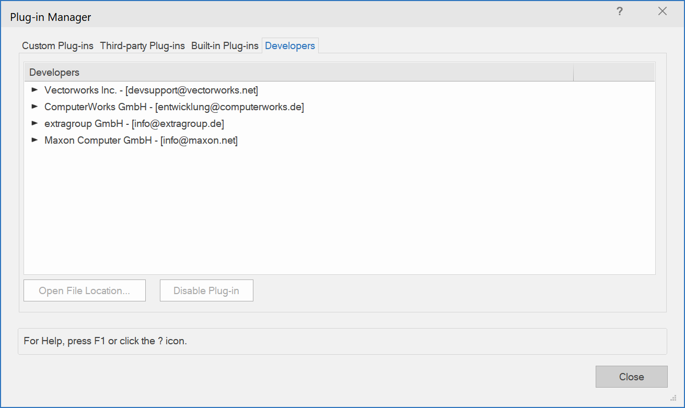
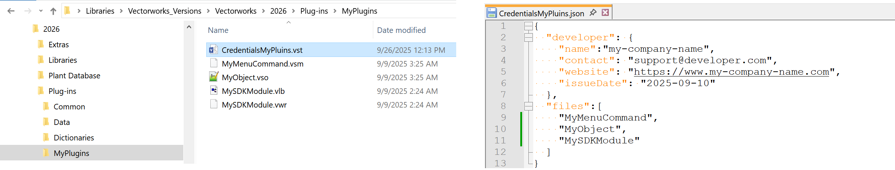
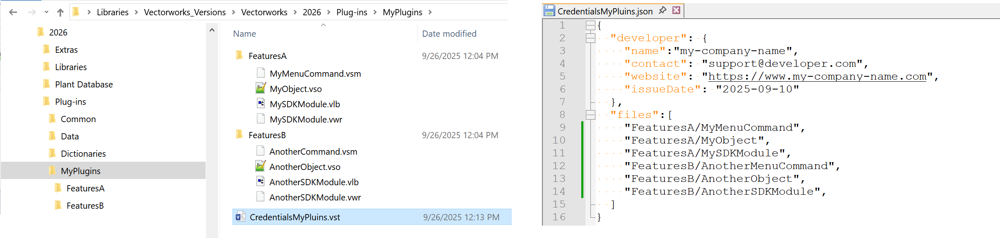
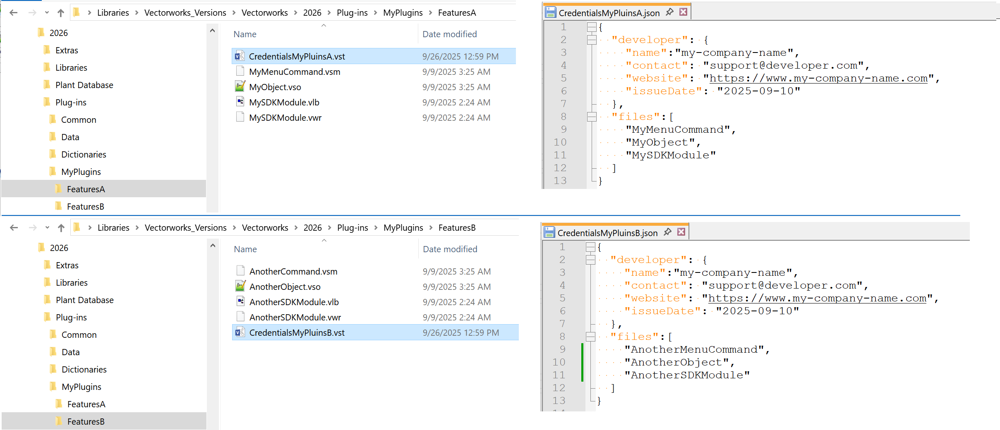
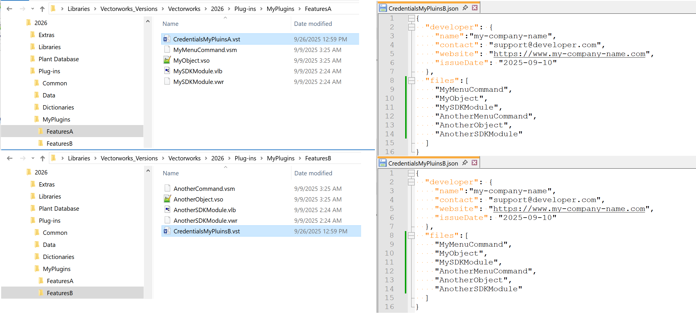

# Info

Vectorworks 2026 enforces plug-in security by ensuring that all externally provided (i.e. third-party) plugins are of known origin. Vectorworks will still load and use unknown plugins, but it will show a warning dialog at launch time, letting the user know which plugins are developed by an unknown party.

This will include SDK and obfuscated Script (i.e. release version) plugins.

Currently, Vectorworks executes any plugin placed in the Plug-ins folder, which means that Vectorworks is running code within the Vectorworks environment that might be of unknown origin and thus reduces the security of the entire application.

__Here’s what you need to know as a user:__
* Vectorworks 2026 will require a ‘Credentials’ file for each developer containing all plugins from this developer.
* Script plugins that are not locked \[open-source plugins] will not be required to have Credentials. This means that custom user plugins will not be considered security risk.
* Please contact the developer of the pluing if you see this alert dialog. They will have to provide a Vectorworks 2026 compatible version of their plugin/feature.
* Vectorworks will issue Credentials files to all our partners that develop plugins when they request.
* The Credentials file contais information about the developer. You can see the developer information using the <code>Tools → Plug-ins → Plug-in Manager...</code> menu command and going to the **Developers** tab.

  

* The signature validation will not require online access. It will be performed via a “public key” validation.
* The user will still be able to use plugins from Unknown developers, after manually enabling them, for the user to not lose features.
* Vectorworks will warn the user if a plugin is not “signed” at launch time and by default it will disable them. This will happen even if they are enabled as unknown developer plugins pose constant risk.
* If you have a locked plugin/feature that the developer abandoned, please contact Vectorworks at  [devsupport@vectorworks.net](mailto:devsupport@vectorworks.net).

__For the developer:__
* Every SDK and encrypted/obfuscated Script \[VectorScript and Python] plugin needs a credentials \[binary] file.
* The developer must fill out a .json file (or files, see the details below):
  * Containing name, email for the developer.
  * Containing a list of plugins, listing file names without extension.
  * The .json file must be submitted to Vectorworks to generate the credentials binary-file, and it will be provided back as part of the Vectorworks Partner program.

    Please email the .json file confirming security key request to: [devsupport@vectorworks.net](mailto:devsupport@vectorworks.net)

  * The credentials file has .vst extension and Vectorworks will not confuse it with a script tool.
  * The name of the credentials file must start with <code>Credentials</code> followed by anything that is Win & Mac OS valid.
  * A new credentials file will be needed for each version after Vectorworks 2026.

# Developer details

### Developer Credentials ###

The credentials file is an encrypted version of a .json file that defines the developer, with the following format:

The JSON and the Credentials file should start with <code>Credentials</code>, and then any any Win & Mac OS valid name.

Note: Vectorwroks will recognize the credentials file only when it starts with <code>Credentials</code> and extension <code>.vst</code>

```json
{
  "developer": {
    "name":"my-company-name",
    "contact": "support@developer.com",
    "website": "https://www.my-company-name.com",
    "issueDate": "2025-09-10"
  },
  "files":[
    "file-name-no-extension",
    "another-file-name-no-extension"
  ]
}
```

**Note:** There is no comma on the last entry of the arrays (files list and developers object) to comply with the JSON format.

This file lists “developer” information: name, contact email, and date of issue. It also defines a list of file names \[without extension] of all plugin files (SDK or script) covered by this credentials file. There is no limit to how many plugins can be included in a credential file.

The credentials file cover the named files considering their location, i.e. the credentials must be along side the plugins.

The credentials file can cover more files that are present in the folder. This means that you can have a single credentials file that covers everything and conditionally installed plugins.

Here are some common case examples:

## All plugin files are in one folder

This is the case where all your plugins are located in one folder. Then you need one credentials file, i.e. one json, that will cover them all.



## Plugins are broken into different folders

* ### One Credentials for all in the parent folder

Use <code>/</code> in your credentials to cover plugins in a sub-folder.



* ### Several credentials for each folder

**Note:** The two credentials files must have different names! Even though they are in different folders they have to be different.



After Update 1: The two credentials files can be identical, i.e. you can have more plugins in the credentials file, it will be only applied to the ones in the folder.




* ### Embedding credentials (after Vectorworks 2026 Update 1)

There is an option for script plugins (.vsm, .vso, vst) to contain the credentials file, removing the need for an extra file to be included. This is very useful when the plugins are installed conditionally without particular structure.

First, you need to prepare a <code>.json</code> file that list one or several plugins that will embed the credentials.

Then, when you receive the credentials <code>.vst</code> file, you would would use Vectorworks script to embed it to one or many script plugin files.

**Note:** You must have the plugin name that will contain these credentials into the credentials file (.json). It is possible to embed any credentials file, but it will not pick it up if the file name doesn't match the .json/.vst.

Here is a pyhon script example that will enumerate all script plugins in <code>c:\MyFolder</code> and embed the <code>C:\Downloads\MyCredentials.vst</code>  credentials file in them.
```python
vs.AddCredentials('c:\MyFolder', 'C:\Downloads\MyCredentials.vst')
```

A log file <code>_AddCredentialsLog.txt</code> will bre reated in <code>c:\MyFolder</code> containing information on the operation.

Additionally, you can use this function to check the credentials of the plugins:
```python
vs.AddCredentials('c:\MyFolder', '')
```

The log file <code>_AddCredentialsLog.txt</code> will contain the information.

**Note:** You need to install the <code>Script Batch Process</code> feature from the <code>Vectorworks Developer</code> section of <code>Help → Install Partner Products...</code> menu command. Or you can find the plugin within the SDK distribution.

Here is the documentation on the function:

[AddCredentials](../../../Function%20Reference/Functions/AddCredentials.md)
  Adds credentials to VectorScript plug-ins. "pluginsPath" expects a full path to a file or the path to a folder containing plug-ins. "credentialFilePath" expects a full path to a .vst credential file. Empty would report the credentials of the plugins. Returns true if no errors and false if any errors were encountered. Actions are logged in "AddCredentialsLog.txt" in the user Plug-ins folder.

```pascal
FUNCTION AddCredentials(
        pluginsPath        : STRING;
        credentialFilePath : STRING) : BOOLEAN;
```

```python
def vs.AddCredentials(pluginsPath, credentialFilePath):
    return BOOLEAN
```


# See also

* [Partner Product Install](../../Partner%20Install/pages/Partner%20Product%20Install%20Package.md)
* [Prepare Release Plugins](../../Partner%20Install/pages/PrepareReleasePlugins.md)
