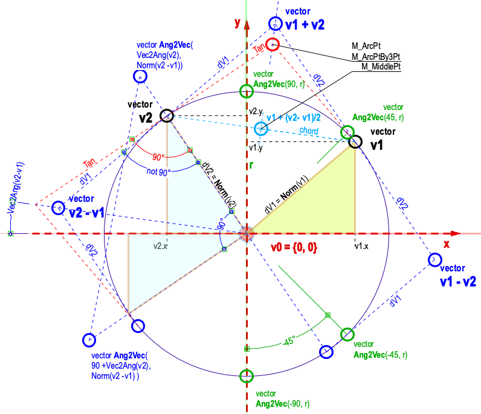
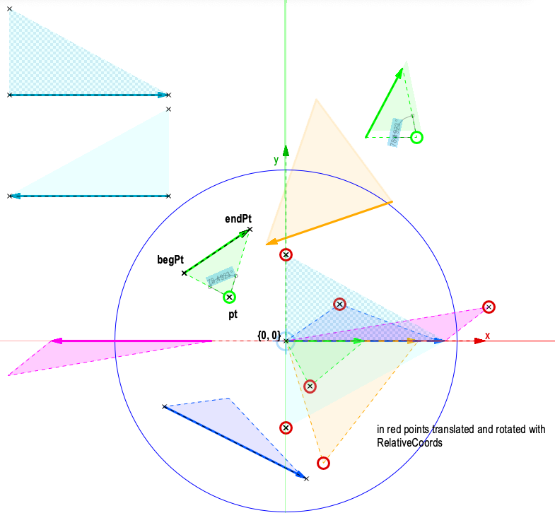
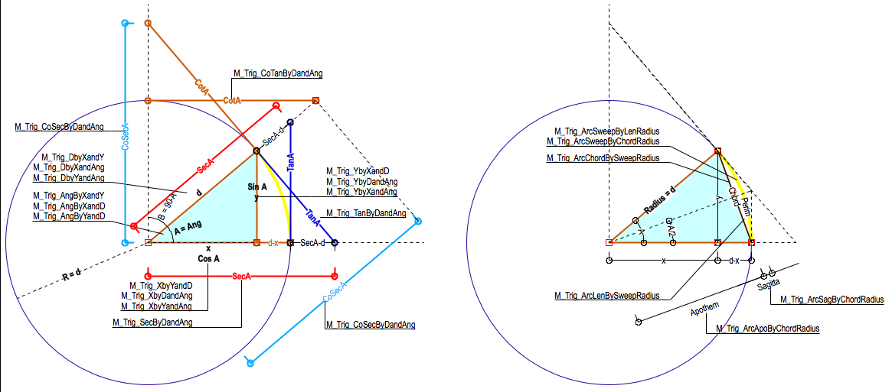

# AngBVec

## Description
Returns the positive angle between the two specified vectors, in the range of 0~180 degrees.

When used with 3D vectors, the angle returned will be in a plane defined by the two vectors.

```pascal
FUNCTION AngBVec(
				v1 : VECTOR;
				v2 : VECTOR): REAL;
```

```python
def vs.AngBVec(v1, v2):
    return REAL
```

## Parameters
|Name|Type|Description|
|---|---|---|
|v1|VECTOR|First vector to be compared.|
|v2|VECTOR|Second vector to be compared.|

## Remarks
(*\_c\_*, 2022.01.20) In VS Python the vectors must be a 3-dimensional tuple in form (0.0, 0.0, 0.0), or the routine will return zero.

Here some visual helps for the vectorial routines for those of us deprived of a proper math culture (me, for example), this was previously on Vectorlab as introduction to the Math section:

**Vector Basic**  


**Vector Operations**  


**Vector Components**  


**Relative Coordinates**  


**Subroutines**  



This is precisely what Vec2Ang does, except that Vec2Ang uses the X axis as the other vector.

## Examples
#### VectorScript ####
```pascal
PROCEDURE Example;
VAR
    pt1, pt2, pt3, pt4 :VECTOR;
BEGIN
    GetPt(pt1.x, pt1.y);
    GetPtL(pt1.x, pt1.y, pt2.x, pt2.y);
    GetPtL(pt2.x, pt2.y, pt3.x, pt3.y);
    MoveTo(pt1.x, pt1.y);
    LineTo(pt2.x, pt2.y);
    LineTo(pt3.x, pt3.y);
    pt4 := (pt1 + pt3) / 2;
    TextOrigin(pt4.x, pt4.y);
    CreateText(Concat(AngBVec(pt1 - pt2, pt3 - pt2)));
END;
RUN(Example);
```
#### Python ####
```python
v1 = (12, 1, 0) # 3-dimensional tuples
v2 = (3, 15, 45)
vs.Message(str(vs.AngBVec( v1, v2 )))
```

## Version
Availability: from All Versions

## Category
* [Math - Vectors](../Categories/Math%20-%20Vectors.md)
