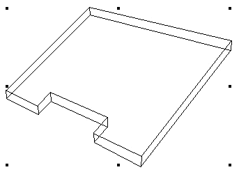

# BeginRoof

## Description
Procedure BeginRoof creates a simple roof object in a VectorWorks document. 

**Table - Roof Miter Styles**

| Miter Style | Constant |
|-------------|----------|
| Vertical    | 1        |
| Horizontal  | 2        |
| Double      | 3        |
| Square      | 4        |

*3-D View of Roof



```pascal
PROCEDURE BeginRoof(
				p1X,p1Y           : REAL;
				p2X,p2Y           : REAL;
				upslopeX,upslopeY : REAL;
				riseDistance      : REAL;
				runDistance       : REAL;
				miter             : INTEGER;
				vertPart          : REAL);
```

```python
def vs.BeginRoof(p1, p2, upslope, riseDistance, runDistance, miter, vertPart):
    return None
```

## Parameters
|Name|Type|Description|
|---|---|---|
|p1|REAL|Coordinates of roof axis start point.|
|p2|REAL|Coordinates of roof axis end point.|
|upslope|REAL|Coordinates of upslope definition point.|
|riseDistance|REAL|Rise distance.|
|runDistance|REAL|Run distance.|
|miter|INTEGER|Edge miter style of roof.|
|vertPart|REAL|Dimension of vertical miter for double miter style.|

## Examples
#### VectorScript ####
```pascal
BeginRoof(1,1,5,1,2,2,0.5,1,1,0);
ClosePoly;
Poly(1,1,3,1,3.5,2,4,1,5,1,5,5,1,5);
EndGroup;
```
#### Python ####
```python
vs.BeginRoof(1,1,5,1,2,2,0.5,1,1,0)
vs.ClosePoly()
vs.Poly(1,1,3,1,3.5,2,4,1,5,1,5,5,1,5)
vs.EndGroup()
```

```pascal
SetZVals(cHeight,cRoof_Thickness);
BeginRoof(-cWidth/2,cWidth/2,0.00,cWidth/2,-cWidth/4,cWidth/4,cRise,cWidth/2,1,0);
Move3D(0.0,0.0,cHeight);
	ClosePoly;
	Poly(
	-(cWidth/2+cOverhang),(cWidth/2+cOverhang),
```
```python
if drop > 0:
	vs.BeginRoof( 0, 0, w, 0, r1 + w / 2, gutterBottomY, -drop, r1, 2, thickness )
	DrawRoadway( r1, sweep2D, w )
	vs.Move3D( 0, 0, drop )
```

## Version
Availability: from MiniCAD 4.0

## Category
* [Objects - Roofs](../Categories/Objects%20-%20Roofs.md)
