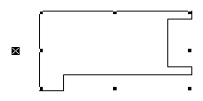
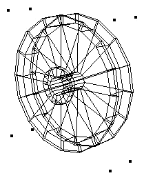

# BeginSweep

## Description
Procedure BeginSweep creates a three-dimensional sweep object in the VectorWorks document. A sweep object is a two-dimensional template object which has been rotated about a specified point to create a 3D object. For example, a circle of radius 1&quot; that is swept about a point 2&quot; to the right of the circles center wil create a sweep object resembling a donut, also known as a torus.

The sweep increment may also be thought of as the spacing between the duplication of radial sweep mesh lines. The &quot;pitch&quot;, or vertical distance, is the distance that the sweep object will travel for every 360 degrees of rotation.  In sweep objects, the 2D template object may also be translated as it rotates, resulting in a &quot;corkscrew&quot; effect. The vertical movement is determined by the following equation: vertical movement = pitch * ArcAngle/360.

*2D Object "Template" for Sweep


*Sweep Object



```pascal
PROCEDURE BeginSweep(
				startAngle    : REAL;
				arcAngle      : REAL;
				incAngle      : REAL;
				PitchDistance : REAL);
```

```python
def vs.BeginSweep(startAngle, arcAngle, incAngle, PitchDistance):
    return None
```

## Parameters
|Name|Type|Description|
|---|---|---|
|startAngle|REAL|Starting angle of the sweep.|
|arcAngle|REAL|Angle of sweep.|
|incAngle|REAL|Increment of sweep.|
|PitchDistance|REAL|Pitch (translation distance) of sweep.|

## Examples
#### VectorScript ####
```pascal
BeginSweep(#0d,#360d,#10d,0');
Poly(3 1/4&quot;,-1/2&quot;,
3 1/4&quot;,-1&quot;,
2 3/4&quot;,-1&quot;,
2 1/4&quot;,-1/2&quot;,
2 1/4&quot;,1&quot;,
1 3/4&quot;,1 1/2&quot;,
-1 3/4&quot;,1 1/2&quot;,
-2 1/4&quot;,1&quot;,
-2 1/4&quot;,-1/2&quot;,
-2 3/4&quot;,-1&quot;,
-3 1/4&quot;,-1&quot;,
-3 1/4&quot;,-1/2&quot;,
-2 3/4&quot;,0&quot;,
-2 3/4&quot;,1 1/2&quot;,
-2 1/4&quot;,2&quot;,
2 1/4&quot;,2&quot;,
2 3/4&quot;,1 1/2&quot;,
2 3/4&quot;,0&quot;);
EndSweep;
```
#### Python ####
```python
vs.BeginSweep(0,360,10,0)
vs.Poly(3 + 1/4,-1/2,
3 + 1/4,-1,
2 + 3/4,-1,
2 + 1/4,-1/2,
2 + 1/4,1,
1 + 3/4,1 + 1/2,
-1+ 3/4,1 + 1/2,
-2+ 1/4,1,
-2+ 1/4,-1/2,
-2+ 3/4,-1,
-3+ 1/4,-1,
-3+ 1/4,-1/2,
-2+ 3/4,0,
-2+ 3/4,1 + 1/2,
-2+ 1/4,2,
2 + 1/4,2,
2 + 3/4,1 + 1/2,
2 + 3/4,0)
vs.EndSweep()
```

```pascal
BEGIN
	Rise := Rise * ( 360 / angle );
	L := angle * rise;
	Absolute;
	BeginSweep (180-angle, angle, kDt, -rise);
		Locus (radius + width/2 ,0);
		MoveTo (0, 0);
		Relative;
		Rect (0, 0 , width, -thk);

BEGIN
	BeginSweep (0, theAngle, kDt, rise);
		Locus (-radius+modifier1, gGuardAngleHite*2 + gGuardFaceHite + gGuardIntervalHite/2);
		MoveTo (0, 0);
		Relative;
		OpenPoly;

BeginSweep (0, theAngle, dt, rise);
	Locus (radius + theWidth/2 ,0);
	{MoveTo (0, 0);}
	{Relative;}
	Rect (0, 0 , theWidth, -thk);
```
```python
#### Sweep for paving ...
vs.BeginSweep( 0, -vs.PSweep, 5, ( vs.PRise / ( vs.PSweep / 360 ) ) )
```
See also in tutorials: [05. Turn a Column Profile with Sweep](ai%20examples/05_SweepColumnAndTorus.md)

## Version
Availability: from All Versions

## Category
* [Objects - 3D](../Categories/Objects%20-%203D.md)
