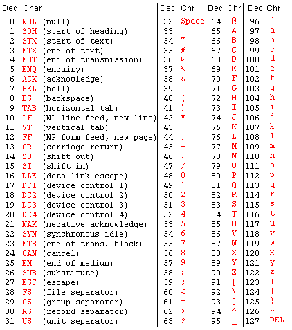

# Chr

## Description
Function Chr returns the ASCII character corresponding to the specified numeric code. The ASCII code value must be between 1 and 255.

```pascal
FUNCTION Chr(v : INTEGER): CHAR;
```

```python
def vs.Chr(v):
    return CHAR
```

## Parameters
|Name|Type|Description|
|---|---|---|
|v|INTEGER|ASCII numeric identifier code.|

## Remarks
Here;s the ASCII table for the lower 128...



## Examples
#### VectorScript ####
```pascal
PROCEDURE Example;
VAR
cnt :INTEGER;
str :STRING;
BEGIN
FOR cnt := 128 TO 255 DO BEGIN
str := Concat(str, Chr(cnt));
IF cnt MOD 32 = 0 THEN str := Concat(str, Chr(13));
END;
AlrtDialog(str);
END;
RUN(Example);
```
#### Python ####
```python
def Example():
	str = ""
	for cnt in range(128, 255):
		str = str + vs.Chr(cnt)
		if cnt % 32 == 0:
			str = str + vs.Chr(13)
	vs.AlrtDialog(str)
Example()
```

```pascal
theLabel := Concat(GetPlugInString(3004), Chr(13), Chr(13),
					GetPlugInString(3006), Num2Str(2, theta), Chr(13),
					GetPlugInString(3007), Num2StrF(D), Chr(13),
					GetPlugInString(3008), Num2StrF(T), Chr(13),
					GetPlugInString(3009), Num2StrF(L), Chr(13),
					GetPlugInString(3010), Num2StrF(theRadius));

bsb := SetObjPropVS(kObjXSupportsStyles, TRUE );
bsb := SetObjPropVS(kObjXPropSupportResourcePopup, TRUE);
bsb := SetObjPropVS(kObjXHasCustomWidgetVisibilities, TRUE );
bsb := SetObjPropVS(kObjXPropCatalogSupport, TRUE);
bsb := SetObjPropCharVS(kObjXPropDefaultHorizontalSectionCutPlane,	Chr(kObjXPropUncutBeyondInViewport));
bsb := SetObjPropCharVS(kObjXPropDefaultVerticalSectionCutPlane,	Chr(kObjXPropViewAsCutInViewport));

BEGIN
	ErrorStatus := TRUE;
	Errors := concat(Errors,chr(13),ErrorMsg);
END;
```
```python
# Sets widget group mode to automatic.
ok = vs.SetObjPropCharVS( vs.kWidgetGroupMode, vs.Chr(vs.kWidgetGroupAutomatic))
```
See also in tutorials: [Plug-in with widgets, basic example (Python)](../../Common/Tasks/Parametrics/Plug-in%20with%20widget%20basic%20example.md)

## See Also
VS Functions:
[Ord](Ord.md)

## Version
Availability: from All Versions

## Category
* [Strings](../Categories/Strings.md)
