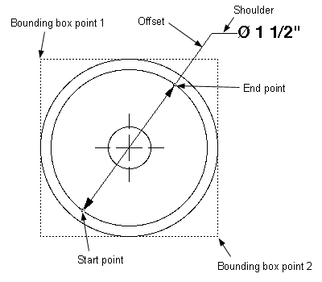

# CircularDim

## Description
Procedure CircularDim creates a diameter or radial dimension in a VectorWorks document.

Bit code values for dimension flags can be found in the [VectorScript Appendix](../Appendix/pages/Appendix%20E%20-%20Miscellaneous%20Selectors.md#lineardim).



```pascal
PROCEDURE CircularDim(
				startPtX,startPtY  : REAL;
				endPtX,endPtY      : REAL;
				box1X,box1Y        : REAL;
				box2X,box2Y        : REAL;
				textOffsetDistance : REAL;
				dimType            : INTEGER;
				arrow              : INTEGER;
				textFlag           : INTEGER;
				shoulder           : REAL);
```

```python
def vs.CircularDim(startPt, endPt, box1, box2, textOffsetDistance, dimType, arrow, textFlag, shoulder):
    return None
```

## Parameters
|Name|Type|Description|
|---|---|---|
|startPt|REAL|X-Y coordinates of dimension start point.|
|endPt|REAL|X-Y coordinates of dimension end point.|
|box1|REAL|X-Y coordinates of top left corner of object bounding box|
|box2|REAL|X-Y coordinates of bottom right corner of object bounding box|
|textOffsetDistance|REAL|Offset distance of text from dimension line(witness leader length).|
|dimType|INTEGER|Dimension type flag.|
|arrow|INTEGER|Arrow style flag.|
|textFlag|INTEGER|Text style flag.|
|shoulder|REAL|Shoulder extension line length.|

## Examples
#### VectorScript ####
```pascal
CircularDim(-4 3/8&quot;,3&quot;,-4 3/8&quot;,1/4&quot;,-5 3/4&quot;,3&quot;,-3&quot;,1/4&quot;,1 1/8&quot;,1,3, 1025,1/4&quot;);
```
#### Python ####
```python
vs.CircularDim(-4 - 3/8,3,-4 - 3/8,1/4,-5 - 3/4,3,-3,1/4,1 + 1/8,1,3, 1025,1/4)
```

```pascal
CircularDim(1.0, 2.0, 0.5, 1.5, 3.0, 1.0, 2.0, 0.5, 1.5, 1, 2, 3, 3.0);
```
```python
import vs

# Procedure CircularDim creates a diameter or radial dimension in a
# VectorWorks document.
startPt = (0, 0)
endPt = (2, 2)
box1 = 'Example'
box2 = 'Example'
textOffsetDistance = 1.0
dimType = 0
arrow = 10
textFlag = 1
shoulder = 1.0

vs.CircularDim(startPt, endPt, box1, box2, textOffsetDistance, dimType, arrow, textFlag, shoulder)
```

## Version
Availability: from All Versions

## Category
* [Dimensions](../Categories/Dimensions.md)
