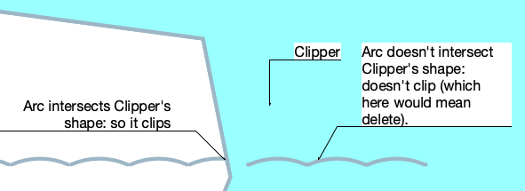

# ClipSurfaceN

## Description
Creates a new surface object by subtracting the intersection of surfaces s1 and s2 from s1.

```pascal
FUNCTION ClipSurfaceN(
				s1 : HANDLE;
				s2 : HANDLE): HANDLE;
```

```python
def vs.ClipSurfaceN(s1, s2):
    return HANDLE
```

## Parameters
|Name|Type|Description|
|---|---|---|
|s1|HANDLE|Surface to be subtracted from|
|s2|HANDLE|Surface to subtract from s1|

## Remarks
ptr: (2022.05.09): This command deletes the s1 object but not the s2 object. 

\_c\_: (2021.03.05):
This clips only parts that intersect the sides of the clipper, it doesn't clip inside the clipper, probably because it would mean deleting geometry.

Example:



## Examples
```pascal
{ ClipSurfaceN deletes the original poly.}
newSurfacedPoly := ClipSurfaceN(hOriginalPoly, hOffsetPoly);
```
```python
import vs

# Creates a new surface object by subtracting the intersection of surfaces s1
# and s2 from s1.
s1 = vs.FSActLayer()  # handle to the first selected object on the active layer
s2 = vs.NextSObj(vs.FSActLayer())  # handle to the next selected object

objHandle = vs.ClipSurfaceN(s1, s2)
if objHandle is not None:
    vs.Message('Created object handle: ' + str(objHandle))
```

## Version
Availability: from Vectorworks 2016

## Category
* [Objects - 2D](../Categories/Objects%20-%202D.md)
