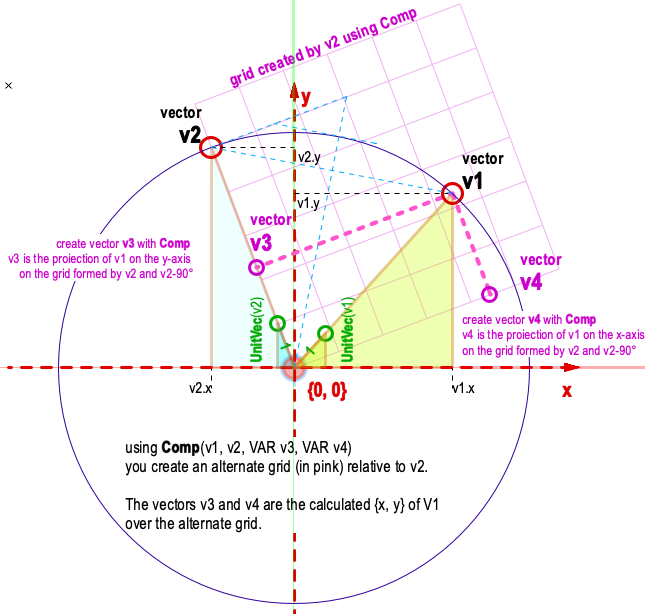

# Comp

## Description
Returns the components of a comparison of two vectors.

The vector component of v1 along v2 in v3, and the vector component of v1 orthogonal to v2 in v4.

```pascal
PROCEDURE Comp(
				v1     : VECTOR;
				v2     : VECTOR;
				VAR v3 : VECTOR;
				VAR v4 : VECTOR);
```

```python
def vs.Comp(v1, v2):
    return (v3, v4)
```

## Parameters
|Name|Type|Description|
|---|---|---|
|v1|VECTOR|Comparison vector 1.|
|v2|VECTOR|Comparison vector 2|
|v3|VECTOR|Component of vector 1 along vector 2|
|v4|VECTOR|Component of vector 1 orthogonal to vector 2.|

## Remarks
(*\_c\_*, 2022.01.19) In VS Python the tuples v1 and v2 must be 3-dimensional, or the function will return gibberish.

(*\_c\_*, 2010 Dec. 22) See graphical representation of how '''Comp''' works (click on the image to enlarge it):



## Examples
#### VectorScript ####
```pascal
PROCEDURE Example;
VAR
    v1, v2, v3, v4 : VECTOR;
BEGIN
    v1.x := 12; v1.y := 1; { vector can be bidimensional without failure }
    v2.x := 3; v2.y := 15;
    Comp( v1, v2, v3, v4 );
    Message(Concat( v3, Chr(13), v4 ));
END;
Run(Example);
```
#### Python ####
```python
v1 = (12, 1, 0) # 3-dimensional tuples
v2 = (3, 15, 0)
v3, v4 = vs.Comp( v1, v2 )
vs.Message(str(v3) + '\r' + str(v4))
```

```pascal
	END;
{align each vector to first edge and re-store in array}
gV2 := gVecArray[1];
FOR i := 2 TO gEdgeCount DO BEGIN
	Comp(gVecArray[i],gV2,gV3,gV4);
	gVecArray[i] := gV3;
	END;

{Need to fix this code for condition when gDrawBack = TRUE}
FOR i := 1 to numV-1 DO BEGIN
	temp_v2 := gCorners[i+1] - gCorners[i]; {edge vector for edge i}
	temp_v1 := gBisectors[i];
	comp(temp_v1,temp_v2,temp_v3,temp_v4);
	IF unitvec(temp_v3) = unitvec(temp_v2)
		THEN gStartpoints[i] := gCorners[i] + temp_v3
		ELSE gStartpoints[i] := gCorners[i];
	temp_v1 := gBisectors[i+1];

{v1[2] := pControlPoint01Y;}
v1[1] := gCP1X;
v1[2] := gCP1Y;
v2 := ang2vec(-Rot,1.0);
Comp(v1,v2,v3,v4);
Points[2,1] := v3[1];
Points[2,2] := v3[2];
v0 := ang2vec(0.0,pLineLength);
{v3[1] := pControlPoint02X;}
```
```python
import vs

# Returns the components of a comparison of two vectors.
v1 = (0, 0)
v2 = (1, 1)

v3, v4 = vs.Comp(v1, v2)
vs.Message('Comp returned: ' + str((v3, v4)))
```

## Version
Availability: from All Versions

## Category
* [Math - Vectors](../Categories/Math%20-%20Vectors.md)
