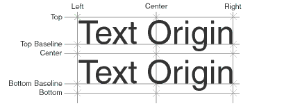

# GetTextVerticalAlign

## Description
Function GetTextVerticalAlign returns the vertical alignment of the referenced text object.




**Table - Text Vertical Justification**

| Justification        | Constant |
|--------------------- |----------|
| Top of text box      | 1        |
| Top baseline         | 2        |
| Text centerline      | 3        |
| Bottom baseline      | 4        |
| Bottom of text box   | 5        |

```pascal
FUNCTION GetTextVerticalAlign(TextHd : HANDLE): INTEGER;
```

```python
def vs.GetTextVerticalAlign(TextHd):
    return INTEGER
```

## Parameters
|Name|Type|Description|
|---|---|---|
|TextHd|HANDLE|Handle to text object.|

## See Also
VS Functions:
* [SetTextVerticalAlign](SetTextVerticalAlign.md) | [SetTextVertAlignN](SetTextVertAlignN.md)
* [GetTextJust](GetTextJust.md) | [SetTextJust](SetTextJust.md) | [SetTextJustN](SetTextJustN.md)

## Version
Availability: from VectorWorks 8.0

## Category
* [Objects - Text](../Categories/Objects%20-%20Text.md)
