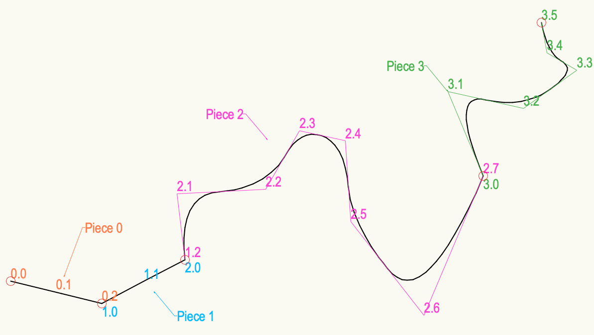

# NurbsCurveGetNumPieces

## Description
Returns the number of pieces that compose the referenced NURBS curve.

```pascal
FUNCTION NurbsCurveGetNumPieces(objectHd : HANDLE): INTEGER;
```

```python
def vs.NurbsCurveGetNumPieces(objectHd):
    return INTEGER
```

## Parameters
|Name|Type|Description|
|---|---|---|
|objectHd|HANDLE|Handle to NURBS curve.|

## Remarks
See example on [NurbsGetPt3D](NurbsGetPt3D.md)

## Examples
presentation of pieces (segments in the example) in a NURBS curve:



## Version
Availability: from VectorWorks 9.0

## Category
* [Objects - NURBS](../Categories/Objects%20-%20NURBS.md)
