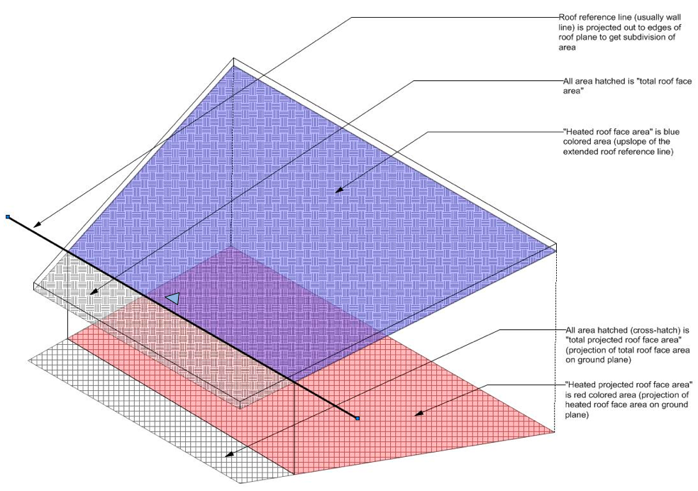

# RoofArea_Heated

## Description
Returns the heated (interior) area along the slope of roofs or roof faces  that meet the criteria.

```pascal
FUNCTION RoofArea_Heated(c : CRITERIA): REAL;
```

```python
def vs.RoofArea_Heated(c):
    return REAL
```

## Parameters
|Name|Type|Description|
|---|---|---|
|c|CRITERIA|   |

## Remarks
\_c\_ (2016.06.28): This returns the area excluding the overhang:
* Roof Faces: the overhang is the part outside the roof axis (line with the arrow). Mind that this doesn't necessarily run parallel to a roof face's edge and the resulting areas are influcenced.
* Roof objects: the overhang is ruled parametrically clicking a face and setting it in the roof dialog. This sets roof axis in the embedded Roof Face[s].

Below a schema posted by Jeff Ouellette 2008:


## Examples
```pascal
resultVal := RoofArea_Heated(c);
```
```python
import vs

# Returns the heated (interior) area along the slope of roofs or roof faces
# that meet the criteria.
c = "(SEL=TRUE)"  # selection criteria - all selected objects

area = vs.RoofArea_Heated(c)
vs.Message('RoofArea_Heated returned: ' + str(area))
```

## See Also
* [RoofArea HeatedProj](RoofArea_HeatedProj.md)
* [RoofArea Total](RoofArea_Total.md)
* [RoofArea TotalProj](RoofArea_TotalProj.md)

## Version
Availability: from Vectorworks 14.0

## Category
* [Criteria](../Categories/Criteria.md)
