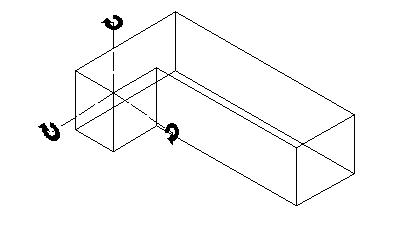

# SetRot3D

## Description
Procedure SetRot3D sets the rotation (in degrees) of the referenced object to the specified rotations and center.  This procedure works on the following 3D objects: extrudes, multiple extrudes, and sweeps.



The difference between Set3DRot and SetRot3D is that Set3DRot adds the specified rotation to the existing rotation of the object, whereas SetRot3D does not consider the existing rotation, and merely makes the object rotation match the specified values.

```pascal
PROCEDURE SetRot3D(
				h         : HANDLE;
				xAngle    : REAL;
				yAngle    : REAL;
				zAngle    : REAL;
				xDistance : REAL;
				yDistance : REAL;
				zDistance : REAL);
```

```python
def vs.SetRot3D(h, xAngle, yAngle, zAngle, xDistance, yDistance, zDistance):
    return None
```

## Parameters
|Name|Type|Description|
|---|---|---|
|h|HANDLE|Handle to 3D object.|
|xAngle|REAL|New X rotation angle.|
|yAngle|REAL|New Y rotation angle.|
|zAngle|REAL|New Z rotation angle.|
|xDistance|REAL|X coordinate of rotation center.|
|yDistance|REAL|Y coordinate of rotation center.|
|zDistance|REAL|Z coordinate of rotation center.|

## Remarks
[sd 8/18/98]

## Examples
```pascal
	pt := pt1 + (tmpVec * 1.5");
	BeginXtrd(pt1.z, pt1.z + 36");
		Rect(pt.x - 1.5", pt.y + 1.5", pt.x + 1.5", pt.y - 1.5");
	EndXtrd;
	SetRot3D(LNewObj, 0, 0, Vec2Ang(tmpVec), pt.x, pt.y, pt.z);
END;
```
```python
import vs

# Procedure SetRot3D sets the rotation (in degrees) of the referenced object
# to the specified rotations and center.
h = vs.FSActLayer()  # handle to the first selected object on the active layer
xAngle = 45.0
yAngle = 90.0
zAngle = 30.0
xDistance = 1.0
yDistance = 1.0
zDistance = 1.0

vs.SetRot3D(h, xAngle, yAngle, zAngle, xDistance, yDistance, zDistance)
```

## See Also
VS Functions:
[Set3DRot](Set3DRot.md)

## Version
Availability: from All Versions

## Category
* [Objects - 3D](../Categories/Objects%20-%203D.md)
