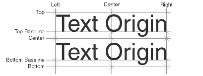

# TextVerticalAlign

## Description
Procedure TextVerticalAlign sets the active text vertical alignment of a VectorWorks document. 


**Table - Text Vertical Justification**

| Justification        | Constant |
|----------------------|----------|
| Top of text box      | 1        |
| Top baseline         | 2        |
| Text centerline      | 3        |
| Bottom baseline      | 4        |
| Bottom of text box   | 5        |



```pascal
PROCEDURE TextVerticalAlign(verticalAlignment : INTEGER);
```

```python
def vs.TextVerticalAlign(verticalAlignment):
    return None
```

## Parameters
|Name|Type|Description|
|---|---|---|
|verticalAlignment|INTEGER|Vertical alignment setting for document.|

## Version
Availability: from VectorWorks 8.0

## Category
* [Objects - Text](../Categories/Objects%20-%20Text.md)
