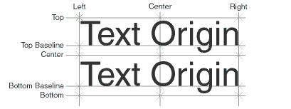

# TextVerticalAlign

## Description
Procedure TextVerticalAlign sets the active text vertical alignment of a VectorWorks document. 

**Table - Text Vertical Justification**

| Justification        | Constant |
|----------------------|----------|
| Top of text box      | 1        |
| Top baseline         | 2        |
| Text centerline      | 3        |
| Bottom baseline      | 4        |
| Bottom of text box   | 5        |



```pascal
PROCEDURE TextVerticalAlign(verticalAlignment : INTEGER);
```

```python
def vs.TextVerticalAlign(verticalAlignment):
    return None
```

## Parameters
|Name|Type|Description|
|---|---|---|
|verticalAlignment|INTEGER|Vertical alignment setting for document.|

## Examples
```pascal
SetPref(92, FALSE);
PushAttrs;
GetOrigin(PX, PY);
TextJust (1);
TextVerticalAlign (1);
TextSize (kTextSize);
boxSize := kBoxSize * getUPI * GetLScale (ActLayer);
textdX := kTextdX * getUPI * GetLScale (ActLayer);
textdy := ktextdy * getUPI * GetLScale (ActLayer);

TextJust(1);
TextVerticalAlign(3);
textTextSize := TextScale * str2num(pTSize);
labelTextSize := textTextSize * pLFact;

TextFlip (0);
TextRotate (#0);
TextSpace (2);
TextJust (2);
TextVerticalAlign (3);
FillPat (kFPat0);
```
```python
vs.TextVerticalAlign(3)
vs.TextJust(2)
```

## Version
Availability: from VectorWorks 8.0

## Category
* [Objects - Text](../Categories/Objects%20-%20Text.md)
