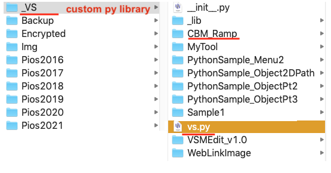
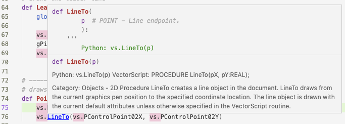
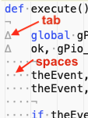
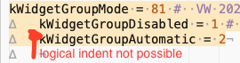
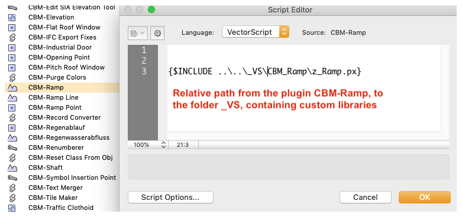
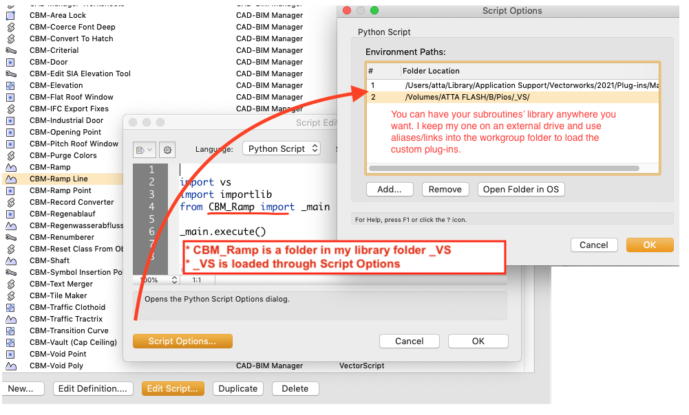

# VS-Python Rosetta Stone

Transitioning from Vectorscript Pascal to Vectorscript Python has its challenges. Here I note down the difficulties I encounter as they come, together with the solution. What troubles me will likely trouble all others.

**Note:** As of today, the wiki doesn't accept external links for safety reasons, which are thus not clickable.

## Set up Python (Mac)

As of this writing, Vectorworks requires Python 3.x. MacOS X before 10.15 ships with Python 2.x. VW delivers the right Python, so you don't need to do anything special if there are no external, vw-unrelated reasons to do so. Should you wish to modify the Python installed on your machine you can proceed as follows, but this won't modify the shipped VW Python. For example, you might want to do some terminal tutorials.

- Launch the Terminal
- Type:
  ```
  python3 --version
  ```
  If there is an error, you should install Python 3 and configure it.
- Follow the instructions on [installpython3.com/mac/](https://installpython3.com/mac/).

This document is very complete and leads you step by step through the rather cryptical configurations. During this process you will install XCode and Homebrew through the terminal.

**Warning:** For some reason XCode wouldn't install on my MacOS X.14. After various hours of fumbling, I gave up and went straight to the official Python 3 installer, available at [python.org](https://www.python.org/downloads/release/python-391/). After that I proceeded with the configurations as described in [installpython3.com/mac/](https://installpython3.com/mac/) and all seems well enough.

## Set up an editor

I tried using Aptana but couldn't configure it. Then I found at Computerworks excellent instructions by Oliver Daus for Visual Studio Code: (German) [www.vectorworksforum.eu/topic/14087-entwicklungsumgebung-für-vectorworks-python-plug-ins/](https://www.vectorworksforum.eu/topic/14087-entwicklungsumgebung-für-vectorworks-python-plug-ins/)

- Download **Visual Studio Code** from [code.visualstudio.com](https://code.visualstudio.com) and install it.
- Install the **Python extension**: launch Visual Studio Code, click on Extensions (`shift + cmd + X`), search for `ms-python`, click on **install Python**.
- Create a script library folder for all your Python tools and commands. I named mine `_VS`.
- In this script library place a file called `vs.py` containing all the Vectorscript calls. You can find this file in the SDK.
- In Visual Studio Code, open the Settings. In Extensions:
  - `Pylance > Python › Analysis: Extra Paths`: add the path to the above-mentioned script library folder (`_VS`).
  - Python > Auto Complete Extra Paths > Edit Settings Json: enter the path to the script library folder, it will look roughly like this:
```json
"python.autoComplete.extraPaths": [
   "/Users/userName/path/to/my/scriptLibrary/_VS"
],
```
- Place in the script library folder a `vs.py` file. It contains the actual list of Vectorscript routines. This file will also allow for intelligent hints (Intellisense) while using an Editor capable of it. You can download the file from the SDK: [www.vectorworks.net/support/custom/sdk](https://www.vectorworks.net/support/custom/sdk)
- In Vectorworks > Script Editor > Script Options: enter the path to your script library folder.



Intellisense from Visual Studio Code:



## VS - Py

### Syntax

| Description | Vectorscript Pascal | Vectorscript Python |
|-------------|---------------------|---------------------|
| **Indenting** | irrelevant | **Fatal:** You used both spaces and tabs to indent your code. This occurs frequently while copy-pasting across sources.  Error Message: unindent does not match any outer indentation level. You added an extra indent.  Error Message: unexpected indent |
| **Semicolon** | **Always needed:**<br>`AlrtDialog('test 1'); AlrtDialog('test 2');` | **Only needed for multiple statements on one line:**<br>`vs.AlrtDialog('test 1')`<br>`vs.AlrtDialog('test 2')` |
| **Case sensitivity** | **Not case sensitive** | **Case sensitive:**<br>`vs.AlrtDialog('test') # OK`<br>`vs.alrtDialog('test') # error` |
| **Brackets** | **No brackets**<br>`FSActLayer;` | **Brackets required**<br>`vs.FSActLayer()` |
| **FOR statements** | **Runs including last value:**<br>`FOR i := 1 TO 3 DO` | **Runs excluding last value:**<br>`for i in range(1, 3):` |
| **Concatenate text** | **Implicit conversion supported** | **No implicit conversion:**<br>`vs.AlrtDialog(str(10) + ' fingers') # OK` |
| **Returning Values** | **Results left, VARs and arguments right** | **Results left, VARs left, arguments right** |
| **Variable Attributes** | no | **built-in in VW**<br>`h = vs.FSActLayer()`<br>`print(h.type)` |
| **Variable scope** | **Global wins over local** | **Local wins over global** |
| **NIL handles** | `h <> NIL` | Recommended:<br>`h is None` |
| **Fetching Plug-in Parameters** | **Direct, not case sensitive** | **Prefixed with `vs`, case sensitive** |
| **Using units** | **Yes** | **Needs conversion** |
| **Vectors, Points** | **Can be manipulated in place** | **Is Tuple** |
| **Colors** | **Color Index:**<br>`SetPenFore(h, RGBToColorIndex(65535, 0, 0));`<br>**RGB:**<br>`SetPenFore(h, 65535, 0, 0);` | **Color Index:**<br>`vs.SetPenFore(h, vs.RGBToColorIndex(65535, 0, 0))`<br>**RGB in Tuple:**<br>`vs.SetPenFore(h, (65535, 0, 0))` |

### Variables

Perhaps the largest source of error while transitioning to Python are the deep differences in variables.

| Description | Vectorscript Pascal | Vectorscript Python |
|-------------|---------------------|---------------------|
| **Returning Values** | **Results left, VARs and arguments right**<br><br>```FUNCTION ActiveClass : STRING;```<br>```classN := ActiveClass;<br>```<br><br>```FUNCTION GetCustomObjectInfo(```<br>```    VAR objectName   :STRING;```<br>```    VAR objectHand   :HANDLE;```<br>```    VAR recordHand   :HANDLE;```<br>```    VAR wallHand     :HANDLE) : BOOLEAN;```<br><br>```ok := GetCustomObjectInfo( objectName, objectHand, recordHand, wallHand );```<br><br>```PROCEDURE HMove(```<br>```    objectHand :HANDLE;```<br>```    xOffset   :REAL;```<br>```    yOffset   :REAL);```<br><br>```HMove( objectHand, xOffset, yOffset );``` | **Results left, VARs left, arguments right**<br><br>```def vs.ActiveClass():```<br>```    return STRING```<br><br>```classN = vs.ActiveClass()```<br><br>```def vs.GetCustomObjectInfo():```<br>```    return (BOOLEAN, objectName, objectHand, recordHand, wallHand)```<br><br>```ok, objectName, objectHand, recordHand, wallHand = vs.GetCustomObjectInfo()```<br><br>```def vs.HMove(objectHand, xOffset, yOffset):```<br>```    return None<br><br>vs.HMove(objectHand, xOffset, yOffset)``` |
| **Variable Attributes**<br>discovered by P. Winkler 2017 | no | **built in in VW**<br>```h = vs.FSActLayer()```<br>```print(h.type)```<br>```print(h.locked)```<br>```print(h.name)```<br>```print(h.selected)```<br><br>```print(h.prev)```<br>```print(h.next)```<br>```print(h.parent)``` |
| **Variable scope** | **Global wins over local:**<br>- Variables must be declared<br>- Subroutines "see" their own variables and those of any parent function/procedure where they are contained.<br><br>```{ GLOBAL ACCESS }```<br><br>```PROCEDURE Main;```<br>```    VAR```<br>```        { good praxis: label globals with "g" }```<br>```        gIndex, gNum : INTEGER;```<br><br>```    PROCEDURE Increment;```<br>```        BEGIN```<br>```            gNum := gNum +1;```<br>```            SysBeep;```<br>```        END;```<br><br>```BEGIN```<br>```    gNum := 10;```<br>```    FOR gIndex := 1 TO 10 DO```<br>```        Increment;```<br><br>```    AlrtDialog(Concat(gNum));```<br>```END;```<br>```Run(Main);``` | **Local wins over global:**<br>- Variables must NOT be declared<br>- Subroutines create automatically a local instance of any used variable.<br><br>```# LOCAL ACCESS```<br><br>```def Increment():```<br>```    gNum +=1```<br>```    vs.SysBeep```<br><br>```gNum = 10```<br>```for gIndex in range(1, 10):```<br>```    Increment```<br><br>```vs.AlrtDialog(str(gNum))```<br>```# returns 10! The global var didn't set```<br><br>```# GLOBAL ACCESS: CORRECT```<br><br>```def Increment():```<br>```    global gNum```<br>```    gNum +=1```<br>```    vs.SysBeep()```<br><br>```gNum = 10```<br>```for gIndex in range(0, 10):```<br>```    Increment()```<br><br>```vs.AlrtDialog(str(gNum))```<br>```# returns 20```<br><br>```# TRY GLOBAL ACCESS: WRONG```<br><br>```def Increment():```<br>```    global gNum```<br>```    gNum +=1```<br>```    vs.SysBeep()```<br><br>```# no init!```<br>```for gIndex in range(0, 10):```<br>```    Increment()```<br><br>```vs.AlrtDialog(str(gNum))```<br>Error Message: NameError: global name 'gNum' is not defined<br><br>```# TRY GLOBAL ACCESS: WRONG```<br><br>```global gNum # wrong place!```<br><br>```def Increment():```<br>```    gNum +=1```<br>```    vs.SysBeep()```<br><br>```gNum = 10```<br>```for gIndex in range(0, 10):```<br>```    Increment()```<br><br>```vs.AlrtDialog(str(gNum))```<br>Error Message: UnboundLocalError: local variable 'gNum' referenced before assignment |
| NIL handles | `h <> NIL` | Recommended:<br>`h is None`<br>`h is not None`<br><br>Not recommended:<br>`h != None`<br>`h != vs.Handle()`<br><br>See: [PEP 8](https://www.python.org/dev/peps/pep-0008/#programming-recommendations) |
| **Fetching Plug-in Parameters** | **Direct, not case sensitive:**<br>`MoveTo(PCONTROLPOINT01X, PCONTROLPOINT01Y);`<br>`LineTo(PCONTROLPOINT02X, PCONTROLPOINT02Y);` | **Prefixed with 'vs', case sensitive:**<br>Correct:<br>`vs.MoveTo(vs.PControlPoint01X, vs.PControlPoint01Y)`<br>`vs.LineTo(vs.PControlPoint02X, vs.PControlPoint02Y)`<br><br>Wrong:<br>`vs.MoveTo(vs.PCOntrolPoint01X, vs.PControlPoint01Y)`<br>`vs.LineTo(vs.PcontrolPoint02X, vs.PControlPoint02Y)` |
| **Using units** | **Yes:**<br>`GetSymLoc(symH, c.x, c.y);`<br>`MoveTo(c.x, c.y);`<br>`Line(1m, 0);` | **Needs conversion:**<br>```c = vs.GetSymLoc(symH)```<br>```vs.MoveTo(c[0], c[1])```<br>```vs.Line(Str2Num('1m'), 0)``` |
| **Vectors, Points** | **Can be manipulated in place:**<br>`GetSymLoc(symH, c.x, c.y);`<br>`c.x := c.x +1m;` | **Is Tuple:**<br>An ordered list whose items are unchangeable<br>`c = vs.GetSymLoc(symH)`<br>`c[0] = c[0] +1m`<br># error! |
| **Colors** | Color Index:<br>`SetPenFore(h, RGBToColorIndex(65535, 0, 0));`<br>`PenFore(RGBToColorIndex(65535, 0, 0));`<br>RGB:<br>`SetPenFore(h, 65535, 0, 0);` | Color Index:<br>`vs.SetPenFore(h, vs.RGBToColorIndex(65535, 0, 0))`<br>RGB in Tuple:<br>`vs.SetPenFore(h, (65535, 0, 0))`<br>Hex in Tuple:<br>`vs.SetPenFore(h, (0xFFFF, 0, 0))`<br><br>Warning:<br>`vs.PenFore((65535, 0, 0))` correct<br>`vs.PenFore(65535, 0, 0)` fails (no error message!) |


## Includes / Imports


<table class="wikitable">
  <thead>
    <tr>
      <th style="width:20%">Description</th>
      <th style="width:40%">Vectorscript Pascal</th>
      <th style="width:40%">Vectorscript Python</th>
    </tr>
  </thead>
  <tbody>
    <tr style="vertical-align: top;">
      <td><strong>Includes/Import</strong><br>Load libraries of code</td>
      <td>
        <ul>
          <li>Custom (own) Libraries:</li>
          <ul>
            <li>Use the term <code>$INCLUDE</code></li>
            <li>Pass the appropriate path to your code and/or code libraries</li>
          </ul>
          <pre>$INCLUDE libraryFolder\libraryFile.vss<br>$INCLUDE libraryFolder\libraryFile.px</pre>
          <p>Note: the path to the vss/px file is relative to the running .vso/.vst/.vsm plug-in file.</p>
          
          <p>In the example in the screenshot, the file z_Ramp.px is located 2 folders higher (<code>..\..\</code>) of the file .CBM-Ramp.vso, and within the folders <code>_VS\CBM-Ramp</code>. There are compelling reasons to split the running code from the plug-ins. For example, because you will want a plug-in for every VW major version, but not necessarily more code files.</p>
        </ul>
        <p>External libraries: not possible</p>
      </td>
      <td>
        <p>Python calls Includes "imports". It searches for imports in the current directory, then in dedicated directories, if any (Script Options). For the current directory, Python understands the folder of the running .vso/.vsm/.vst file.</p>
        <ul>
          <li>Custom (own) Libraries:</li>
          <ul>
            <li>Set up in the Script Options (see below) one or more environmental paths from which all active plug-ins will resolve imports</li>
            <li>Choose a library folder with your code and/or libraries in the Plug-Ins <strong>Script Options</strong></li>
            <li>Use the term <code>import</code></li>
          </ul>
          <pre>import main<br># import the script main.py, in this case it resides in the same folder as the running .vso/.vsm/.vst plug-in</pre>
          <li>Other Libraries:</li>
          <pre>import vs<br>import math<br>from subprocess import Popen, PIPE</pre>
          <p>But not:</p>
          <pre>import vs, math # not recommended</pre>
          <p>Absolute path:</p>
          <pre>import mypkg.sibling<br>from mypkg import sibling<br>from mypkg.sibling import example</pre>
          <p>Relative path:</p>
          <pre>from . import sibling<br>from .sibling import example</pre>
          <p>See more in: <a href="https://www.python.org/dev/peps/pep-0008/#imports">PEP 8 Imports</a></p>
        </ul>
        <p>Note: the paths listed through the <strong>Script Options</strong> dialog are valid for <strong>all</strong> plug-ins. One might be misled into thinking that the list affected only one plug-in.</p>
        
        <p>External library: include + name of the chosen library</p>
        <pre>import sys<br>ver = sys.version_info<br>vs.Message(repr(ver))</pre>
        <p>VS API: you must always include the VS API or you won't be able to use it. This file will also allow for intelligent hints while using an Editor capable of it. Download it from the SDK: <a href="https://www.vectorworks.net/support/custom/sdk">Vectorworks SDK</a></p>
        <ul>
          <li>Copy the file SDKVW(...)/SDKLib/Include/vs.py in your script library (defined in the Script Options). If you don't have such a library, you can copy the file in the folder where your plug-in object (.vso) or command (.vsm) is.</li>
          <li>Link to the API using:</li>
          <pre>import vs</pre>
        </ul>
        
        <p>Intellisense from Visual Studio Code:</p>
        
      </td>
    </tr>
    <tr style="vertical-align: top;">
      <td><strong>Encryption</strong><br>See <a href="../../VectorScript/pages/Include Files and Encryption.md">encryption</a> for more information.</td>
      <td>
        <ul>
          <li>vss: -</li>
          <li>px: Encrypt upon launching the Encryption command (in the Plug-in Manager dialog, click on the button <strong>Edit Script...</strong> while pressing shift + caps lock + alt + cmd)</li>
        </ul>
        <pre>{$INCLUDE ..\..\_VS_includes\_common\Utils.px}<br>{$INCLUDE ..\..\_VS_includes\_common\Math.px}</pre>
      </td>
      <td>
        <p>For encryption in Python, there are difficulties. See instructions from Vlado on the Techboard, search for "problems-encrypting-a-python-script" (at the moment we cannot add external links to the present wiki).</p>
      </td>
    </tr>
    <tr style="vertical-align: top;">
      <td><strong>Python Version</strong></td>
      <td>-</td>
      <td>
        <pre>import sys<br>ver = sys.version_info<br>vs.Message(repr(ver))</pre>
      </td>
    </tr>
    <tr style="vertical-align: top;">
      <td><strong>Python Caching</strong><br>Some caching prevents your script from reflecting changes:</td>
      <td>-</td>
      <td>
        <pre>varPersistentPythonEngine = 412 { Boolean }<br>In the SDK starting from VW 2014 we can read:<br>"When True the Python engine is the same for the execution of all scripts, this solves some issues with Py_Initialize and Py_Finalize. For example, when debugging externally python leaves threads that cause crash if Py_Initialize and Py_Finalize is used for each script call. So, this allows the engine to be preserved between calls, however Vectorworks will delete all custom modules and objects defined in the engine prior each execution."<br><br>* Enable the developer mode in Preferences > Session<br>* Open your Plug-in in the Script Editor, add:<br>import vs  # import Vectorscript definitions<br>import imp  # import Python library, see note below<br>import module<br><br>from module import _script  # main script for your tool<br>imp.reload(_script)  # Make sure the module is always up to date and has initial values<br>vs.SetPref(412, True)  # Turns off include caching<br><br>_script.mainRoutineInScript()  # execute the main routine in the script<br><br># The Import libraries changed across Python versions:<br># For Python2.x<br>#      reload(module)<br># For above 2.x and <= Python 3.3<br>#      import imp<br>#      imp.reload(module)<br># For >= Python 3.4<br>#      import importlib<br>#      importlib.reload(module)</pre>
      </td>
    </tr>
  </tbody>
</table>

# Lists

Lists are powerful in Python. Below are some fascinating list manipulations. They remind me of AppleScript:

```python
months = "Jan Feb Mar Apr May Jun Jul"
months = months.split()  # no splitter defined and it will use the empty space --> ['Jan', 'Feb', 'Mar', 'Apr', 'May', 'Jun', 'Jul']
months[2]  # --> 'Mar' note that the index is 0-based
months2 = "Jan, Feb, Mar, Apr, May, Jun, Jul"
months2.split(', ')  # --> ['Jan', 'Feb', 'Mar', 'Apr', 'May', 'Jun', 'Jul'] use comma and empty space as splitter 
months.append('Jul')  # --> ['Jan', 'Feb', 'Mar', 'Apr', 'May', 'Jun', 'Jul'] append adds an item to a list 
months.pop()  # --> 'Jul' pop fetches the last item of a list
', sunny '.join(months)  # --> ', sunny Jan, sunny Feb, sunny Mar, sunny Apr, sunny May, sunny Jun, sunny Sep'
'-'.join(months[1:3])  # --> 'Feb-Mar'
del months[2]  # --> ['Jan', 'Feb', 'Apr', 'May', 'Jun', 'Jul']
months = {1: 'Jan', 2: 'Feb', 3: 'Mar'}  # --> {1: 'Jan', 2: 'Feb', 3: 'Mar'}
```

# Errors

Python Error Messages:

BaseExceptions:
- SystemExit
- KeyboardInterrupt
- GeneratorExit
- Exception
  - StopIteration
  - ArithmeticError
    - FloatingPointError
    - OverflowError
    - ZeroDivisionError
  - AssertionError
  - AttributeError
  - BufferError
  - EOFError
  - ImportError
  - LookupError
    - IndexError
    - KeyError
  - MemoryError
  - NameError
    - UnboundLocalError
  - OSError
    - BlockingIOError
    - ChildProcessError
    - ConnectionError
      - BrokenPipeError
      - ConnectionAbortedError
      - ConnectionRefusedError
      - ConnectionResetError
    - FileExistsError
    - FileNotFoundError
    - InterruptedError
    - IsADirectoryError
    - NotADirectoryError
    - PermissionError
    - ProcessLookupError
    - TimeoutError
  - ReferenceError
  - RuntimeError
    - NotImplementedError
  - SyntaxError
    - IndentationError
      - TabError
  - SystemError
  - TypeError
  - ValueError
    - UnicodeError
      - UnicodeDecodeError
      - UnicodeEncodeError
      - UnicodeTranslateError
  - Warning
    - DeprecationWarning
    - PendingDeprecationWarning
    - RuntimeWarning
    - SyntaxWarning
    - UserWarning
    - FutureWarning
    - ImportWarning
    - UnicodeWarning
    - BytesWarning
    - ResourceWarning
